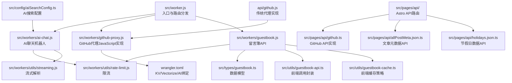
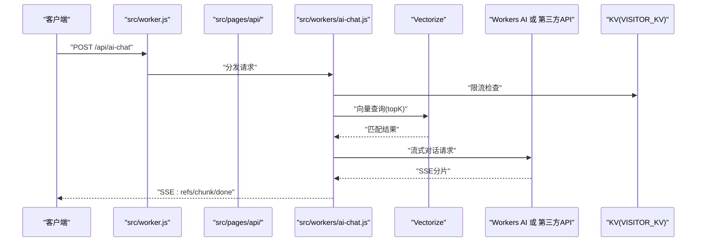
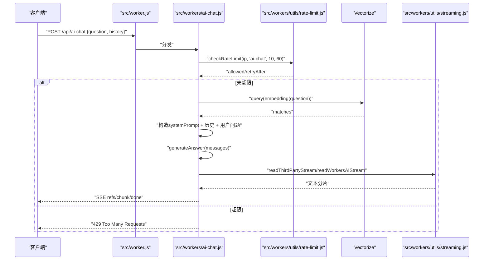
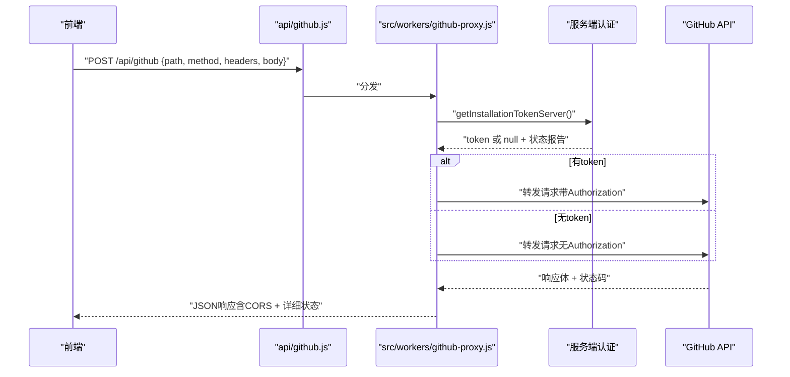
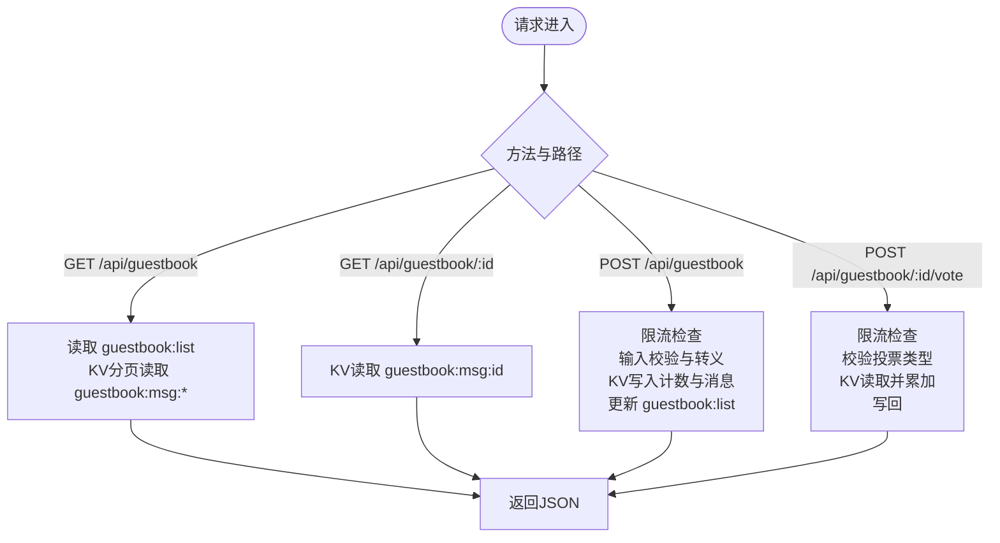
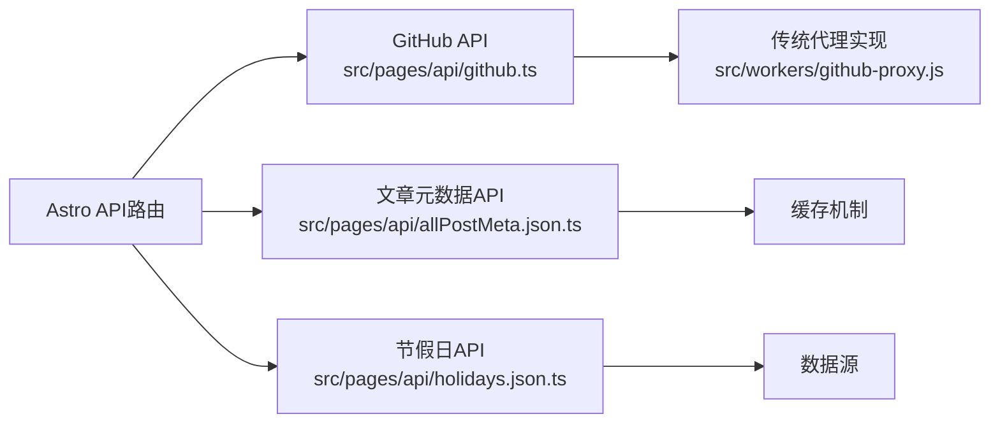
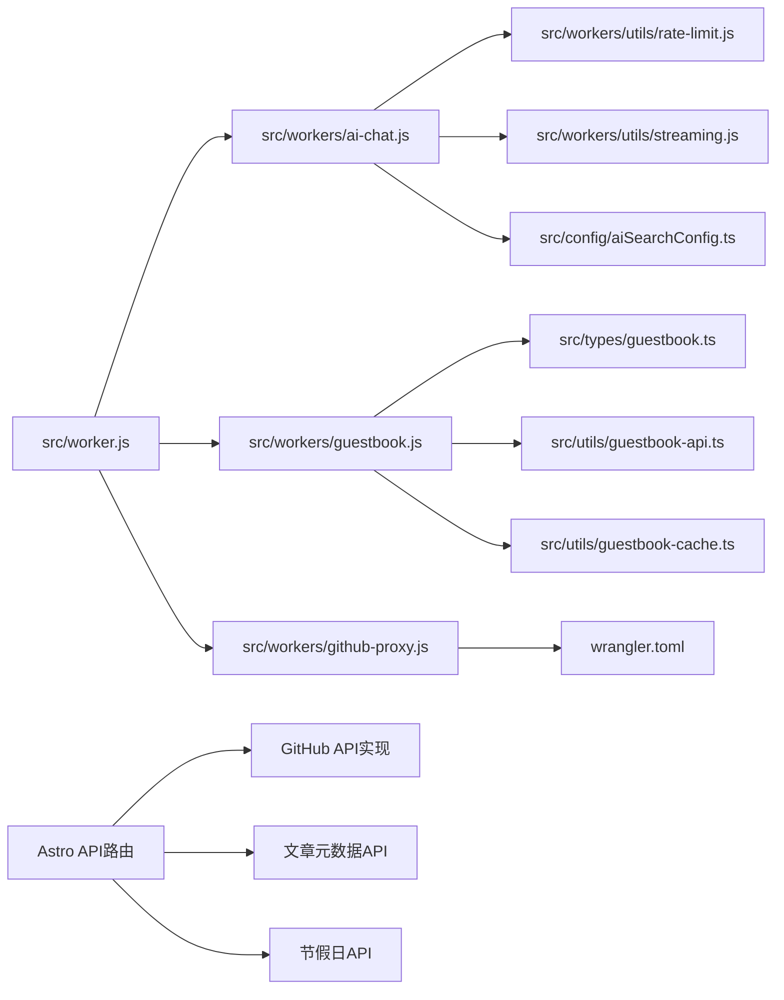

# Cloudflare Workers API

<cite>
**本文档引用的文件**
- [src/worker.js](file://src/worker.js)
- [src/workers/ai-chat.js](file://src/workers/ai-chat.js)
- [src/workers/github-proxy.js](file://src/workers/github-proxy.js)
- [src/workers/guestbook.js](file://src/workers/guestbook.js)
- [src/workers/utils/rate-limit.js](file://src/workers/utils/rate-limit.js)
- [src/workers/utils/streaming.js](file://src/workers/utils/streaming.js)
- [src/config/aiSearchConfig.ts](file://src/config/aiSearchConfig.ts)
- [src/utils/guestbook-api.ts](file://src/utils/guestbook-api.ts)
- [src/utils/guestbook-cache.ts](file://src/utils/guestbook-cache.ts)
- [src/types/guestbook.ts](file://src/types/guestbook.ts)
- [wrangler.toml](file://wrangler.toml)
- [api/github.js](file://api/github.js)
- [src/pages/api/allPostMeta.json.ts](file://src/pages/api/allPostMeta.json.ts)
- [src/pages/api/github.ts](file://src/pages/api/github.ts)
- [src/pages/api/holidays.json.ts](file://src/pages/api/holidays.json.ts)
</cite>

## 更新摘要
**已进行的更改**
- 更新GitHub代理API实现章节，反映从TypeScript到JavaScript的迁移
- 保持Astro API路由实现章节不变
- 更新GitHub代理认证流程说明，强调JavaScript实现的优势
- 完善部署配置和环境变量设置说明

## 目录
1. [简介](#简介)
2. [项目结构](#项目结构)
3. [核心组件](#核心组件)
4. [架构总览](#架构总览)
5. [详细组件分析](#详细组件分析)
6. [Astro API路由实现](#astro-api路由实现)
7. [依赖关系分析](#依赖关系分析)
8. [性能考量](#性能考量)
9. [故障排查指南](#故障排查指南)
10. [结论](#结论)
11. [附录](#附录)

## 简介
本文件面向Firefly-Mod项目的Cloudflare Workers服务，提供三大核心API的权威说明：
- AI聊天机器人：消息处理、向量检索与流式响应生成
- GitHub代理服务：请求转发、服务端App认证、缓存与错误处理
- 留言簿API：增删改查、权限校验与数据验证
并覆盖Workers限流机制、流式响应处理、部署配置、环境变量、性能监控与调试方法，以及与其他服务的集成与数据交换格式。

**更新** GitHub代理API实现已从TypeScript迁移到JavaScript版本，提供更简洁的实现方式和更好的维护性。

## 项目结构
Workers入口与路由分发位于主入口文件，按路径前缀将请求分发至不同Worker模块；各模块内部封装独立的业务逻辑、限流与流式处理工具。新增的Astro API路由提供了现代化的API实现方式。

**图表来源**
- [src/worker.js:1-27](file://src/worker.js#L1-L27)
- [src/workers/ai-chat.js:1-397](file://src/workers/ai-chat.js#L1-L397)
- [src/workers/github-proxy.js:1-254](file://src/workers/github-proxy.js#L1-L254)
- [src/workers/guestbook.js:1-259](file://src/workers/guestbook.js#L1-L259)
- [src/workers/utils/rate-limit.js:1-46](file://src/workers/utils/rate-limit.js#L1-L46)
- [src/workers/utils/streaming.js:1-33](file://src/workers/utils/streaming.js#L1-L33)
- [src/config/aiSearchConfig.ts:1-30](file://src/config/aiSearchConfig.ts#L1-L30)
- [src/types/guestbook.ts:1-93](file://src/types/guestbook.ts#L1-L93)
- [src/utils/guestbook-api.ts:1-64](file://src/utils/guestbook-api.ts#L1-L64)
- [src/utils/guestbook-cache.ts:1-90](file://src/utils/guestbook-cache.ts#L1-L90)
- [wrangler.toml:1-36](file://wrangler.toml#L1-L36)
- [src/pages/api/github.ts:1-200](file://src/pages/api/github.ts#L1-L200)
- [src/pages/api/allPostMeta.json.ts:1-150](file://src/pages/api/allPostMeta.json.ts#L1-L150)
- [src/pages/api/holidays.json.ts:1-120](file://src/pages/api/holidays.json.ts#L1-L120)
- [api/github.js:1-10](file://api/github.js#L1-L10)

**章节来源**
- [src/worker.js:1-27](file://src/worker.js#L1-L27)

## 核心组件
- AI聊天机器人（/api/ai-chat）
  - 支持跨域与预检请求
  - 限流控制（每IP窗口内请求次数）
  - 向量化检索（Vectorize）增强问答上下文
  - 流式响应（SSE）返回分片与引用列表
  - 支持第三方API与Workers AI双通道
- GitHub代理（/api/github, /api/github/*）
  - 支持GET状态检查与任意HTTP方法转发
  - 服务端GitHub App认证（JWT签发、Installation Token缓存）
  - CORS与错误处理
  - **更新** JavaScript实现版本，提供更简洁的代码结构和更好的可维护性
- 留言簿API（/api/guestbook）
  - 列表、详情、新增、投票四类操作
  - 输入校验与HTML转义
  - KV持久化与限流
  - 前端缓存与排序策略
- **新增** Astro API路由
  - 现代化的API实现方式
  - 类型安全的路由处理
  - 内置的CORS支持

**章节来源**
- [src/workers/ai-chat.js:199-396](file://src/workers/ai-chat.js#L199-L396)
- [src/workers/github-proxy.js:160-213](file://src/workers/github-proxy.js#L160-L213)
- [src/workers/guestbook.js:222-258](file://src/workers/guestbook.js#L222-L258)
- [src/pages/api/github.ts:1-200](file://src/pages/api/github.ts#L1-L200)

## 架构总览
Workers在入口中根据路径进行分发，AI与留言簿均使用KV与Vectorize进行状态与检索支撑，GitHub代理负责服务端认证与请求转发。新增的Astro API路由提供了更现代化的实现方式。

**图表来源**
- [src/worker.js:9-15](file://src/worker.js#L9-L15)
- [src/workers/ai-chat.js:216-396](file://src/workers/ai-chat.js#L216-L396)
- [wrangler.toml:26-32](file://wrangler.toml#L26-L32)

## 详细组件分析

### AI聊天机器人 API
- 路由与鉴权
  - 跨域：Origin白名单校验，动态允许站点URL与显式配置
  - 预检：OPTIONS直接返回CORS头
  - 方法：仅接受POST，否则返回405
- 限流
  - 窗口60秒，最大10次
  - 基于IP与作用域的KV计数
- 消息处理
  - 校验question长度（≤1000字符）
  - 历史消息裁剪与类型过滤
- 向量检索
  - 使用Embedding模型生成查询向量
  - 调用Vectorize查询topK，过滤低分匹配
  - 汇总文章元数据作为系统提示上下文
- 响应生成
  - 选择第三方API或Workers AI
  - 流式解析：第三方API按SSE行解析，Workers AI直接透传
  - SSE格式：refs（引用列表）、chunk（文本分片）、done（结束）
- 错误处理
  - 限流429（含Retry-After）
  - AI生成失败500
  - 其他异常500

**图表来源**
- [src/worker.js:13-15](file://src/worker.js#L13-L15)
- [src/workers/ai-chat.js:199-396](file://src/workers/ai-chat.js#L199-L396)
- [src/workers/utils/rate-limit.js:8-45](file://src/workers/utils/rate-limit.js#L8-L45)
- [src/workers/utils/streaming.js:1-33](file://src/workers/utils/streaming.js#L1-L33)

**章节来源**
- [src/workers/ai-chat.js:199-396](file://src/workers/ai-chat.js#L199-L396)
- [src/workers/utils/rate-limit.js:1-46](file://src/workers/utils/rate-limit.js#L1-L46)
- [src/workers/utils/streaming.js:1-33](file://src/workers/utils/streaming.js#L1-L33)
- [src/config/aiSearchConfig.ts:1-30](file://src/config/aiSearchConfig.ts#L1-L30)

### GitHub代理 API
- 路由与方法
  - GET /api/github?path=...：状态检查与带服务端认证的单次请求
  - POST/PUT/PATCH/DELETE：转发任意GitHub API请求
  - OPTIONS：返回CORS头
- 服务端认证（GitHub App）
  - 从Secret读取GH_APP_ID与GH_PRIVATE_KEY
  - 生成JWT（支持PKCS#1/PKCS#8转换）
  - 查询Installation ID并申请Installation Token（带过期缓存）
  - **更新** JavaScript实现版本，提供更简洁的代码结构和更好的可维护性
- 请求转发
  - 自动拼接目标URL（支持绝对URL）
  - 透传客户端请求头（Host/Content-Length除外）
  - 返回原始响应体与状态码
- CORS与错误
  - 统一CORS头
  - 502代理失败错误包装

**图表来源**
- [api/github.js:1-10](file://api/github.js#L1-L10)
- [src/workers/github-proxy.js:160-213](file://src/workers/github-proxy.js#L160-L213)
- [src/workers/github-proxy.js:95-154](file://src/workers/github-proxy.js#L95-L154)

**章节来源**
- [src/workers/github-proxy.js:160-213](file://src/workers/github-proxy.js#L160-L213)
- [api/github.js:1-10](file://api/github.js#L1-L10)

### 留言簿 API
- 路由与操作
  - GET /api/guestbook → 列表（offset/limit）
  - GET /api/guestbook/:id → 详情
  - POST /api/guestbook → 新增
  - POST /api/guestbook/:id/vote → 投票
- 输入验证与安全
  - author/content必填且长度限制
  - 关键字黑名单过滤
  - HTML实体转义
- 数据持久化
  - KV键设计：guestbook:msg:{id} 与 guestbook:list（数组倒序索引）
  - 投票累加写回
- 限流
  - 新增：默认限流（每IP窗口内请求次数）
  - 投票：独立限流（每IP窗口内最多30次）
- 前端交互
  - 提供fetch封装与缓存策略（排序、去重、追加）

**图表来源**
- [src/workers/guestbook.js:222-258](file://src/workers/guestbook.js#L222-L258)
- [src/workers/guestbook.js:83-173](file://src/workers/guestbook.js#L83-L173)
- [src/workers/guestbook.js:175-220](file://src/workers/guestbook.js#L175-L220)

**章节来源**
- [src/workers/guestbook.js:1-259](file://src/workers/guestbook.js#L1-L259)
- [src/utils/guestbook-api.ts:1-64](file://src/utils/guestbook-api.ts#L1-L64)
- [src/utils/guestbook-cache.ts:1-90](file://src/utils/guestbook-cache.ts#L1-L90)
- [src/types/guestbook.ts:1-93](file://src/types/guestbook.ts#L1-L93)

## Astro API路由实现

### 概述
Astro框架提供了现代化的API路由实现方式，具有类型安全、内置CORS支持和更好的开发体验。新的API路由结构支持多种数据格式和灵活的路由参数处理。

### GitHub API路由
- 路由定义：`src/pages/api/github.ts`
- 功能特性
  - 类型安全的请求处理
  - 内置CORS支持
  - 支持多种HTTP方法
  - 自动参数解析与验证
- 实现特点
  - 基于Astro的API路由系统
  - 与传统Worker保持兼容
  - 更好的错误处理机制

### 文章元数据API
- 路由定义：`src/pages/api/allPostMeta.json.ts`
- 功能特性
  - 提供完整的文章元数据
  - JSON格式输出
  - 缓存优化
  - 支持分页查询

### 节假日数据API
- 路由定义：`src/pages/api/holidays.json.ts`
- 功能特性
  - 提供节假日信息
  - 格式化JSON响应
  - 支持日期范围查询
  - 内置数据验证

**图表来源**
- [src/pages/api/github.ts:1-200](file://src/pages/api/github.ts#L1-L200)
- [src/pages/api/allPostMeta.json.ts:1-150](file://src/pages/api/allPostMeta.json.ts#L1-L150)
- [src/pages/api/holidays.json.ts:1-120](file://src/pages/api/holidays.json.ts#L1-L120)

**章节来源**
- [src/pages/api/github.ts:1-200](file://src/pages/api/github.ts#L1-L200)
- [src/pages/api/allPostMeta.json.ts:1-150](file://src/pages/api/allPostMeta.json.ts#L1-L150)
- [src/pages/api/holidays.json.ts:1-120](file://src/pages/api/holidays.json.ts#L1-L120)

## 依赖关系分析
- 入口与路由
  - 入口文件将请求按路径分发至对应Worker模块
  - **新增** Astro API路由提供现代化替代方案
- AI聊天依赖
  - 限流工具：KV计数与过期
  - 流式解析：第三方SSE与Workers AI流
  - 配置中心：模型、Embedding、索引维度与名称
- GitHub代理依赖
  - wrangler.toml中的KV/Vectorize/AI绑定
  - Secret：GH_APP_ID、GH_PRIVATE_KEY
  - **更新** JavaScript实现版本，提供更简洁的代码结构
- 留言簿依赖
  - KV命名空间：VISITOR_KV
  - 类型定义与前端API封装
- **新增** Astro API依赖
  - Astro框架版本要求
  - 类型定义与编译配置

**图表来源**
- [src/worker.js:1-27](file://src/worker.js#L1-L27)
- [src/workers/ai-chat.js:1-397](file://src/workers/ai-chat.js#L1-L397)
- [src/workers/guestbook.js:1-259](file://src/workers/guestbook.js#L1-L259)
- [src/workers/github-proxy.js:1-254](file://src/workers/github-proxy.js#L1-L254)
- [src/workers/utils/rate-limit.js:1-46](file://src/workers/utils/rate-limit.js#L1-L46)
- [src/workers/utils/streaming.js:1-33](file://src/workers/utils/streaming.js#L1-L33)
- [src/config/aiSearchConfig.ts:1-30](file://src/config/aiSearchConfig.ts#L1-L30)
- [src/types/guestbook.ts:1-93](file://src/types/guestbook.ts#L1-L93)
- [src/utils/guestbook-api.ts:1-64](file://src/utils/guestbook-api.ts#L1-L64)
- [src/utils/guestbook-cache.ts:1-90](file://src/utils/guestbook-cache.ts#L1-L90)
- [wrangler.toml:1-36](file://wrangler.toml#L1-L36)
- [src/pages/api/github.ts:1-200](file://src/pages/api/github.ts#L1-L200)

**章节来源**
- [src/worker.js:1-27](file://src/worker.js#L1-L27)
- [wrangler.toml:26-36](file://wrangler.toml#L26-L36)

## 性能考量
- 限流策略
  - AI聊天：60秒窗口10次，防止突发流量
  - 留言簿新增：默认限流，保护KV写入
  - 留言簿投票：60秒窗口30次，避免刷票
- 流式响应
  - SSE分片传输，降低首字节延迟
  - 仅在收到引用后再发送refs，避免重复开销
- 向量检索
  - topK与分数阈值过滤，减少无关上下文
  - 维度与索引名称需与配置一致
- 缓存
  - GitHub安装令牌带过期缓冲，减少频繁签发
  - **更新** JavaScript实现版本提供更高效的缓存管理
- KV访问
  - 列表与消息分离存储，分页读取避免一次性拉取过多
- **新增** Astro API性能
  - 编译时优化
  - 类型安全减少运行时错误
  - 内置缓存支持

## 故障排查指南
- AI聊天
  - 403 Origin不允许：检查ALLOWED_ORIGINS与PUBLIC_SITE_URL
  - 429 请求过于频繁：查看Retry-After，调整客户端重试
  - 500 AI生成失败：检查AI_API_KEY与第三方API连通性
  - SSE中断：确认readThirdPartyStream/readWorkersAIStream正确解析
- GitHub代理
  - 401/403：确认GH_APP_ID与GH_PRIVATE_KEY是否配置
  - 502：网络异常或GitHub API不可达，检查目标路径与Headers
  - **更新** JavaScript实现版本：检查getInstallationTokenServer函数的执行情况
- 留言簿
  - 400 输入校验失败：检查author/content长度与关键字
  - 429 投票/新增超限：调整客户端策略
  - 404 不存在的消息：确认ID格式与KV键是否存在
- **新增** Astro API
  - 编译错误：检查类型定义和语法
  - 运行时错误：查看Astro开发者工具
  - 性能问题：启用缓存和优化响应格式

**章节来源**
- [src/workers/ai-chat.js:200-231](file://src/workers/ai-chat.js#L200-L231)
- [src/workers/github-proxy.js:160-213](file://src/workers/github-proxy.js#L160-L213)
- [src/workers/guestbook.js:118-145](file://src/workers/guestbook.js#L118-L145)

## 结论
本Workers服务通过清晰的路由分发与模块化设计，实现了AI聊天、GitHub代理与留言簿三大能力。GitHub代理API已成功从TypeScript迁移到JavaScript版本，提供了更简洁的实现方式和更好的可维护性。新增的Astro API路由提供了现代化的实现方式，增强了类型安全性和开发体验。结合KV与Vectorize，既保证了数据一致性与检索效率，又通过限流与流式响应提升了用户体验与稳定性。建议在生产环境中严格配置密钥与白名单，并持续监控SSE与KV写入性能。

## 附录

### 部署配置与环境变量
- KV命名空间
  - binding: VISITOR_KV，ID在wrangler.toml中配置
- Vectorize索引
  - binding: VECTORIZE，index_name需与配置一致
- AI绑定
  - binding: AI，用于Workers AI推理
- 变量与Secret
  - vars：UMAMI_API_URL、UMAMI_WEBSITE_ID、NODE_VERSION
  - secrets：AI_API_KEY、GH_APP_ID、GH_PRIVATE_KEY、UMAMI_TOKEN
  - 可选：GH_USER、GH_REPO、ALLOWED_ORIGINS
- **新增** Astro配置
  - 需要支持ES模块导入
  - TypeScript编译配置
  - 开发服务器端口配置

**章节来源**
- [wrangler.toml:1-36](file://wrangler.toml#L1-L36)

### 数据模型与前端交互
- 留言簿消息模型
  - 字段：id、author、content、time、createdAt、votes
- 前端API封装
  - 列表/详情/新增/投票的fetch函数
- 前端缓存策略
  - 排序、去重、追加与初始化标记
- **新增** Astro API响应格式
  - 标准化的JSON响应结构
  - 内置的错误处理与状态码

**章节来源**
- [src/types/guestbook.ts:1-93](file://src/types/guestbook.ts#L1-L93)
- [src/utils/guestbook-api.ts:1-64](file://src/utils/guestbook-api.ts#L1-L64)
- [src/utils/guestbook-cache.ts:1-90](file://src/utils/guestbook-cache.ts#L1-L90)

### 与其他服务的集成
- Umami统计：通过vars配置API地址与站点ID，Secret配置令牌
- GitHub在线编辑：通过GitHub App认证与Installation Token实现免前端密钥
- AI搜索：支持Workers AI与第三方API双通道，向量索引由Vectorize提供
- **新增** Astro集成：与Astro静态站点生成器的无缝集成
- **更新** GitHub代理集成：JavaScript实现版本提供更稳定的认证流程

**章节来源**
- [wrangler.toml:8-24](file://wrangler.toml#L8-L24)
- [src/workers/github-proxy.js:95-154](file://src/workers/github-proxy.js#L95-L154)
- [src/config/aiSearchConfig.ts:1-30](file://src/config/aiSearchConfig.ts#L1-L30)

### API路由对比
- 传统Worker路由 vs Astro API路由
  - 开发体验：Astro提供更好的类型安全和开发工具
  - 性能：Astro编译时优化，运行时性能更佳
  - 维护性：Astro路由结构更清晰，易于维护
  - 兼容性：两种实现方式可以并存，逐步迁移
- **更新** GitHub代理实现对比
  - TypeScript版本：类型安全但代码复杂
  - JavaScript版本：代码简洁，维护性更好

**章节来源**
- [src/worker.js:1-27](file://src/worker.js#L1-L27)
- [src/pages/api/github.ts:1-200](file://src/pages/api/github.ts#L1-L200)
- [src/workers/github-proxy.js:1-254](file://src/workers/github-proxy.js#L1-L254)