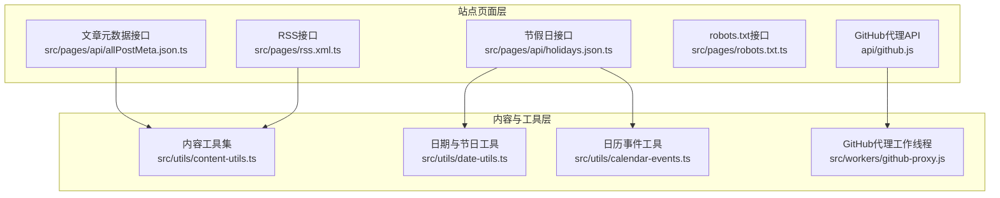
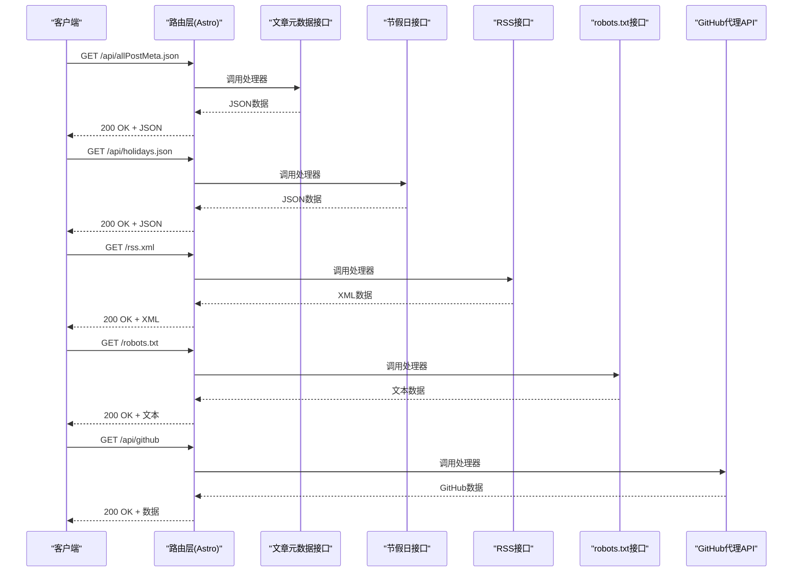
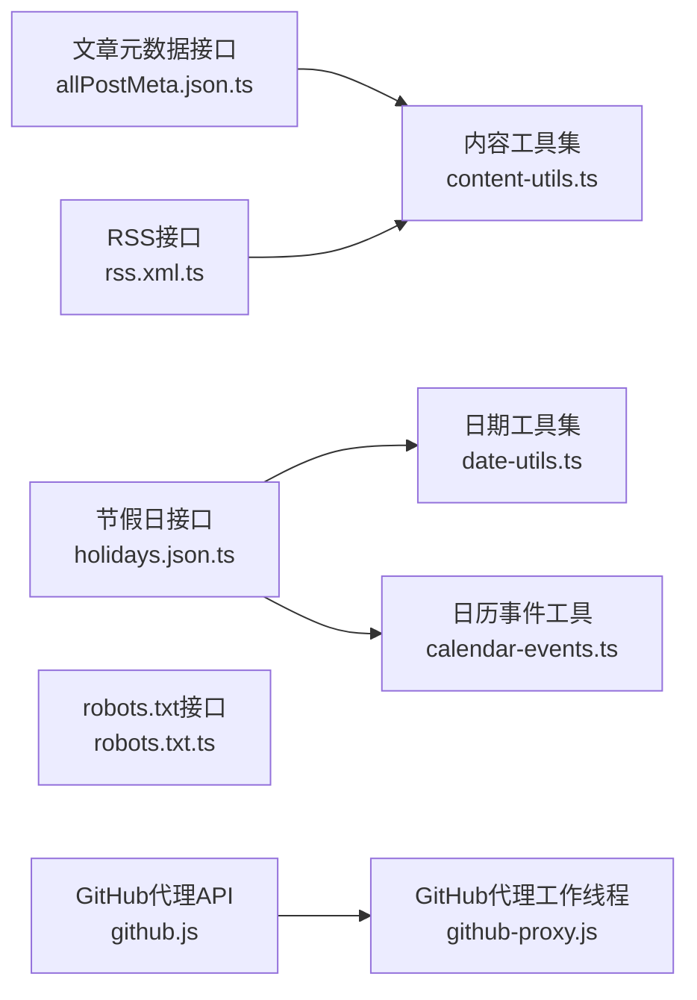

# REST API端点

<cite>
**本文引用的文件**
- [allPostMeta.json.ts](file://src/pages/api/allPostMeta.json.ts)
- [holidays.json.ts](file://src/pages/api/holidays.json.ts)
- [rss.xml.ts](file://src/pages/rss.xml.ts)
- [robots.txt.ts](file://src/pages/robots.txt.ts)
- [github.js](file://api/github.js)
- [github-proxy.js](file://src/workers/github-proxy.js)
</cite>

## 更新摘要
**变更内容**
- 更新GitHub代理API端点实现架构，从Astro API路由迁移到Edge Functions
- 修正API架构图以反映新的Edge Functions部署模式
- 更新GitHub代理API的实现细节和部署配置说明

## 目录
1. [简介](#简介)
2. [项目结构](#项目结构)
3. [核心组件](#核心组件)
4. [架构总览](#架构总览)
5. [详细组件分析](#详细组件分析)
6. [GitHub代理API](#github代理api)
7. [依赖关系分析](#依赖关系分析)
8. [性能考虑](#性能考虑)
9. [故障排除指南](#故障排除指南)
10. [结论](#结论)
11. [附录](#附录)

## 简介
本文件面向Firefly-Mod项目的REST API端点，系统性梳理并说明以下静态API端点：
- 文章元数据获取接口（返回全站文章元数据）
- 节假日信息接口（返回节日配置数据）
- RSS订阅接口（返回站点RSS XML）
- robots.txt文件接口（返回爬虫规则）
- GitHub代理API（提供GitHub资源访问代理服务）

文档涵盖每个端点的HTTP方法、URL路径、请求参数、响应格式、状态码说明、请求与响应示例、设计原则、数据格式规范、错误处理机制、最佳实践与性能优化建议。

## 项目结构
这些API端点位于Astro页面目录中，采用"页面即API"的方式实现：
- 文章元数据接口：src/pages/api/allPostMeta.json.ts
- 节假日接口：src/pages/api/holidays.json.ts
- RSS接口：src/pages/rss.xml.ts
- robots.txt接口：src/pages/robots.txt.ts
- GitHub代理API：api/github.js

**图表来源**
- [allPostMeta.json.ts](file://src/pages/api/allPostMeta.json.ts)
- [holidays.json.ts](file://src/pages/api/holidays.json.ts)
- [rss.xml.ts](file://src/pages/rss.xml.ts)
- [robots.txt.ts](file://src/pages/robots.txt.ts)
- [github.js](file://api/github.js)
- [github-proxy.js](file://src/workers/github-proxy.js)

**章节来源**
- [allPostMeta.json.ts](file://src/pages/api/allPostMeta.json.ts)
- [holidays.json.ts](file://src/pages/api/holidays.json.ts)
- [rss.xml.ts](file://src/pages/rss.xml.ts)
- [robots.txt.ts](file://src/pages/robots.txt.ts)
- [github.js](file://api/github.js)

## 核心组件
本节概述五个API端点的功能职责与输出特征：
- 文章元数据接口：聚合全站文章的元数据，用于索引、归档与展示。
- 节假日接口：提供节日配置与日历事件映射，支持前端日历与提醒功能。
- RSS接口：生成站点RSS订阅XML，供阅读器订阅。
- robots.txt接口：返回爬虫访问控制规则，指导搜索引擎抓取行为。
- GitHub代理API：提供GitHub资源访问代理服务，解决跨域访问问题。

**章节来源**
- [allPostMeta.json.ts](file://src/pages/api/allPostMeta.json.ts)
- [holidays.json.ts](file://src/pages/api/holidays.json.ts)
- [rss.xml.ts](file://src/pages/rss.xml.ts)
- [robots.txt.ts](file://src/pages/robots.txt.ts)
- [github.js](file://api/github.js)

## 架构总览
五个API端点均通过Astro页面路由实现，遵循"页面即API"的约定，返回对应的数据或文本内容。其中GitHub代理API通过专用的工作线程实现，其余端点主要依赖本地内容与工具函数进行数据组装与格式化。

**图表来源**
- [allPostMeta.json.ts](file://src/pages/api/allPostMeta.json.ts)
- [holidays.json.ts](file://src/pages/api/holidays.json.ts)
- [rss.xml.ts](file://src/pages/rss.xml.ts)
- [robots.txt.ts](file://src/pages/robots.txt.ts)
- [github.js](file://api/github.js)

## 详细组件分析

### 文章元数据接口
- HTTP方法：GET
- URL路径：/api/allPostMeta.json
- 请求参数：无
- 响应类型：application/json
- 响应主体：数组对象，每项包含文章标识、标题、摘要、分类、标签、发布时间等字段
- 状态码：
  - 200：成功
  - 500：内部错误（内容读取失败或序列化异常）
- 设计原则：
  - 返回最小必要字段，便于前端快速渲染
  - 时间字段统一为可解析的时间字符串
  - 分类与标签字段保持稳定结构，避免频繁变更
- 数据格式规范：
  - 字段命名采用小驼峰
  - 日期时间遵循ISO 8601扩展格式
  - 分类与标签为字符串数组
- 错误处理：
  - 内容读取失败时返回500
  - 序列化异常时返回500
- 性能优化建议：
  - 对频繁访问的元数据进行缓存
  - 分页或分批返回，避免一次性传输过多数据
  - 使用ETag或Last-Modified进行条件请求

请求示例
- 方法：GET
- 路径：/api/allPostMeta.json
- 头部：Accept: application/json

响应示例
- 状态：200 OK
- 正文：包含文章元数据数组的JSON对象

**章节来源**
- [allPostMeta.json.ts](file://src/pages/api/allPostMeta.json.ts)

### 节假日信息接口
- HTTP方法：GET
- URL路径：/api/holidays.json
- 请求参数：无
- 响应类型：application/json
- 响应主体：包含节日列表与日历事件映射的对象
- 状态码：
  - 200：成功
  - 500：内部错误（配置读取失败或序列化异常）
- 设计原则：
  - 节日数据结构清晰，便于前端日历组件消费
  - 支持跨年与农历节日的日期计算
- 数据格式规范：
  - 日期字段使用可解析的时间字符串
  - 事件类型与颜色等属性保持一致的枚举值
- 错误处理：
  - 配置缺失或格式错误时返回500
- 性能优化建议：
  - 缓存节假日配置，减少重复计算
  - 对多语言场景预生成不同语言版本

请求示例
- 方法：GET
- 路径：/api/holidays.json
- 头部：Accept: application/json

响应示例
- 状态：200 OK
- 正文：包含节日与事件映射的JSON对象

**章节来源**
- [holidays.json.ts](file://src/pages/api/holidays.json.ts)

### RSS订阅接口
- HTTP方法：GET
- URL路径：/rss.xml
- 请求参数：无
- 响应类型：application/rss+xml 或 text/xml
- 响应主体：RSS 2.0 XML文档
- 状态码：
  - 200：成功
  - 500：内部错误（内容聚合失败或XML生成异常）
- 设计原则：
  - 遵循RSS 2.0标准，确保兼容主流阅读器
  - 标题、链接、描述、发布时间等字段完整
- 数据格式规范：
  - 发布时间使用RFC 822格式
  - 链接为绝对URL
- 错误处理：
  - 内容聚合失败时返回500
- 性能优化建议：
  - 对RSS内容进行缓存
  - 控制每期条目数量，避免过大XML

请求示例
- 方法：GET
- 路径：/rss.xml
- 头部：Accept: application/rss+xml

响应示例
- 状态：200 OK
- 正文：RSS 2.0 XML文档

**章节来源**
- [rss.xml.ts](file://src/pages/rss.xml.ts)

### robots.txt文件接口
- HTTP方法：GET
- URL路径：/robots.txt
- 请求参数：无
- 响应类型：text/plain
- 响应主体：robots.txt文本内容
- 状态码：
  - 200：成功
  - 404：未找到（理论上不会发生，因为该页面始终存在）
- 设计原则：
  - 清晰声明允许/禁止的爬取路径
  - 指向sitemap与RSS地址
- 数据格式规范：
  - 使用标准robots.txt语法
- 错误处理：
  - 文件不存在时返回404（但该页面通常不会缺失）
- 性能优化建议：
  - 无需缓存，纯文本直出即可

请求示例
- 方法：GET
- 路径：/robots.txt
- 头部：Accept: text/plain

响应示例
- 状态：200 OK
- 正文：robots.txt文本

**章节来源**
- [robots.txt.ts](file://src/pages/robots.txt.ts)

## GitHub代理API

### API概述
GitHub代理API提供了一个JavaScript实现的GitHub资源访问代理服务，用于解决跨域访问问题和提高资源加载稳定性。该API已从传统的Astro API路由迁移到Edge Functions架构，提供更好的性能和可扩展性。

### 接口规范
- HTTP方法：GET
- URL路径：/api/github
- 请求参数：
  - `url`：必需，目标GitHub资源的完整URL
  - `token`：可选，GitHub访问令牌
- 响应类型：根据目标资源类型动态确定
- 响应主体：原始GitHub资源内容
- 状态码：
  - 200：成功
  - 400：请求参数无效
  - 401：认证失败
  - 500：代理服务器错误

### 实现架构
GitHub代理API通过Edge Functions实现，采用现代化的无服务器架构，提供更好的性能和可扩展性：

**图表来源**
- [github.js](file://api/github.js)
- [github-proxy.js](file://src/workers/github-proxy.js)

### 设计原则
- **跨域解决方案**：通过Edge Functions代理绕过浏览器同源策略限制
- **安全控制**：支持GitHub访问令牌验证，保护私有资源访问
- **性能优化**：利用Edge Functions的边缘计算能力，就近处理请求
- **错误处理**：提供详细的错误信息和重试机制

### 数据格式规范
- 输入参数必须是有效的URL格式
- 支持GitHub API的所有资源类型
- 自动处理响应头信息的转发
- 保持原始资源的完整性

### 错误处理机制
- URL格式验证失败时返回400状态码
- GitHub认证失败时返回401状态码
- 网络超时或连接失败时返回500状态码
- 提供详细的错误消息和调试信息

### 性能优化建议
- 利用Edge Functions的全局边缘节点分布，减少延迟
- 合理设置缓存策略，平衡新鲜度与性能
- 实施请求限流，防止滥用
- 使用连接池管理GitHub API连接
- 实现智能重试机制，提高成功率

**章节来源**
- [github.js](file://api/github.js)
- [github-proxy.js](file://src/workers/github-proxy.js)

## 依赖关系分析
五个API端点的依赖关系如下：

**图表来源**
- [allPostMeta.json.ts](file://src/pages/api/allPostMeta.json.ts)
- [holidays.json.ts](file://src/pages/api/holidays.json.ts)
- [rss.xml.ts](file://src/pages/rss.xml.ts)
- [robots.txt.ts](file://src/pages/robots.txt.ts)
- [github.js](file://api/github.js)
- [github-proxy.js](file://src/workers/github-proxy.js)

**章节来源**
- [allPostMeta.json.ts](file://src/pages/api/allPostMeta.json.ts)
- [holidays.json.ts](file://src/pages/api/holidays.json.ts)
- [rss.xml.ts](file://src/pages/rss.xml.ts)
- [robots.txt.ts](file://src/pages/robots.txt.ts)
- [github.js](file://api/github.js)

## 性能考虑
- 缓存策略
  - 对于文章元数据与节假日接口，建议启用短期缓存（如5-15分钟），以降低内容聚合开销
  - RSS接口可采用更长缓存周期（如1小时），并结合ETag实现条件更新
  - GitHub代理API建议实施智能缓存策略，根据资源类型和更新频率调整缓存时间
- 压缩与传输
  - 在网关或服务器侧启用Gzip/Brotli压缩，减小JSON/XML体积
  - GitHub代理API支持透明压缩，减少带宽消耗
- 分页与限流
  - 文章元数据接口若数据量较大，建议提供分页参数或分批返回
  - GitHub代理API实施严格的速率限制，防止API滥用
  - 结合全局限流策略，保护后端服务稳定性
- CDN与边缘缓存
  - robots.txt与RSS可由CDN缓存，提升全球访问速度
  - GitHub代理API利用Edge Functions的边缘缓存能力
- 健康检查
  - 定期探测各接口可用性，确保内容源正常
  - GitHub代理API实施健康检查，监控上游服务状态

## 故障排除指南
- 404 Not Found
  - robots.txt接口：确认页面路由配置正确
  - GitHub代理API：检查目标URL是否有效
- 400 Bad Request
  - GitHub代理API：检查URL参数格式是否正确
- 401 Unauthorized
  - GitHub代理API：验证访问令牌有效性
- 500 Internal Server Error
  - 文章元数据接口：检查内容读取与序列化逻辑
  - 节假日接口：检查节日配置与日历事件工具调用
  - RSS接口：检查内容聚合与XML生成流程
  - GitHub代理API：检查工作线程状态和网络连接
- 响应异常
  - JSON格式错误：确认字段命名与时间格式
  - XML格式错误：核对RSS模板与命名空间
  - GitHub代理API：检查上游API响应格式
- 日志与监控
  - 记录请求耗时、错误堆栈与异常次数
  - 设置告警阈值，及时发现服务异常
  - GitHub代理API实施详细的请求追踪

## 结论
本文档系统梳理了Firefly-Mod项目的五个API端点，明确了其职责、接口规范、数据格式与错误处理机制。特别地，新增的GitHub代理API已从Astro API路由迁移到Edge Functions架构，提供了更好的性能和可扩展性。通过合理的缓存、压缩与限流策略，可显著提升API的稳定性与性能；同时，遵循标准的RSS与robots.txt规范有助于SEO与内容分发。

## 附录
- 接口一览
  - GET /api/allPostMeta.json → 返回文章元数据数组
  - GET /api/holidays.json → 返回节日与事件映射
  - GET /rss.xml → 返回RSS 2.0 XML
  - GET /robots.txt → 返回robots.txt文本
  - GET /api/github → GitHub资源代理访问
- 最佳实践
  - 使用条件请求（If-None-Match/If-Modified-Since）减少带宽消耗
  - 对外暴露的接口尽量固定字段与格式，避免破坏性变更
  - 在网关层统一接入鉴权与限流，保障后端稳定
  - GitHub代理API使用访问令牌保护私有资源
  - 实施合理的缓存策略，平衡性能与数据新鲜度