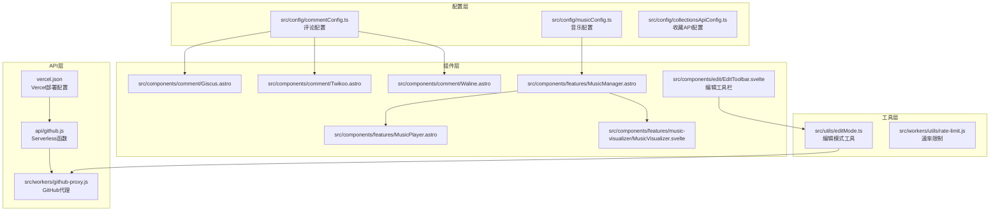
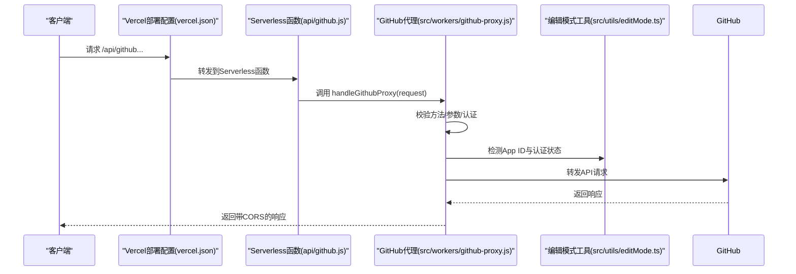
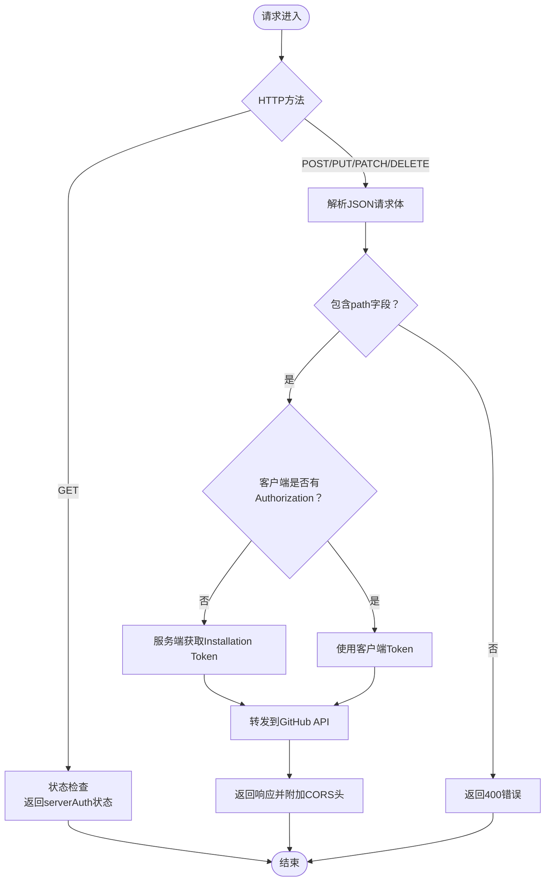
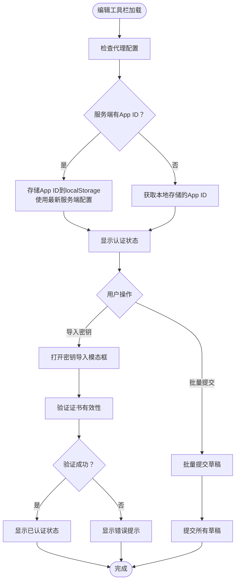
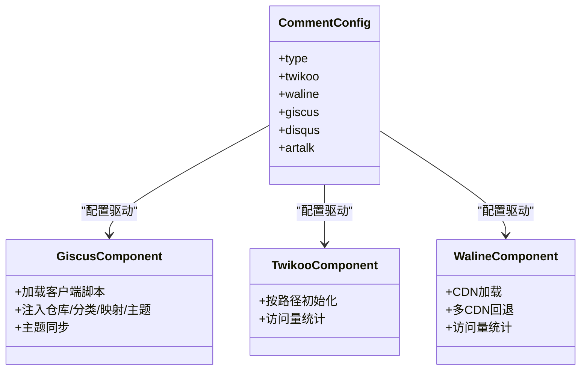
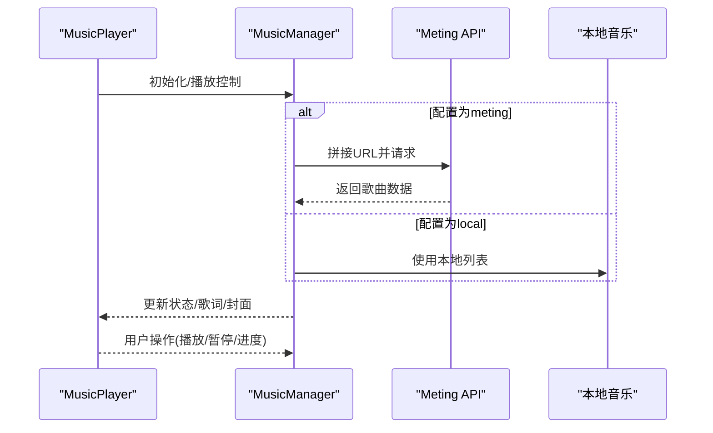
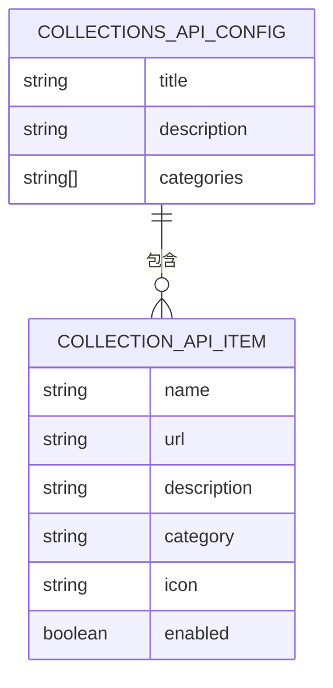
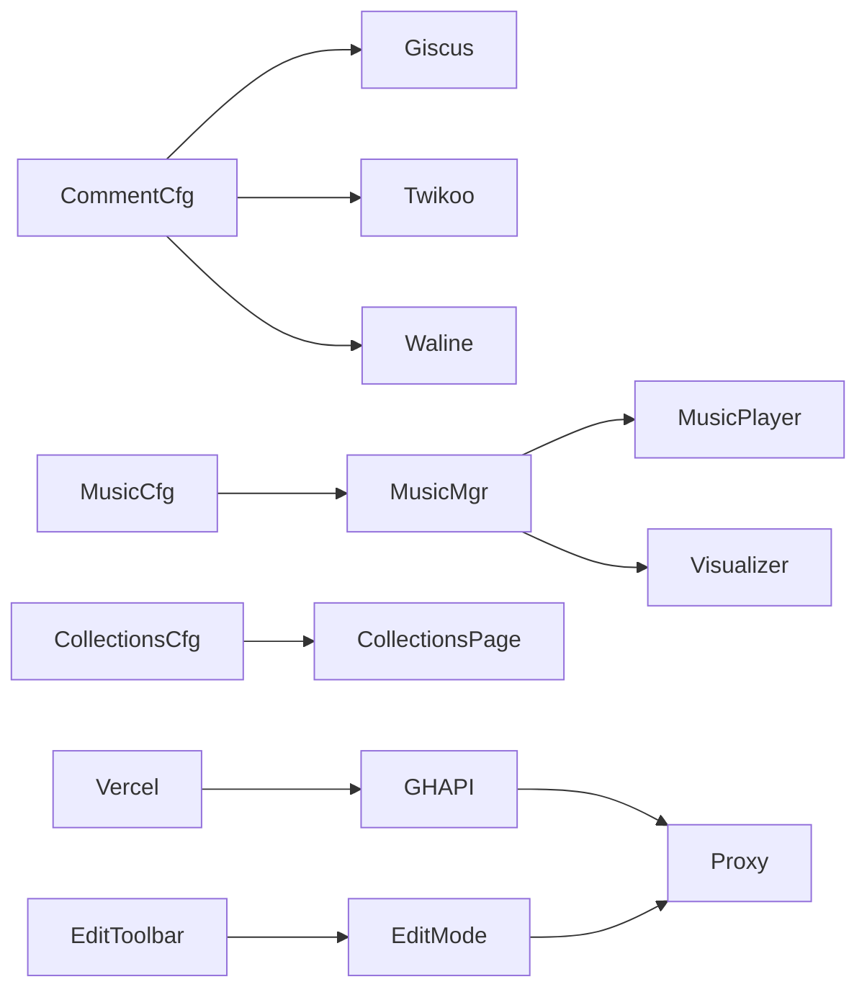

# 第三方集成API

<cite>
**本文档引用的文件**
- [api/github.js](file://api/github.js)
- [src/workers/github-proxy.js](file://src/workers/github-proxy.js)
- [src/worker.js](file://src/worker.js)
- [src/config/commentConfig.ts](file://src/config/commentConfig.ts)
- [src/components/comment/Giscus.astro](file://src/components/comment/Giscus.astro)
- [src/components/comment/Twikoo.astro](file://src/components/comment/Twikoo.astro)
- [src/components/comment/Waline.astro](file://src/components/comment/Waline.astro)
- [src/config/musicConfig.ts](file://src/config/musicConfig.ts)
- [src/components/features/MusicManager.astro](file://src/components/features/MusicManager.astro)
- [src/components/features/MusicPlayer.astro](file://src/components/features/MusicPlayer.astro)
- [src/components/features/music-visualizer/MusicVisualizer.svelte](file://src/components/features/music-visualizer/MusicVisualizer.svelte)
- [src/config/collectionsApiConfig.ts](file://src/config/collectionsApiConfig.ts)
- [src/types/config.ts](file://src/types/config.ts)
- [src/utils/editMode.ts](file://src/utils/editMode.ts)
- [src/pages/admin/index.astro](file://src/pages/admin/index.astro)
- [src/workers/utils/rate-limit.js](file://src/workers/utils/rate-limit.js)
- [src/components/edit/EditToolbar.svelte](file://src/components/edit/EditToolbar.svelte)
- [vercel.json](file://vercel.json)
- [wrangler.toml](file://wrangler.toml)
</cite>

## 更新摘要
**变更内容**
- 更新GitHub代理服务实现方式：从Cloudflare Workers迁移到Vercel Serverless Functions
- 更新架构总览图以反映新的部署架构
- 更新依赖关系分析以体现Vercel部署配置
- 更新故障排查指南中的部署相关配置检查
- **更新** 编辑工具栏App ID存储逻辑改进：增强服务端App ID检测与存储机制，避免使用过期缓存值

## 目录
1. [简介](#简介)
2. [项目结构](#项目结构)
3. [核心组件](#核心组件)
4. [架构总览](#架构总览)
5. [详细组件分析](#详细组件分析)
6. [依赖关系分析](#依赖关系分析)
7. [性能考虑](#性能考虑)
8. [故障排查指南](#故障排查指南)
9. [结论](#结论)
10. [附录](#附录)

## 简介
本文件面向Firefly-Mod项目的第三方集成API，系统性梳理以下方面：
- GitHub API集成：代理服务、服务端App认证、客户端令牌管理与测试
- 评论系统集成：Giscus、Twikoo、Waline等第三方评论服务的配置与接口
- 音乐服务集成：Meting API与本地音乐播放器的数据源与播放控制
- 收藏夹API集成：收藏列表的数据格式与分类管理
- 编辑工具栏集成：GitHub代理App ID检测功能与用户界面提示信息
- 配置参数、认证方式与错误处理策略
- API限制、速率控制与故障转移方案
- 集成示例与常见问题解决方案

## 项目结构
项目采用模块化组织，第三方集成相关代码主要分布在以下位置：
- API层：Vercel Serverless Functions入口与GitHub代理
- 配置层：评论系统、音乐播放器、收藏夹API的配置文件
- 组件层：评论组件、音乐播放器与可视化组件
- 工具层：速率限制、编辑模式中的GitHub认证工具
- 编辑工具栏：GitHub代理App ID检测与用户界面提示

**图表来源**
- [vercel.json:1-50](file://vercel.json#L1-L50)
- [api/github.js:1-10](file://api/github.js#L1-L10)
- [src/workers/github-proxy.js:1-254](file://src/workers/github-proxy.js#L1-L254)
- [src/config/commentConfig.ts:1-79](file://src/config/commentConfig.ts#L1-L79)
- [src/config/musicConfig.ts:1-62](file://src/config/musicConfig.ts#L1-L62)
- [src/config/collectionsApiConfig.ts:1-453](file://src/config/collectionsApiConfig.ts#L1-L453)
- [src/components/comment/Giscus.astro:1-74](file://src/components/comment/Giscus.astro#L1-L74)
- [src/components/comment/Twikoo.astro:1-94](file://src/components/comment/Twikoo.astro#L1-L94)
- [src/components/comment/Waline.astro:1-42](file://src/components/comment/Waline.astro#L1-L42)
- [src/components/features/MusicManager.astro:1-170](file://src/components/features/MusicManager.astro#L1-L170)
- [src/components/features/MusicPlayer.astro:1-755](file://src/components/features/MusicPlayer.astro#L1-L755)
- [src/components/features/music-visualizer/MusicVisualizer.svelte:1-92](file://src/components/features/music-visualizer/MusicVisualizer.svelte#L1-L92)
- [src/components/edit/EditToolbar.svelte:1-312](file://src/components/edit/EditToolbar.svelte#L1-L312)
- [src/utils/editMode.ts:1-617](file://src/utils/editMode.ts#L1-L617)
- [src/workers/utils/rate-limit.js:1-45](file://src/workers/utils/rate-limit.js#L1-L45)

**章节来源**
- [vercel.json:1-50](file://vercel.json#L1-L50)
- [api/github.js:1-10](file://api/github.js#L1-L10)
- [src/workers/github-proxy.js:1-254](file://src/workers/github-proxy.js#L1-L254)
- [src/config/commentConfig.ts:1-79](file://src/config/commentConfig.ts#L1-L79)
- [src/config/musicConfig.ts:1-62](file://src/config/musicConfig.ts#L1-L62)
- [src/config/collectionsApiConfig.ts:1-453](file://src/config/collectionsApiConfig.ts#L1-L453)

## 核心组件
- GitHub代理与认证：提供统一的GitHub API代理，支持服务端GitHub App认证与客户端令牌管理，具备CORS与错误处理
- 评论系统：Giscus、Twikoo、Waline三种评论系统，均通过配置文件启用与参数化
- 音乐播放器：支持Meting API与本地音乐两种模式，提供播放控制、歌词与可视化
- 收藏夹API：集中管理外部API链接，支持分类与图标
- 编辑工具栏：集成GitHub代理App ID检测功能，提供增强的用户界面提示信息
- 速率限制：通用速率限制工具，支持多场景配置

**章节来源**
- [src/workers/github-proxy.js:1-254](file://src/workers/github-proxy.js#L1-L254)
- [src/config/commentConfig.ts:1-79](file://src/config/commentConfig.ts#L1-L79)
- [src/config/musicConfig.ts:1-62](file://src/config/musicConfig.ts#L1-L62)
- [src/config/collectionsApiConfig.ts:1-453](file://src/config/collectionsApiConfig.ts#L1-L453)
- [src/components/edit/EditToolbar.svelte:1-312](file://src/components/edit/EditToolbar.svelte#L1-L312)
- [src/utils/editMode.ts:1-617](file://src/utils/editMode.ts#L1-L617)
- [src/workers/utils/rate-limit.js:1-45](file://src/workers/utils/rate-limit.js#L1-L45)

## 架构总览
整体架构围绕"配置驱动 + 组件封装 + 代理服务"的模式展开：
- 配置层定义第三方服务参数与启用状态
- 组件层负责前端渲染与交互
- 代理层统一处理认证、CORS与错误
- 工具层提供通用能力（速率限制、编辑模式）
- **更新** 部署层采用Vercel Serverless Functions替代Cloudflare Workers

**图表来源**
- [vercel.json:1-50](file://vercel.json#L1-L50)
- [api/github.js:1-10](file://api/github.js#L1-L10)
- [src/workers/github-proxy.js:156-213](file://src/workers/github-proxy.js#L156-L213)
- [src/utils/editMode.ts:344-365](file://src/utils/editMode.ts#L344-L365)

## 详细组件分析

### GitHub API集成
- 代理入口
  - **更新** Vercel Serverless Functions入口：通过vercel.json配置路由到/api/github及其子路径
  - Serverless函数：简化包装handleGithubProxy，兼容原有接口
- 认证机制
  - 服务端GitHub App认证：通过环境变量GH_APP_ID与GH_PRIVATE_KEY生成JWT并获取Installation Token，自动附加到请求头
  - 客户端令牌：若未提供Authorization，优先使用服务端Token；否则使用客户端提供的Token
  - CORS：支持跨域请求与预检OPTIONS
- 错误处理
  - JSON解析失败、缺少必要字段、代理请求失败等均有明确错误响应
- 客户端测试
  - 管理后台提供Token连接测试，验证Gist访问权限

**图表来源**
- [src/workers/github-proxy.js:160-213](file://src/workers/github-proxy.js#L160-L213)
- [api/github.js:7-9](file://api/github.js#L7-L9)

**章节来源**
- [vercel.json:1-50](file://vercel.json#L1-L50)
- [api/github.js:1-10](file://api/github.js#L1-L10)
- [src/workers/github-proxy.js:1-254](file://src/workers/github-proxy.js#L1-L254)
- [src/utils/editMode.ts:197-218](file://src/utils/editMode.ts#L197-L218)
- [src/pages/admin/index.astro:1358-1639](file://src/pages/admin/index.astro#L1358-L1639)

### 编辑工具栏集成
- GitHub代理App ID检测功能
  - **更新** 增强的服务端App ID检测与存储机制：当服务端代理配置了GitHub App ID时，客户端会自动检测并存储该ID，避免使用过期的缓存值
  - 增强的用户界面提示：编辑工具栏根据认证状态显示不同的按钮样式和提示信息
  - App ID优先级：优先使用服务端配置的App ID，如果不存在则使用用户手动输入的App ID
- 用户界面提示信息
  - 已认证状态：显示"已认证"按钮，绿色样式，提示"已导入私钥，点击管理"
  - 未认证状态：显示"导入密钥"按钮，红色样式，提示"点击导入 GitHub App 私钥"
  - 批量提交状态：显示草稿数量徽章，实时更新
- 认证流程
  - 检查代理配置：通过checkProxyConfigured方法检测代理服务器的认证状态
  - **更新** App ID存储优化：将服务端App ID自动存储到localStorage中，确保使用最新的服务端配置
  - 私钥导入：支持从本地文件导入.pem格式的私钥文件
  - 认证验证：验证App ID和私钥的有效性，生成临时安装令牌

**图表来源**
- [src/components/edit/EditToolbar.svelte:143-188](file://src/components/edit/EditToolbar.svelte#L143-L188)
- [src/utils/editMode.ts:344-365](file://src/utils/editMode.ts#L344-L365)
- [src/utils/editMode.ts:285-299](file://src/utils/editMode.ts#L285-L299)

**章节来源**
- [src/components/edit/EditToolbar.svelte:1-312](file://src/components/edit/EditToolbar.svelte#L1-L312)
- [src/utils/editMode.ts:235-282](file://src/utils/editMode.ts#L235-L282)
- [src/utils/editMode.ts:344-365](file://src/utils/editMode.ts#L344-L365)

### 评论系统集成
- 配置项
  - 评论类型：twikoo、waline、giscus、disqus、artalk
  - 各系统的关键参数：仓库、分类、语言、表情、登录模式、访问量统计等
- Giscus
  - 通过客户端脚本加载，动态注入仓库、分类、映射、主题等参数
  - 支持主题同步与Swup页面切换后的重新加载
- Twikoo
  - 通过CDN引入，按页面路径动态初始化
  - 支持访问量统计与Swup重载
- Waline
  - 通过CDN加载，支持多CDN回退与访问量统计

**图表来源**
- [src/config/commentConfig.ts:3-78](file://src/config/commentConfig.ts#L3-L78)
- [src/components/comment/Giscus.astro:14-72](file://src/components/comment/Giscus.astro#L14-L72)
- [src/components/comment/Twikoo.astro:21-92](file://src/components/comment/Twikoo.astro#L21-L92)
- [src/components/comment/Waline.astro:21-41](file://src/components/comment/Waline.astro#L21-L41)

**章节来源**
- [src/config/commentConfig.ts:1-79](file://src/config/commentConfig.ts#L1-L79)
- [src/components/comment/Giscus.astro:1-74](file://src/components/comment/Giscus.astro#L1-L74)
- [src/components/comment/Twikoo.astro:1-94](file://src/components/comment/Twikoo.astro#L1-L94)
- [src/components/comment/Waline.astro:1-42](file://src/components/comment/Waline.astro#L1-L42)

### 音乐服务集成
- 配置模式
  - meting：通过Meting API获取音乐数据，支持备用API
  - local：使用本地音乐列表，支持封面与歌词
- 数据源与播放控制
  - MusicManager：根据配置选择数据源，发起Meting API请求或使用本地列表
  - MusicPlayer：提供UI控件与事件分发，支持播放/暂停、进度、音量、歌词与播放列表
  - MusicVisualizer：基于AudioContext与Three.js的可视化组件，随主题切换与首次交互自动恢复音频上下文
- 交互流程

**图表来源**
- [src/config/musicConfig.ts:25-61](file://src/config/musicConfig.ts#L25-L61)
- [src/components/features/MusicManager.astro:132-169](file://src/components/features/MusicManager.astro#L132-L169)
- [src/components/features/MusicPlayer.astro:528-586](file://src/components/features/MusicPlayer.astro#L528-L586)
- [src/components/features/music-visualizer/MusicVisualizer.svelte:17-31](file://src/components/features/music-visualizer/MusicVisualizer.svelte#L17-L31)

**章节来源**
- [src/config/musicConfig.ts:1-62](file://src/config/musicConfig.ts#L1-L62)
- [src/components/features/MusicManager.astro:1-170](file://src/components/features/MusicManager.astro#L1-L170)
- [src/components/features/MusicPlayer.astro:1-755](file://src/components/features/MusicPlayer.astro#L1-L755)
- [src/components/features/music-visualizer/MusicVisualizer.svelte:1-92](file://src/components/features/music-visualizer/MusicVisualizer.svelte#L1-L92)

### 收藏夹API集成
- 数据结构
  - CollectionApiItem：包含名称、URL、描述、分类、图标、启用状态
  - CollectionsApiConfig：收藏列表与可选分类
- 配置示例
  - 包含测试数据、图片、AI聊天、AI、BOT、UI组件库、知识库、动漫漫画、API等分类
  - 通过favicon服务生成图标
- 使用方式
  - 在页面中读取配置并渲染收藏列表，支持分类筛选与图标展示

**图表来源**
- [src/types/config.ts:903-919](file://src/types/config.ts#L903-L919)
- [src/config/collectionsApiConfig.ts:13-448](file://src/config/collectionsApiConfig.ts#L13-L448)

**章节来源**
- [src/types/config.ts:903-919](file://src/types/config.ts#L903-L919)
- [src/config/collectionsApiConfig.ts:1-453](file://src/config/collectionsApiConfig.ts#L1-L453)

## 依赖关系分析
- 组件与配置
  - 评论组件依赖commentConfig.ts中的对应系统配置
  - 音乐组件依赖musicConfig.ts中的播放器与数据源配置
  - 收藏API依赖collectionsApiConfig.ts中的列表与分类
  - 编辑工具栏依赖editMode.ts中的认证工具
- 代理与认证
  - **更新** GitHub代理通过Vercel部署配置与Serverless函数共同调用
  - 编辑模式工具通过代理URL与本地存储的凭据进行认证
- 速率限制
  - 通用工具提供统一的速率限制逻辑，可复用到不同场景

**图表来源**
- [src/config/commentConfig.ts:1-79](file://src/config/commentConfig.ts#L1-L79)
- [src/config/musicConfig.ts:1-62](file://src/config/musicConfig.ts#L1-L62)
- [src/config/collectionsApiConfig.ts:1-453](file://src/config/collectionsApiConfig.ts#L1-L453)
- [vercel.json:1-50](file://vercel.json#L1-L50)
- [api/github.js:1-10](file://api/github.js#L1-L10)
- [src/workers/github-proxy.js:1-254](file://src/workers/github-proxy.js#L1-L254)
- [src/utils/editMode.ts:1-617](file://src/utils/editMode.ts#L1-L617)
- [src/components/edit/EditToolbar.svelte:1-312](file://src/components/edit/EditToolbar.svelte#L1-L312)

**章节来源**
- [src/config/commentConfig.ts:1-79](file://src/config/commentConfig.ts#L1-L79)
- [src/config/musicConfig.ts:1-62](file://src/config/musicConfig.ts#L1-L62)
- [src/config/collectionsApiConfig.ts:1-453](file://src/config/collectionsApiConfig.ts#L1-L453)
- [vercel.json:1-50](file://vercel.json#L1-L50)
- [api/github.js:1-10](file://api/github.js#L1-L10)
- [src/workers/github-proxy.js:1-254](file://src/workers/github-proxy.js#L1-L254)
- [src/utils/editMode.ts:1-617](file://src/utils/editMode.ts#L1-L617)
- [src/components/edit/EditToolbar.svelte:1-312](file://src/components/edit/EditToolbar.svelte#L1-L312)

## 性能考虑
- 代理缓存
  - 服务端Installation Token具备过期时间，避免频繁获取
- 懒加载与回退
  - 评论系统支持懒加载与CDN回退，提升可用性
  - 音乐播放器支持分批渲染播放列表，减少初始渲染压力
- 可视化优化
  - 音乐可视化组件在挂载时连接音频，避免阻塞主线程
- 速率限制
  - 通用速率限制工具支持窗口与最大请求数配置，便于扩展到评论、投票等场景
- 编辑工具栏优化
  - **更新** App ID检测功能优化：增强的服务端App ID检测机制，避免使用过期缓存值，减少认证失败重试
  - 用户界面提示信息采用轻量级实现，不影响编辑体验
- **更新** Vercel部署优化
  - Serverless Functions具备自动扩缩容能力，适合突发流量
  - 冷启动优化，减少首次请求延迟

**章节来源**
- [src/workers/github-proxy.js:95-154](file://src/workers/github-proxy.js#L95-L154)
- [src/components/comment/Waline.astro:27-40](file://src/components/comment/Waline.astro#L27-L40)
- [src/components/features/MusicPlayer.astro:345-386](file://src/components/features/MusicPlayer.astro#L345-L386)
- [src/workers/utils/rate-limit.js:1-45](file://src/workers/utils/rate-limit.js#L1-L45)
- [src/utils/editMode.ts:344-365](file://src/utils/editMode.ts#L344-L365)

## 故障排查指南
- GitHub代理
  - **更新** Vercel部署配置检查：确认vercel.json中的路由配置正确指向/api/github
  - 环境变量配置：确认GH_APP_ID与GH_PRIVATE_KEY是否正确配置在Vercel项目设置中
  - Serverless函数检查：验证api/github.js函数部署状态和日志
  - Caching与预检：检查CORS头与预检请求是否通过
  - 查看代理错误响应中的message字段定位问题
- 编辑工具栏
  - **更新** App ID检测失败：检查服务端代理配置，确认GitHub App ID是否正确设置，确保使用最新的服务端配置而非过期缓存
  - 私钥导入失败：确认.pem文件格式正确，私钥内容完整
  - 认证状态异常：清除localStorage中的认证信息，重新导入证书
  - 批量提交失败：检查草稿数据完整性，确认GitHub权限配置
- 评论系统
  - Giscus：确认仓库、分类ID与映射参数正确，检查主题同步逻辑
  - Twikoo：确认envId与路径参数，查看初始化回调错误
  - Waline：确认CDN可用性与访问量统计开关
- 音乐播放器
  - Meting API：检查备用API配置与网络连通性
  - 本地音乐：确认文件路径与跨域访问
- 速率限制
  - 检查KV存储是否可用，确认窗口与最大请求数配置
- **新增** Vercel部署相关
  - 检查Vercel项目构建日志，确认Serverless Functions编译通过
  - 验证环境变量在Vercel仪表板中的配置状态
  - 查看Vercel Analytics中的函数执行指标和错误率

**章节来源**
- [vercel.json:1-50](file://vercel.json#L1-L50)
- [src/workers/github-proxy.js:156-253](file://src/workers/github-proxy.js#L156-L253)
- [src/components/edit/EditToolbar.svelte:174-188](file://src/components/edit/EditToolbar.svelte#L174-L188)
- [src/utils/editMode.ts:285-299](file://src/utils/editMode.ts#L285-L299)
- [src/components/comment/Giscus.astro:14-72](file://src/components/comment/Giscus.astro#L14-L72)
- [src/components/comment/Twikoo.astro:40-61](file://src/components/comment/Twikoo.astro#L40-L61)
- [src/components/comment/Waline.astro:27-40](file://src/components/comment/Waline.astro#L27-L40)
- [src/components/features/MusicManager.astro:132-169](file://src/components/features/MusicManager.astro#L132-L169)
- [src/workers/utils/rate-limit.js:8-44](file://src/workers/utils/rate-limit.js#L8-L44)

## 结论
本项目通过配置驱动的方式，将GitHub API、评论系统、音乐播放、收藏夹API与编辑工具栏进行了模块化集成。**更新** 部署架构已从Cloudflare Workers迁移到Vercel Serverless Functions，提供了更好的自动扩缩容能力和更稳定的运行时环境。代理层统一处理认证与CORS，组件层提供灵活的参数化配置与良好的用户体验。**更新** 新增的编辑工具栏GitHub代理App ID检测功能进一步增强了用户的认证体验，通过智能的App ID检测和增强的用户界面提示信息，使编辑模式下的GitHub认证更加直观和可靠。改进的App ID存储逻辑确保始终使用服务端提供的最新配置，避免使用过期的缓存值，提升了认证的准确性和可靠性。结合速率限制与故障回退机制，整体具备较好的稳定性与可维护性。

## 附录
- 配置参数速查
  - GitHub代理：GH_APP_ID、GH_PRIVATE_KEY、GH_USER、GH_REPO
  - 评论系统：type、twikoo、waline、giscus、disqus、artalk
  - 音乐播放器：mode、meting、local、volume、playMode、showLyrics
  - 收藏API：apis、categories
  - 编辑工具栏：repoConfig.appId、localStorage存储键值
  - **更新** Vercel部署：vercel.json路由配置、环境变量设置
- 集成示例
  - 在管理后台测试GitHub Token有效性
  - 在评论组件中按需启用twikoo、waline或giscus
  - 在音乐配置中选择本地或Meting数据源
  - 在编辑工具栏中导入GitHub App私钥，自动检测App ID
  - 使用增强的用户界面提示信息进行认证状态管理
  - **更新** 配置Vercel部署：在vercel.json中设置/api/github路由规则
  - **更新** 确保编辑工具栏使用最新的服务端App ID配置，避免过期缓存影响认证

**章节来源**
- [vercel.json:1-50](file://vercel.json#L1-L50)
- [src/pages/admin/index.astro:1358-1639](file://src/pages/admin/index.astro#L1358-L1639)
- [src/config/commentConfig.ts:1-79](file://src/config/commentConfig.ts#L1-L79)
- [src/config/musicConfig.ts:1-62](file://src/config/musicConfig.ts#L1-L62)
- [src/config/collectionsApiConfig.ts:1-453](file://src/config/collectionsApiConfig.ts#L1-L453)
- [src/components/edit/EditToolbar.svelte:143-188](file://src/components/edit/EditToolbar.svelte#L143-L188)
- [src/utils/editMode.ts:344-365](file://src/utils/editMode.ts#L344-L365)