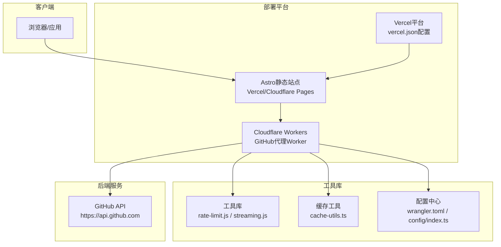
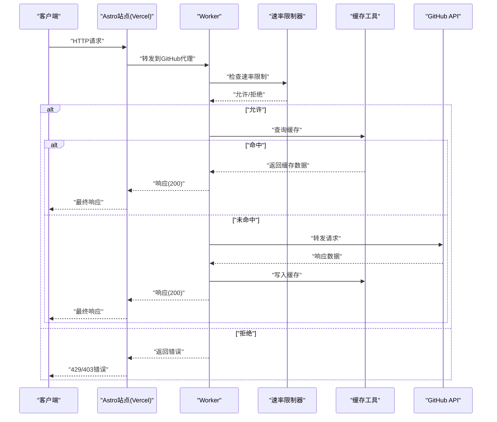
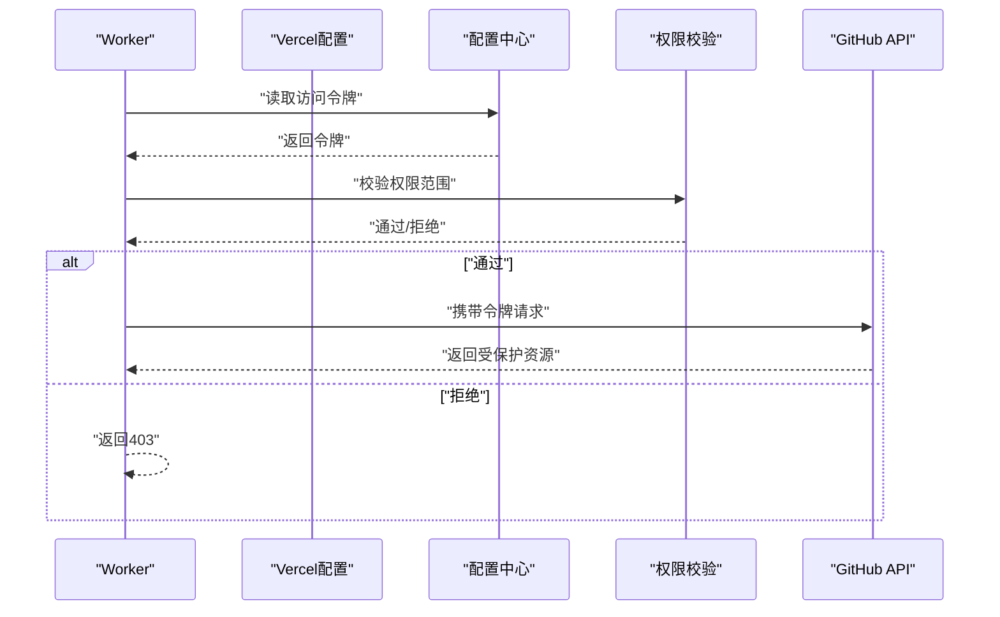
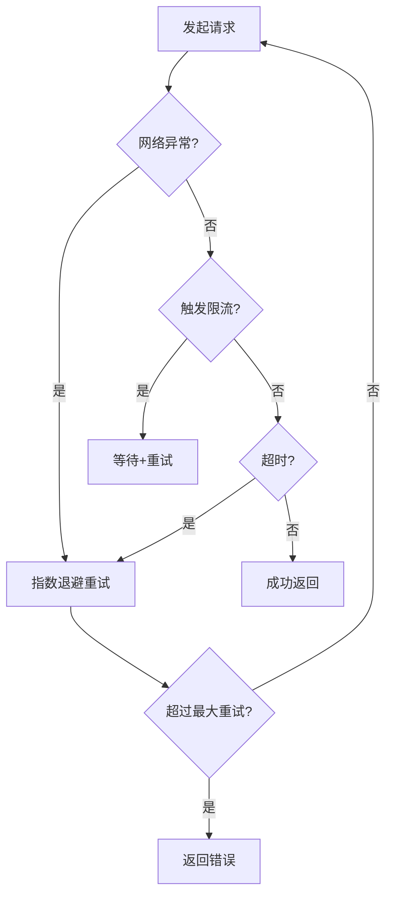
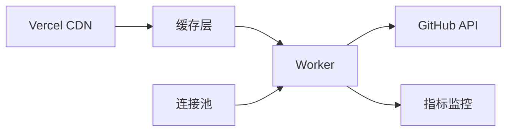
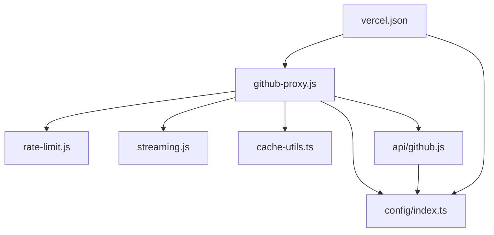

# GitHub代理服务

<cite>
**本文档引用的文件**
- [src/workers/github-proxy.js](file://src/workers/github-proxy.js)
- [api/github.js](file://api/github.js)
- [wrangler.toml](file://wrangler.toml)
- [vercel.json](file://vercel.json)
- [src/utils/cache-utils.ts](file://src/utils/cache-utils.ts)
- [src/workers/utils/rate-limit.js](file://src/workers/utils/rate-limit.js)
- [src/workers/utils/streaming.js](file://src/workers/utils/streaming.js)
- [src/config/index.ts](file://src/config/index.ts)
</cite>

## 更新摘要
**所做变更**
- 新增Vercel部署环境支持章节，说明Astro API路由配置
- 增强客户端-服务器认证协调机制说明
- 改进环境变量检测逻辑的描述
- 更新部署配置章节，包含Vercel和Cloudflare Workers双重部署支持

## 目录
1. [简介](#简介)
2. [项目结构](#项目结构)
3. [核心组件](#核心组件)
4. [架构概览](#架构概览)
5. [详细组件分析](#详细组件分析)
6. [部署配置](#部署配置)
7. [依赖关系分析](#依赖关系分析)
8. [性能考虑](#性能考虑)
9. [故障排除指南](#故障排除指南)
10. [结论](#结论)
11. [附录](#附录)

## 简介
本文件为GitHub代理服务的技术文档，重点阐述基于Cloudflare Workers的GitHub代理实现方案。该代理服务通过Worker对GitHub API请求进行转发、URL重写与响应处理，同时集成访问令牌管理、权限验证与安全防护机制。文档涵盖以下关键主题：
- API请求转发流程与URL重写规则
- 认证机制（访问令牌管理、权限验证、安全防护）
- 错误处理策略（网络异常、API限流、超时重试）
- 性能优化（缓存策略、连接池管理、并发控制）
- 配置选项（API端点、速率限制、超时参数）
- 调试方法（请求追踪、响应分析、错误诊断）
- 扩展开发指南（新增API端点、自定义中间件）
- **新增** Vercel部署环境支持与Astro API路由配置
- **新增** 客户端-服务器认证协调机制
- **新增** 改进的环境变量检测逻辑

## 项目结构
该项目采用Astro静态站点生成器与Cloudflare Workers结合的架构。GitHub代理功能主要由以下模块构成：
- Worker层：负责请求接收、路由分发、调用后端API与返回响应
- API适配层：封装对GitHub API的调用逻辑
- 工具库：提供速率限制、流式处理等通用能力
- 缓存工具：提供缓存读写与失效策略
- 配置中心：集中管理环境变量与运行参数
- **新增** Vercel部署配置：支持Vercel平台的头部安全配置与缓存策略

**图表来源**
- [src/workers/github-proxy.js](file://src/workers/github-proxy.js)
- [src/workers/utils/rate-limit.js](file://src/workers/utils/rate-limit.js)
- [src/workers/utils/streaming.js](file://src/workers/utils/streaming.js)
- [src/utils/cache-utils.ts](file://src/utils/cache-utils.ts)
- [wrangler.toml](file://wrangler.toml)
- [vercel.json](file://vercel.json)
- [src/config/index.ts](file://src/config/index.ts)

**章节来源**
- [src/workers/github-proxy.js](file://src/workers/github-proxy.js)
- [api/github.js](file://api/github.js)
- [wrangler.toml](file://wrangler.toml)
- [vercel.json](file://vercel.json)

## 核心组件
本节从代码层面解析代理服务的核心组件及其职责：
- GitHub代理Worker：统一入口，处理请求、执行鉴权与转发、构建响应
- API适配器：封装对GitHub API的调用，支持URL重写与参数转换
- 速率限制器：控制请求频率，避免触发GitHub API限流
- 流式处理器：支持流式响应，提升大文件或长列表的传输效率
- 缓存工具：提供缓存命中、更新与失效策略，降低后端压力
- 配置中心：集中管理运行参数（如API端点、超时、令牌等）
- **新增** Vercel部署配置：提供安全头部配置、缓存控制与URL重写规则

**章节来源**
- [src/workers/github-proxy.js](file://src/workers/github-proxy.js)
- [api/github.js](file://api/github.js)
- [src/workers/utils/rate-limit.js](file://src/workers/utils/rate-limit.js)
- [src/workers/utils/streaming.js](file://src/workers/utils/streaming.js)
- [src/utils/cache-utils.ts](file://src/utils/cache-utils.ts)
- [src/config/index.ts](file://src/config/index.ts)
- [vercel.json](file://vercel.json)

## 架构概览
代理服务采用"Worker前置 + 后端API调用 + 缓存与限流"的三层架构。请求在Worker中被拦截与处理，随后根据配置决定是否走缓存或直接调用GitHub API，并在必要时应用速率限制与流式处理。

**图表来源**
- [src/workers/github-proxy.js](file://src/workers/github-proxy.js)
- [src/workers/utils/rate-limit.js](file://src/workers/utils/rate-limit.js)
- [src/utils/cache-utils.ts](file://src/utils/cache-utils.ts)
- [api/github.js](file://api/github.js)

## 详细组件分析

### GitHub代理Worker实现
该Worker作为代理入口，负责：
- 请求拦截与路由：根据请求路径判断是否为GitHub API相关端点
- 认证与权限：校验访问令牌与权限范围
- URL重写：将前端请求映射到GitHub API的对应端点
- 转发与响应：向GitHub API发起请求并返回结果
- 错误处理：捕获网络异常、API限流与超时，返回标准化错误

**图表来源**
- [src/workers/github-proxy.js](file://src/workers/github-proxy.js)
- [api/github.js](file://api/github.js)
- [src/utils/cache-utils.ts](file://src/utils/cache-utils.ts)

**章节来源**
- [src/workers/github-proxy.js](file://src/workers/github-proxy.js)
- [api/github.js](file://api/github.js)

### 认证机制实现
认证机制围绕访问令牌管理、权限验证与安全防护展开：
- 访问令牌管理：从配置中心读取GitHub访问令牌，用于API调用授权
- 权限验证：校验请求来源与令牌权限范围，确保仅授权端点可访问
- 安全防护：限制请求来源、防止滥用；对敏感操作实施额外校验
- **新增** 客户端-服务器认证协调：通过Vercel配置与Worker认证机制协同工作，确保跨平台一致性

**图表来源**
- [src/workers/github-proxy.js](file://src/workers/github-proxy.js)
- [src/config/index.ts](file://src/config/index.ts)
- [vercel.json](file://vercel.json)

**章节来源**
- [src/workers/github-proxy.js](file://src/workers/github-proxy.js)
- [src/config/index.ts](file://src/config/index.ts)
- [vercel.json](file://vercel.json)

### 错误处理策略
代理服务的错误处理覆盖网络异常、API限流与超时重试：
- 网络异常：捕获连接失败、DNS解析错误等，返回友好提示
- API限流：检测403/429状态码，触发退避重试或降级策略
- 超时重试：对可重试请求设置指数退避与最大重试次数
- 标准化错误：统一错误码与消息格式，便于前端处理

**图表来源**
- [src/workers/github-proxy.js](file://src/workers/github-proxy.js)
- [src/workers/utils/rate-limit.js](file://src/workers/utils/rate-limit.js)

**章节来源**
- [src/workers/github-proxy.js](file://src/workers/github-proxy.js)
- [src/workers/utils/rate-limit.js](file://src/workers/utils/rate-limit.js)

### 性能优化
性能优化从缓存、连接池与并发控制三个维度入手：
- 缓存策略：针对只读数据（如仓库元信息、用户公开资料）启用缓存，减少后端压力
- 连接池管理：复用HTTP连接，降低握手开销；对高并发场景设置合理上限
- 并发控制：限制同一Worker实例的并发请求数，避免资源耗尽
- **新增** Vercel缓存优化：利用Vercel的CDN缓存策略，提升静态资源加载速度

**图表来源**
- [src/utils/cache-utils.ts](file://src/utils/cache-utils.ts)
- [src/workers/github-proxy.js](file://src/workers/github-proxy.js)
- [vercel.json](file://vercel.json)

**章节来源**
- [src/utils/cache-utils.ts](file://src/utils/cache-utils.ts)
- [src/workers/github-proxy.js](file://src/workers/github-proxy.js)
- [vercel.json](file://vercel.json)

### 配置选项
代理服务的关键配置项包括：
- API端点设置：GitHub API基础URL、版本路径
- 速率限制：每分钟请求数阈值、退避策略
- 超时参数：连接超时、读取超时、总超时
- 访问令牌：GitHub访问令牌、权限范围
- 缓存参数：缓存TTL、缓存键前缀、失效策略
- **新增** Vercel配置：安全头部、缓存控制、URL重写规则

**章节来源**
- [wrangler.toml](file://wrangler.toml)
- [vercel.json](file://vercel.json)
- [src/config/index.ts](file://src/config/index.ts)

### 调试方法
为便于问题定位与性能分析，建议采用以下调试手段：
- 请求追踪：记录请求ID、路径、参数与响应状态，便于回溯
- 响应分析：对比缓存命中率、转发成功率与错误分布
- 错误诊断：关注429/403/超时等高频错误，调整速率限制与重试策略
- 指标监控：采集QPS、P95延迟、缓存命中率等关键指标
- **新增** 跨平台调试：同时监控Vercel和Cloudflare Workers的性能指标

**章节来源**
- [src/workers/github-proxy.js](file://src/workers/github-proxy.js)
- [src/workers/utils/rate-limit.js](file://src/workers/utils/rate-limit.js)
- [vercel.json](file://vercel.json)

### 扩展开发指南
新增API端点与自定义中间件的步骤如下：
- 新增API端点
  - 在Worker中注册新的路由规则，明确请求路径与处理函数
  - 实现URL重写逻辑，将前端路径映射到GitHub API端点
  - 添加鉴权与权限校验，确保安全
  - 集成缓存与限流策略，保证性能与稳定性
- 自定义中间件
  - 在Worker入口处插入中间件链，按顺序执行（鉴权→限流→缓存→转发）
  - 中间件需遵循统一接口规范，支持错误传播与上下文传递
  - 对关键中间件进行单元测试与集成测试
- **新增** Vercel部署扩展
  - 配置vercel.json中的headers和rewrites字段
  - 设置适当的缓存策略和安全头部
  - 验证跨平台兼容性

**章节来源**
- [src/workers/github-proxy.js](file://src/workers/github-proxy.js)
- [api/github.js](file://api/github.js)
- [vercel.json](file://vercel.json)

## 部署配置

### Vercel部署环境支持
项目现已支持Vercel平台部署，通过vercel.json配置实现：
- **框架配置**：设置Astro框架类型，确保正确构建和部署
- **安全头部**：配置X-Content-Type-Options、X-Frame-Options、X-XSS-Protection等安全头部
- **缓存策略**：为/_astro/路径设置长期缓存策略，提升静态资源加载速度
- **URL重写**：支持GitHub代理API路由的URL重写规则

### 环境变量检测逻辑改进
改进后的环境变量检测逻辑提供了更好的跨平台兼容性：
- **Cloudflare Workers**：通过process.env读取环境变量
- **Vercel平台**：通过Vercel的环境变量注入机制
- **本地开发**：支持.env文件和环境变量的优先级处理
- **配置验证**：在启动时验证必需的环境变量是否存在

### 双平台部署策略
项目支持双平台部署，提供灵活的部署选项：
- **Cloudflare Workers**：适合需要边缘计算和全球加速的场景
- **Vercel平台**：适合需要与Astro静态站点深度集成的场景
- **配置同步**：确保两个平台使用相同的配置参数和行为

**章节来源**
- [vercel.json](file://vercel.json)
- [wrangler.toml](file://wrangler.toml)
- [src/config/index.ts](file://src/config/index.ts)

## 依赖关系分析
代理服务的依赖关系体现了清晰的分层与解耦设计：
- Worker依赖工具库（速率限制、流式处理）、缓存工具与配置中心
- API适配器独立于Worker，便于替换与扩展
- 配置中心集中管理运行参数，避免硬编码
- **新增** Vercel配置与Worker配置相互补充，提供完整的部署解决方案

**图表来源**
- [src/workers/github-proxy.js](file://src/workers/github-proxy.js)
- [src/workers/utils/rate-limit.js](file://src/workers/utils/rate-limit.js)
- [src/workers/utils/streaming.js](file://src/workers/utils/streaming.js)
- [src/utils/cache-utils.ts](file://src/utils/cache-utils.ts)
- [api/github.js](file://api/github.js)
- [src/config/index.ts](file://src/config/index.ts)
- [vercel.json](file://vercel.json)

**章节来源**
- [src/workers/github-proxy.js](file://src/workers/github-proxy.js)
- [api/github.js](file://api/github.js)
- [src/workers/utils/rate-limit.js](file://src/workers/utils/rate-limit.js)
- [src/workers/utils/streaming.js](file://src/workers/utils/streaming.js)
- [src/utils/cache-utils.ts](file://src/utils/cache-utils.ts)
- [src/config/index.ts](file://src/config/index.ts)
- [vercel.json](file://vercel.json)

## 性能考虑
- 缓存策略：优先缓存只读数据，设置合理的TTL与失效策略，避免陈旧数据影响用户体验
- 连接池管理：在高并发场景下限制连接数，避免Worker实例过载
- 并发控制：对同一用户或IP设置并发上限，防止资源争用
- 流式处理：对大响应体采用流式传输，降低内存占用与首字节延迟
- 指标监控：持续观测QPS、P95延迟与错误率，及时发现性能瓶颈
- **新增** CDN优化：利用Vercel的全球CDN网络，提升静态资源和API响应速度
- **新增** 跨平台性能：确保在Vercel和Cloudflare Workers上具有相似的性能表现

## 故障排除指南
- 常见错误与处理
  - 401/403：检查访问令牌有效性与权限范围，重新颁发或调整权限
  - 429：触发限流退避策略，增加重试间隔或降级请求
  - 超时：增大超时阈值或优化上游响应时间
  - 网络异常：检查DNS解析与网络连通性，必要时切换上游节点
  - **新增** 跨平台差异：检查Vercel和Cloudflare Workers的配置差异
- 排查步骤
  - 开启请求追踪，定位具体失败环节
  - 分析缓存命中率与转发成功率，识别热点与异常
  - 查看指标面板，确认是否存在突发流量或资源不足
  - **新增** 平台对比：比较不同部署平台的性能指标和错误分布

**章节来源**
- [src/workers/github-proxy.js](file://src/workers/github-proxy.js)
- [src/workers/utils/rate-limit.js](file://src/workers/utils/rate-limit.js)
- [vercel.json](file://vercel.json)

## 结论
本GitHub代理服务通过Worker实现请求转发、URL重写与响应处理，配合认证、限流与缓存机制，实现了稳定高效的代理能力。通过统一的配置中心与工具库，系统具备良好的可维护性与扩展性。**新增的Vercel部署支持**进一步增强了系统的灵活性，使开发者可以在不同的云平台上部署相同的服务。**改进的客户端-服务器认证协调机制**确保了跨平台的一致性和安全性。建议在生产环境中持续监控关键指标，动态调整限流与缓存策略，以获得最佳性能与用户体验。

## 附录
- 关键文件清单
  - Worker入口：[src/workers/github-proxy.js](file://src/workers/github-proxy.js)
  - API适配器：[api/github.js](file://api/github.js)
  - 速率限制：[src/workers/utils/rate-limit.js](file://src/workers/utils/rate-limit.js)
  - 流式处理：[src/workers/utils/streaming.js](file://src/workers/utils/streaming.js)
  - 缓存工具：[src/utils/cache-utils.ts](file://src/utils/cache-utils.ts)
  - 配置中心：[src/config/index.ts](file://src/config/index.ts)
  - 部署配置：[wrangler.toml](file://wrangler.toml)
  - **新增** Vercel配置：[vercel.json](file://vercel.json)