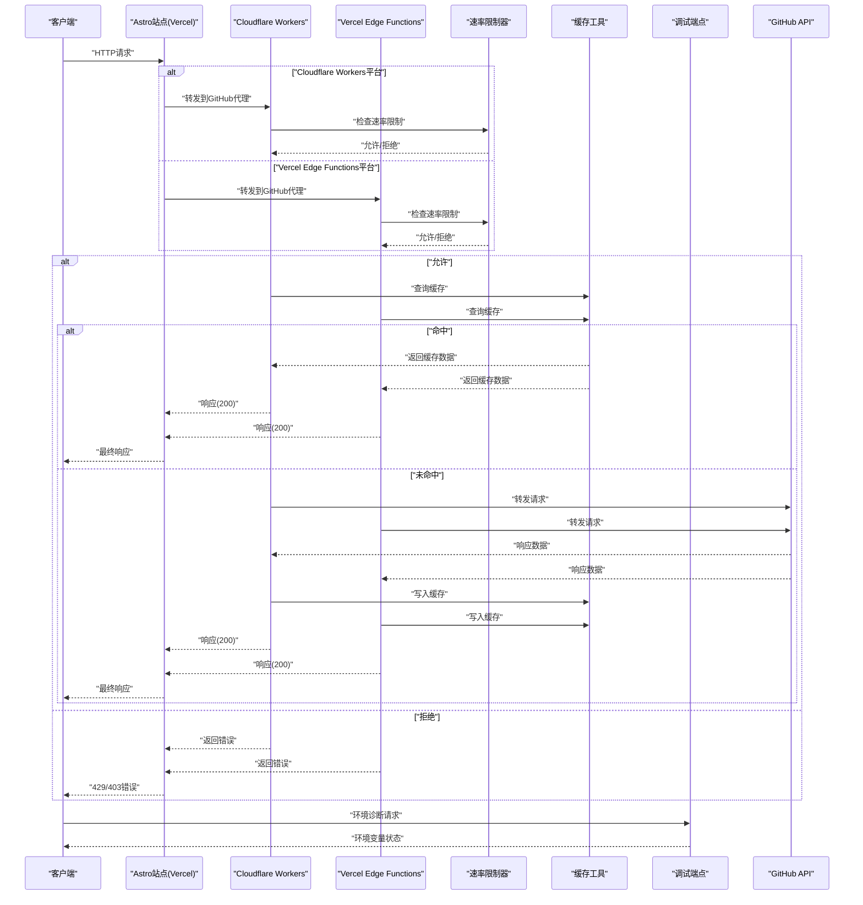
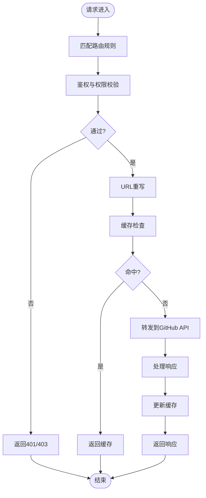
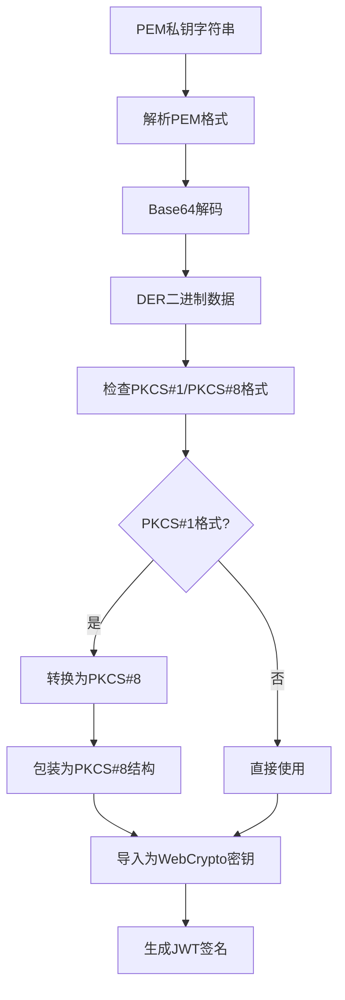
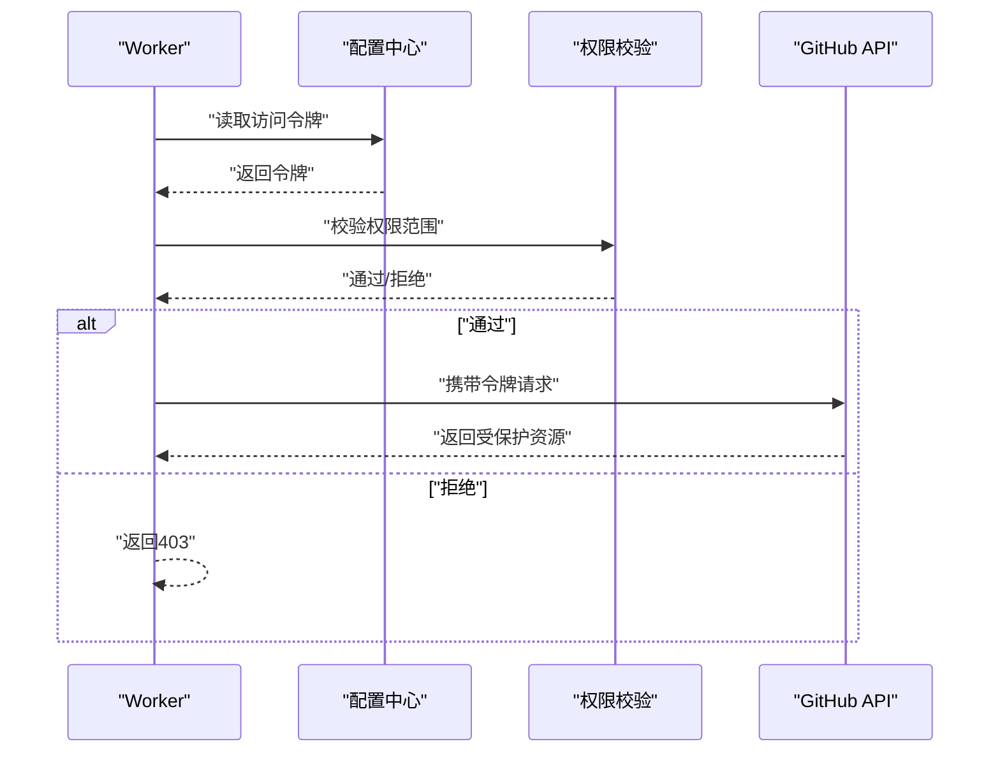
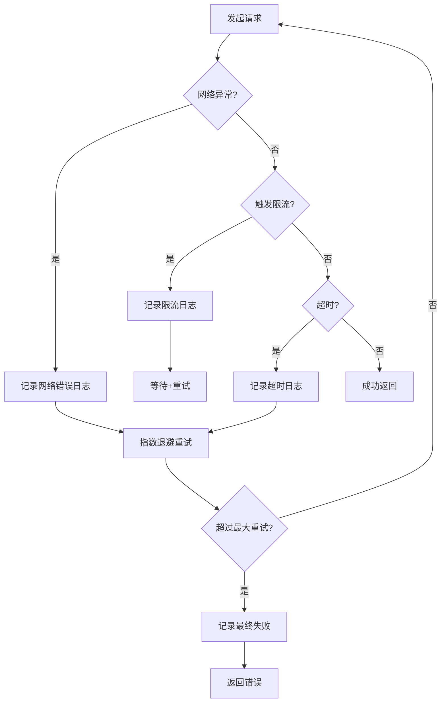
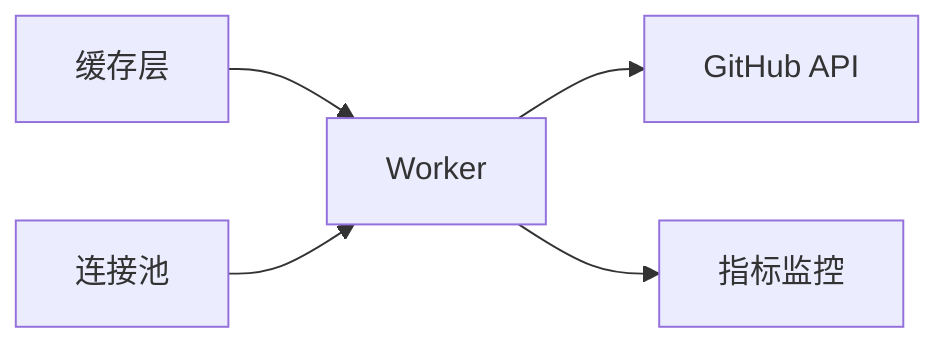
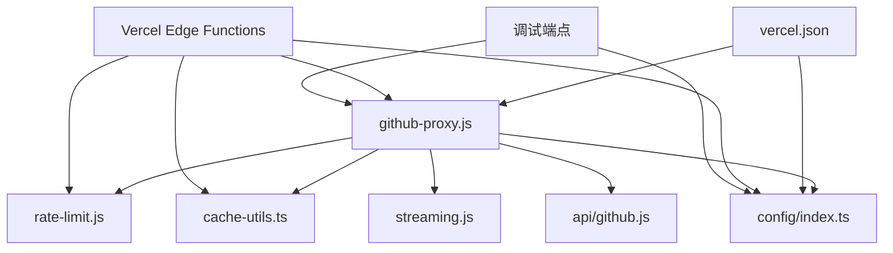

# GitHub代理服务

<cite>
**本文档引用的文件**
- [api/github.js](file://api/github.js)
- [src/workers/github-proxy.js](file://src/workers/github-proxy.js)
- [src/utils/editMode.ts](file://src/utils/editMode.ts)
- [src/utils/draftHelpers.ts](file://src/utils/draftHelpers.ts)
- [TROUBLESHOOTING.md](file://TROUBLESHOOTING.md)
- [wrangler.toml](file://wrangler.toml)
- [vercel.json](file://vercel.json)
- [src/utils/cache-utils.ts](file://src/utils/cache-utils.ts)
- [src/workers/utils/rate-limit.js](file://src/workers/utils/rate-limit.js)
- [src/workers/utils/streaming.js](file://src/workers/utils/streaming.js)
- [src/config/index.ts](file://src/config/index.ts)
</cite>

## 更新摘要
**所做变更**
- 更新架构图以反映GitHub代理API从Astro API路由迁移到Edge Functions实现
- 更新实现细节以体现新的api/github.js Edge Functions架构
- 更新部署配置章节以反映Edge Functions替代Astro API路由
- 更新核心组件分析以反映新的API适配器实现方式
- 更新故障排除指南以包含Edge Functions特有的诊断方法

## 目录
1. [简介](#简介)
2. [项目结构](#项目结构)
3. [核心组件](#核心组件)
4. [架构概览](#架构概览)
5. [详细组件分析](#详细组件分析)
6. [部署配置](#部署配置)
7. [依赖关系分析](#依赖关系分析)
8. [性能考虑](#性能考虑)
9. [故障排除指南](#故障排除指南)
10. [结论](#结论)
11. [附录](#附录)

## 简介
本文件为GitHub代理服务的技术文档，重点阐述基于Edge Functions实现的GitHub代理服务架构。该代理服务通过Cloudflare Workers和Vercel Edge Functions两种部署方式，为GitHub API请求提供转发、URL重写与响应处理，同时集成访问令牌管理、权限验证与安全防护机制。文档涵盖以下关键主题：
- 双平台架构：Cloudflare Workers与Vercel Edge Functions的协同工作
- API请求转发流程与URL重写规则
- 认证机制（访问令牌管理、权限验证、安全防护）
- 加密密钥转换功能（PKCS#1到PKCS#8格式转换、DER长度编码处理）
- 错误处理策略（网络异常、API限流、超时重试）
- 性能优化（缓存策略、连接池管理、并发控制）
- 配置选项（API端点、速率限制、超时参数）
- 调试方法（请求追踪、响应分析、错误诊断）
- 扩展开发指南（新增API端点、自定义中间件）

## 项目结构
该项目采用Astro静态站点生成器与双平台部署架构。GitHub代理功能主要由以下模块构成：
- Cloudflare Workers层：负责请求接收、路由分发、调用后端API与返回响应
- Vercel Edge Functions层：提供Vercel Edge Runtime兼容的API端点
- API适配层：封装对GitHub API的调用逻辑
- 工具库：提供速率限制、流式处理等通用能力
- 缓存工具：提供缓存读写与失效策略
- 配置中心：集中管理环境变量与运行参数
- 调试工具：提供诊断端点和详细的日志记录机制

```mermaid
graph TB
subgraph "客户端"
Browser["浏览器/应用"]
end
subgraph "部署平台"
Astro["Astro静态站点<br/>Vercel/Cloudflare Pages"]
Worker["Cloudflare Workers<br/>GitHub代理Worker"]
EdgeFunctions["Vercel Edge Functions<br/>GitHub代理API"]
Debug["调试端点<br/>环境诊断"]
end
subgraph "工具库"
Utils["工具库<br/>rate-limit.js / streaming.js"]
Cache["缓存工具<br/>cache-utils.ts"]
Config["配置中心<br/>wrangler.toml / config/index.ts"]
Log["日志记录<br/>详细错误报告"]
End
subgraph "后端服务"
GitHub["GitHub API<br/>https://api.github.com"]
end
Browser --> Astro
Astro --> Worker
Astro --> EdgeFunctions
Astro --> Debug
Worker --> Utils
Worker --> Cache
EdgeFunctions --> Utils
EdgeFunctions --> Cache
Debug --> Log
Worker --> GitHub
EdgeFunctions --> GitHub
Worker --> Config
EdgeFunctions --> Config
Debug --> Config
```

**图表来源**
- [api/github.js](file://api/github.js)
- [src/workers/github-proxy.js](file://src/workers/github-proxy.js)
- [src/workers/utils/rate-limit.js](file://src/workers/utils/rate-limit.js)
- [src/workers/utils/streaming.js](file://src/workers/utils/streaming.js)
- [src/utils/cache-utils.ts](file://src/utils/cache-utils.ts)
- [wrangler.toml](file://wrangler.toml)
- [vercel.json](file://vercel.json)
- [src/config/index.ts](file://src/config/index.ts)

**章节来源**
- [api/github.js](file://api/github.js)
- [src/workers/github-proxy.js](file://src/workers/github-proxy.js)
- [wrangler.toml](file://wrangler.toml)
- [vercel.json](file://vercel.json)

## 核心组件
本节从代码层面解析代理服务的核心组件及其职责：
- GitHub代理Worker：统一入口，处理请求、执行鉴权与转发、构建响应
- Vercel Edge Functions：提供Vercel Edge Runtime兼容的API端点，支持环境变量注入
- API适配器：封装对GitHub API的调用，支持URL重写与参数转换
- 速率限制器：控制请求频率，避免触发GitHub API限流
- 流式处理器：支持流式响应，提升大文件或长列表的传输效率
- 缓存工具：提供缓存命中、更新与失效策略，降低后端压力
- 配置中心：集中管理运行参数（如API端点、超时、令牌等）
- 调试工具：提供环境诊断端点和详细的日志记录机制

**章节来源**
- [api/github.js](file://api/github.js)
- [src/workers/github-proxy.js](file://src/workers/github-proxy.js)
- [src/workers/utils/rate-limit.js](file://src/workers/utils/rate-limit.js)
- [src/workers/utils/streaming.js](file://src/workers/utils/streaming.js)
- [src/utils/cache-utils.ts](file://src/utils/cache-utils.ts)
- [src/config/index.ts](file://src/config/index.ts)

## 架构概览
代理服务采用"双平台前置 + 后端API调用 + 缓存与限流 + 调试诊断"的四层架构。请求在两个平台中的任意一个被拦截与处理，随后根据配置决定是否走缓存或直接调用GitHub API，并在必要时应用速率限制与流式处理。调试端点提供环境变量诊断和详细的错误报告。



**图表来源**
- [api/github.js](file://api/github.js)
- [src/workers/github-proxy.js](file://src/workers/github-proxy.js)
- [src/workers/utils/rate-limit.js](file://src/workers/utils/rate-limit.js)
- [src/utils/cache-utils.ts](file://src/utils/cache-utils.ts)

## 详细组件分析

### GitHub代理Worker实现
该Worker作为代理入口，负责：
- 请求拦截与路由：根据请求路径判断是否为GitHub API相关端点
- 认证与权限：校验访问令牌与权限范围
- URL重写：将前端请求映射到GitHub API的对应端点
- 转发与响应：向GitHub API发起请求并返回结果
- 错误处理：捕获网络异常、API限流与超时，返回标准化错误



**图表来源**
- [src/workers/github-proxy.js](file://src/workers/github-proxy.js)
- [src/utils/cache-utils.ts](file://src/utils/cache-utils.ts)

**章节来源**
- [src/workers/github-proxy.js](file://src/workers/github-proxy.js)

### Vercel Edge Functions实现
**更新** Vercel Edge Functions作为新的API实现方式，提供与Cloudflare Workers相同的功能：

#### Edge Runtime配置
- **运行时设置**：配置runtime为"edge"，确保在Vercel Edge环境中运行
- **环境变量注入**：通过process.env获取GitHub相关配置参数
- **统一接口**：调用相同的handleGithubProxy函数，保持功能一致性

#### 环境变量处理
```javascript
// Vercel Edge: 通过 process.env 传递环境变量给代理
const env = {
    GH_APP_ID: process.env.GH_APP_ID || "",
    GH_PRIVATE_KEY: process.env.GH_PRIVATE_KEY || "",
    GH_USER: process.env.GH_USER || "",
    GH_REPO: process.env.GH_REPO || "",
};
```

#### Edge Functions架构优势
- **部署灵活性**：与Astro静态站点无缝集成，支持热重载
- **性能优化**：利用Vercel的全球边缘网络，提供更低延迟
- **成本效益**：按需付费，无需维护专用Worker实例
- **平台选择**：开发者可根据部署偏好选择不同实现

**章节来源**
- [api/github.js](file://api/github.js)

### 加密密钥转换功能实现
**更新** 加密密钥转换功能经过重大改进，专门处理PKCS#1到PKCS#8私钥格式转换中的关键问题：

#### INTEGER版本字段处理
- **问题背景**：PKCS#1私钥格式中的INTEGER版本字段需要正确处理，以确保与PKCS#8标准兼容
- **解决方案**：在`pkcs1ToPkcs8`函数中，明确定义了版本字段的DER编码格式
- **实现细节**：使用`VERSION = new Uint8Array([0x02, 0x01, 0x00])`确保版本号正确编码为INTEGER类型

#### DER长度编码增强
- **短格式编码**：支持小于128字节的数据使用短格式长度编码
- **长格式编码**：支持128-255字节数据使用0x81前缀的单字节扩展
- **超长格式编码**：支持256字节以上数据使用0x82前缀的双字节扩展
- **动态长度计算**：根据实际数据长度动态选择合适的长度编码方式

#### 完整转换流程


**图表来源**
- [src/workers/github-proxy.js:47-78](file://src/workers/github-proxy.js#L47-L78)
- [src/workers/github-proxy.js:80-104](file://src/workers/github-proxy.js#L80-L104)

**章节来源**
- [src/workers/github-proxy.js:47-78](file://src/workers/github-proxy.js#L47-L78)
- [src/workers/github-proxy.js:80-104](file://src/workers/github-proxy.js#L80-L104)

### 认证机制实现
认证机制围绕访问令牌管理、权限验证与安全防护展开：
- 访问令牌管理：从配置中心读取GitHub访问令牌，用于API调用授权
- 权限验证：校验请求来源与令牌权限范围，确保仅授权端点可访问
- 安全防护：限制请求来源、防止滥用；对敏感操作实施额外校验
- **更新** 加密密钥转换增强：确保私钥格式转换过程中的安全性



**图表来源**
- [src/workers/github-proxy.js](file://src/workers/github-proxy.js)
- [src/config/index.ts](file://src/config/index.ts)

**章节来源**
- [src/workers/github-proxy.js](file://src/workers/github-proxy.js)
- [src/config/index.ts](file://src/config/index.ts)

### 错误处理策略
**更新** 代理服务的错误处理策略经过全面增强，包含详细的日志记录、更好的错误消息和改进的异常处理机制：

#### 网络异常处理
- **连接失败**：捕获DNS解析错误、网络超时等，记录详细错误信息
- **重试机制**：对可恢复的网络异常实施指数退避重试
- **超时处理**：设置合理的超时阈值，避免请求挂起

#### API限流处理
- **状态码检测**：准确识别403/429状态码
- **退避策略**：实施智能退避算法，避免雪崩效应
- **降级处理**：在限流情况下提供缓存数据或降级响应

#### 超时重试机制
- **指数退避**：每次重试间隔翻倍，最多重试3次
- **最大重试次数**：防止无限重试导致资源耗尽
- **错误传播**：将重试失败的错误信息传递给上层处理

#### 文件操作错误报告
- **创建文件错误**：详细记录创建新文件时的错误状态和原因
- **更新文件错误**：提供SHA验证失败、权限不足等具体错误信息
- **删除文件错误**：记录删除操作的失败状态和可能的原因

#### 标准化错误输出
- **统一错误格式**：所有错误响应采用一致的JSON格式
- **详细错误描述**：提供具体的错误原因和解决建议
- **状态码映射**：将内部错误映射到标准HTTP状态码



**图表来源**
- [src/workers/github-proxy.js](file://src/workers/github-proxy.js)
- [src/workers/utils/rate-limit.js](file://src/workers/utils/rate-limit.js)
- [src/utils/draftHelpers.ts](file://src/utils/draftHelpers.ts)

**章节来源**
- [src/workers/github-proxy.js](file://src/workers/github-proxy.js)
- [src/workers/utils/rate-limit.js](file://src/workers/utils/rate-limit.js)
- [src/utils/draftHelpers.ts](file://src/utils/draftHelpers.ts)

### 性能优化
性能优化从缓存、连接池与并发控制三个维度入手：
- 缓存策略：针对只读数据（如仓库元信息、用户公开资料）启用缓存，减少后端压力
- 连接池管理：复用HTTP连接，降低握手开销；对高并发场景设置合理上限
- 并发控制：限制同一Worker实例的并发请求数，避免资源耗尽



**图表来源**
- [src/utils/cache-utils.ts](file://src/utils/cache-utils.ts)
- [src/workers/github-proxy.js](file://src/workers/github-proxy.js)

**章节来源**
- [src/utils/cache-utils.ts](file://src/utils/cache-utils.ts)
- [src/workers/github-proxy.js](file://src/workers/github-proxy.js)

### 配置选项
代理服务的关键配置项包括：
- API端点设置：GitHub API基础URL、版本路径
- 速率限制：每分钟请求数阈值、退避策略
- 超时参数：连接超时、读取超时、总超时
- 访问令牌：GitHub访问令牌、权限范围
- 缓存参数：缓存TTL、缓存键前缀、失效策略
- **新增** 环境变量：GH_APP_ID、GH_PRIVATE_KEY、GH_USER、GH_REPO

**章节来源**
- [wrangler.toml](file://wrangler.toml)
- [vercel.json](file://vercel.json)
- [src/config/index.ts](file://src/config/index.ts)
- [api/github.js](file://api/github.js)

### 调试方法
**更新** 为便于问题定位与性能分析，系统提供了全面的调试功能：

#### 环境诊断端点
- **诊断端点**：`/api/diagnose-env.json`用于检查环境变量配置
- **详细信息**：显示所有GitHub相关环境变量的状态和值
- **实时验证**：立即验证环境变量是否正确配置

#### 控制台日志记录
- **文件操作日志**：详细记录文件创建、更新、删除操作的完整流程
- **错误日志**：提供完整的错误堆栈和上下文信息
- **调试信息**：包含请求ID、时间戳、操作类型等调试信息

#### 网络请求分析
- **请求追踪**：记录每个请求的完整生命周期
- **响应分析**：显示HTTP状态码、响应时间和数据大小
- **错误诊断**：提供详细的错误原因和解决建议

#### Edge Functions特定调试
- **运行时诊断**：检查Edge Functions的运行时状态和配置
- **环境变量验证**：确认Vercel环境变量的正确注入
- **性能监控**：利用Vercel的内置监控工具分析请求性能

#### 具体调试步骤
1. **环境检查**：访问`/api/diagnose-env.json`验证环境变量
2. **功能测试**：使用`/api/test-github.json`测试GitHub API连接
3. **日志分析**：查看浏览器控制台和服务器日志
4. **网络监控**：使用开发者工具Network标签分析请求
5. **Edge Functions监控**：通过Vercel仪表板查看部署状态

**章节来源**
- [src/utils/editMode.ts](file://src/utils/editMode.ts)
- [src/utils/draftHelpers.ts](file://src/utils/draftHelpers.ts)
- [TROUBLESHOOTING.md](file://TROUBLESHOOTING.md)

### 扩展开发指南
新增API端点与自定义中间件的步骤如下：
- 新增API端点
  - 在Worker中注册新的路由规则，明确请求路径与处理函数
  - 实现URL重写逻辑，将前端路径映射到GitHub API端点
  - 添加鉴权与权限校验，确保安全
  - 集成缓存与限流策略，保证性能与稳定性
  - **新增** 实现详细的错误处理和日志记录
- 自定义中间件
  - 在Worker入口处插入中间件链，按顺序执行（鉴权→限流→缓存→转发）
  - 中间件需遵循统一接口规范，支持错误传播与上下文传递
  - 对关键中间件进行单元测试与集成测试
  - **新增** 添加调试日志和错误报告机制

**章节来源**
- [src/workers/github-proxy.js](file://src/workers/github-proxy.js)
- [api/github.js](file://api/github.js)

## 部署配置

### 双平台部署架构
项目现已支持双平台部署，通过不同的配置实现：
- **Cloudflare Workers**：通过wrangler.toml配置，支持完整的Worker功能
- **Vercel Edge Functions**：通过api/github.js配置，提供轻量级API端点
- **统一实现**：两个平台共享同一核心代理逻辑，确保功能一致性

### Cloudflare Workers部署环境支持
- **平台配置**：设置Cloudflare Workers运行时，确保正确构建和部署
- **安全头部**：配置X-Content-Type-Options、X-Frame-Options、X-XSS-Protection等安全头部
- **缓存策略**：为/_astro/路径设置长期缓存策略，提升静态资源加载速度
- **URL重写**：支持GitHub代理API路由的URL重写规则

### Vercel Edge Functions部署配置
**更新** Vercel Edge Functions提供现代化的部署选项：
- **运行时设置**：配置runtime为"edge"，确保在Vercel Edge环境中运行
- **环境变量**：通过process.env获取GitHub相关配置参数
- **部署灵活性**：与Astro静态站点无缝集成，支持热重载
- **性能优化**：利用Vercel的全球边缘网络，提供更低延迟

### 架构迁移：从Astro API路由到Edge Functions
项目已完成从Astro API路由到Edge Functions的架构演进：
- **Astro API路由时代**：使用src/pages/api/github.ts实现API端点
- **Edge Functions时代**：采用api/github.js实现更简洁的Edge Functions架构
- **统一核心逻辑**：所有API接口通过共享的handleGithubProxy函数实现
- **平台选择**：开发者可根据部署偏好选择不同平台

### 部署策略
项目采用双平台部署策略，提供灵活的部署选项：
- **Cloudflare Workers**：适合需要边缘计算和全球加速的场景
- **Vercel Edge Functions**：适合需要与Astro站点深度集成的场景
- **配置同步**：确保使用相同的配置参数和行为
- **平台切换**：可在不改变业务逻辑的情况下切换部署平台

**章节来源**
- [wrangler.toml](file://wrangler.toml)
- [vercel.json](file://vercel.json)
- [api/github.js](file://api/github.js)
- [src/config/index.ts](file://src/config/index.ts)

## 依赖关系分析
代理服务的依赖关系体现了清晰的分层与解耦设计：
- Worker依赖工具库（速率限制、流式处理）、缓存工具与配置中心
- API适配器独立于Worker，便于替换与扩展
- 配置中心集中管理运行参数，避免硬编码
- **新增** Vercel Edge Functions依赖相同的工具库和配置中心
- **新增** 调试端点提供环境诊断和错误报告功能



**图表来源**
- [api/github.js](file://api/github.js)
- [src/workers/github-proxy.js](file://src/workers/github-proxy.js)
- [src/workers/utils/rate-limit.js](file://src/workers/utils/rate-limit.js)
- [src/workers/utils/streaming.js](file://src/workers/utils/streaming.js)
- [src/utils/cache-utils.ts](file://src/utils/cache-utils.ts)
- [src/config/index.ts](file://src/config/index.ts)
- [vercel.json](file://vercel.json)

**章节来源**
- [api/github.js](file://api/github.js)
- [src/workers/github-proxy.js](file://src/workers/github-proxy.js)
- [src/workers/utils/rate-limit.js](file://src/workers/utils/rate-limit.js)
- [src/workers/utils/streaming.js](file://src/workers/utils/streaming.js)
- [src/utils/cache-utils.ts](file://src/utils/cache-utils.ts)
- [src/config/index.ts](file://src/config/index.ts)
- [vercel.json](file://vercel.json)

## 性能考虑
- 缓存策略：优先缓存只读数据，设置合理的TTL与失效策略，避免陈旧数据影响用户体验
- 连接池管理：在高并发场景下限制连接数，避免Worker实例过载
- 并发控制：对同一用户或IP设置并发上限，防止资源争用
- 流式处理：对大响应体采用流式传输，降低内存占用与首字节延迟
- 指标监控：持续观测QPS、P95延迟与错误率，及时发现性能瓶颈
- **新增** 平台选择：根据部署平台特性选择最优的性能配置
- **新增** Edge Functions优化：利用Vercel的全球边缘网络提升性能
- **新增** 调试性能：利用详细的日志记录和诊断端点优化性能

## 故障排除指南
**更新** 故障排除指南经过全面增强，包含新增的诊断功能和改进的错误报告机制：

### 环境变量诊断
- **诊断端点**：访问`/api/diagnose-env.json`检查所有环境变量状态
- **变量验证**：确认GH_APP_ID、GH_PRIVATE_KEY、GH_USER、GH_REPO是否正确设置
- **实时反馈**：立即显示变量值和配置状态

### Edge Functions特定问题排查
- **运行时错误**：检查Edge Functions的运行时状态和错误日志
- **环境变量注入**：验证Vercel环境变量是否正确注入到Edge Functions
- **部署状态**：通过Vercel仪表板检查部署状态和健康状况
- **性能问题**：分析Edge Functions的执行时间和内存使用情况

### 常见错误与处理
- **401/403**：检查访问令牌有效性与权限范围，重新颁发或调整权限
- **429**：触发限流退避策略，增加重试间隔或降级请求
- **超时**：增大超时阈值或优化上游响应时间
- **网络异常**：检查DNS解析与网络连通性，必要时切换上游节点
- **加密错误**：检查PEM格式是否正确，确认私钥转换过程中的DER编码问题
- **文件操作错误**：检查文件权限、存储配额和SHA验证
- **新增** **Edge Functions特定错误**：检查运行时配置和环境变量设置

### 排查步骤
1. **环境诊断**：使用`/api/diagnose-env.json`验证环境变量
2. **功能测试**：访问`/api/test-github.json`测试GitHub API连接
3. **日志分析**：查看浏览器控制台和服务器日志中的详细错误信息
4. **网络监控**：使用开发者工具Network标签分析请求和响应
5. **文件操作调试**：检查文件创建、更新、删除操作的日志记录
6. **权限验证**：确认GitHub App权限设置和仓库访问权限
7. **新增** **Edge Functions监控**：通过Vercel仪表板查看部署状态和性能指标

### 详细调试方法
- **控制台日志**：关注`[RepoDrafts]`、`[createRepoFile]`、`[updateRepoFile]`等日志
- **错误消息**：查看具体的错误状态码和错误描述
- **请求追踪**：记录请求ID、时间戳和操作类型
- **响应分析**：对比缓存命中率、转发成功率与错误分布
- **新增** **Edge Functions调试**：利用Vercel提供的调试工具和日志分析功能

**章节来源**
- [src/utils/editMode.ts](file://src/utils/editMode.ts)
- [src/utils/draftHelpers.ts](file://src/utils/draftHelpers.ts)
- [TROUBLESHOOTING.md](file://TROUBLESHOOTING.md)

## 结论
本GitHub代理服务通过双平台架构实现请求转发、URL重写与响应处理，配合认证、限流与缓存机制，实现了稳定高效的代理能力。通过统一的配置中心与工具库，系统具备良好的可维护性与扩展性。**Edge Functions实现**使系统能够在Vercel Edge Functions平台上运行，**统一核心实现**确保了功能的一致性，**平台选择灵活性**为用户提供了更多部署选项。

**更新** 错误处理和调试功能的重大增强显著提升了系统的可观测性和可维护性。通过详细的日志记录、更好的错误消息和改进的异常处理机制，开发者可以更快速地定位和解决问题。新增的诊断端点和文件操作错误报告机制进一步完善了系统的调试能力，为生产环境的稳定运行提供了有力保障。

建议在生产环境中持续监控关键指标，动态调整限流与缓存策略，以获得最佳性能与用户体验。同时，充分利用增强的调试功能和诊断工具，及时发现和解决潜在问题。根据业务需求选择最适合的部署平台，充分利用双平台架构的优势。

## 附录
- 关键文件清单
  - Worker入口：[src/workers/github-proxy.js](file://src/workers/github-proxy.js)
  - Edge Functions适配器：[api/github.js](file://api/github.js)
  - 速率限制：[src/workers/utils/rate-limit.js](file://src/workers/utils/rate-limit.js)
  - 流式处理：[src/workers/utils/streaming.js](file://src/workers/utils/streaming.js)
  - 缓存工具：[src/utils/cache-utils.ts](file://src/utils/cache-utils.ts)
  - 配置中心：[src/config/index.ts](file://src/config/index.ts)
  - 部署配置：[wrangler.toml](file://wrangler.toml)
  - Vercel配置：[vercel.json](file://vercel.json)
  - 环境诊断：[src/utils/editMode.ts](file://src/utils/editMode.ts)
  - 功能测试：[src/utils/draftHelpers.ts](file://src/utils/draftHelpers.ts)
  - 故障排除：[TROUBLESHOOTING.md](file://TROUBLESHOOTING.md)