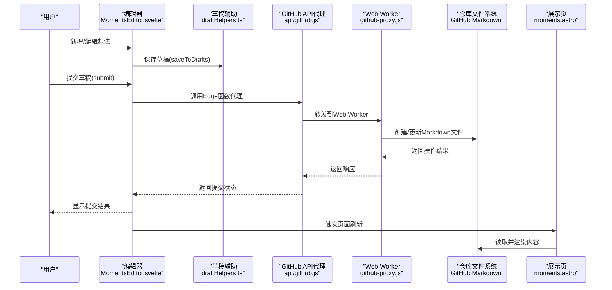
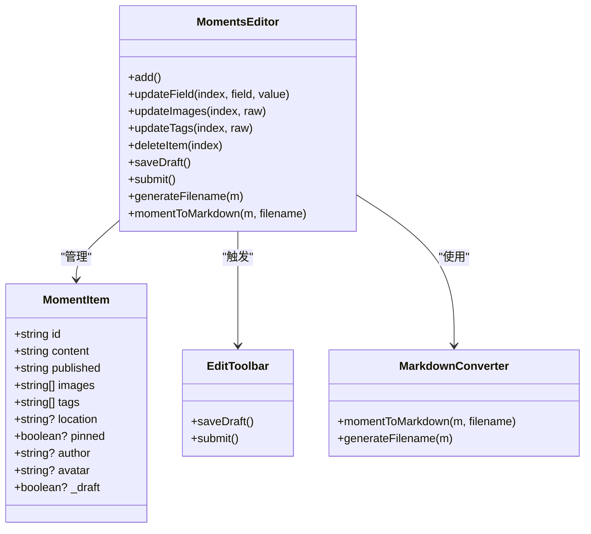
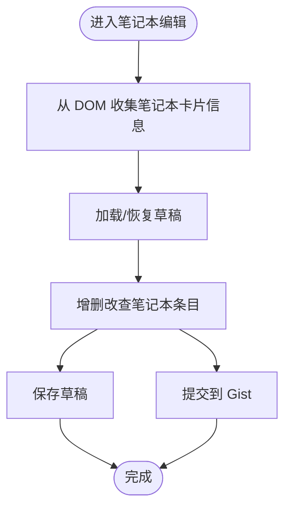
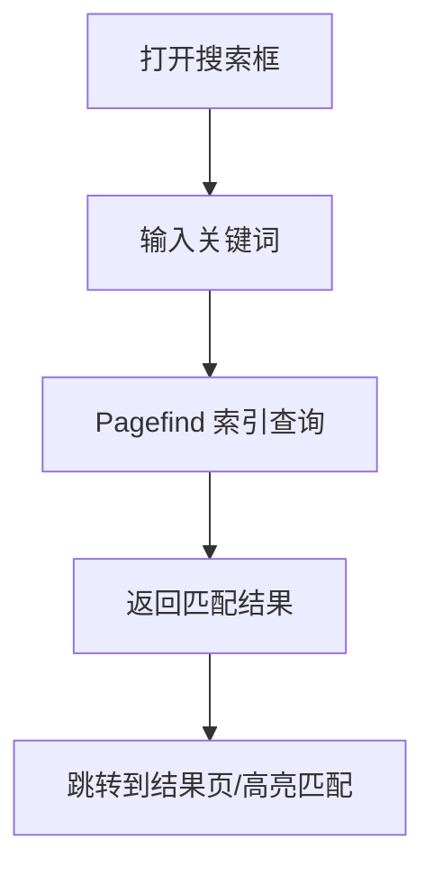
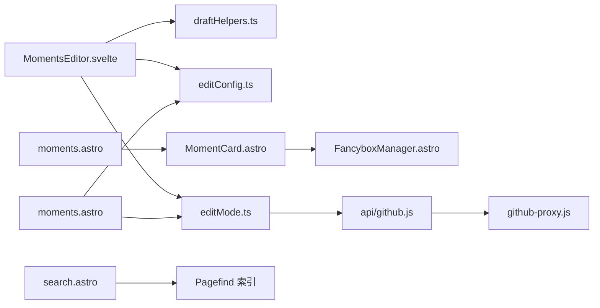

# 想法内容管理

<cite>
**本文引用的文件**
- [src/components/edit/MomentsEditor.svelte](file://src/components/edit/MomentsEditor.svelte)
- [src/config/editConfig.ts](file://src/config/editConfig.ts)
- [src/utils/editMode.ts](file://src/utils/editMode.ts)
- [src/utils/draftHelpers.ts](file://src/utils/draftHelpers.ts)
- [src/pages/moments.astro](file://src/pages/moments.astro)
- [src/components/moments/MomentCard.astro](file://src/components/moments/MomentCard.astro)
- [src/components/edit/EditToolbar.svelte](file://src/components/edit/EditToolbar.svelte)
- [src/components/common/Search.svelte](file://src/components/common/Search.svelte)
- [src/components/common/SearchModal.svelte](file://src/components/common/SearchModal.svelte)
- [src/pages/search.astro](file://src/pages/search.astro)
- [pagefind.yml](file://pagefind.yml)
- [test-moments-api.cjs](file://test-moments-api.cjs)
- [api/github.js](file://api/github.js)
- [scripts/new-post.js](file://scripts/new-post.js)
- [src/components/edit/RoutinesEditor.svelte](file://src/components/edit/RoutinesEditor.svelte)
- [src/components/edit/ChangelogEditor.svelte](file://src/components/edit/ChangelogEditor.svelte)
- [src/components/edit/PlacesEditor.svelte](file://src/components/edit/PlacesEditor.svelte)
</cite>

## 更新摘要
**变更内容**
- 想法内容管理系统从外部JSON加载完全迁移到GitHub Markdown文件系统
- 新增Markdown转换工具，支持将想法内容转换为标准Markdown格式
- 重构GitHub API交互机制，通过Edge函数代理实现安全的文件操作
- 实现自动刷新机制，提交后自动重新加载页面以显示最新内容
- 更新内容存储结构，从moments.json迁移到src/content/moments目录的独立Markdown文件
- 新增GitHub App认证和权限诊断功能

## 目录
1. [简介](#简介)
2. [项目结构](#项目结构)
3. [核心组件](#核心组件)
4. [架构总览](#架构总览)
5. [详细组件分析](#详细组件分析)
6. [依赖关系分析](#依赖关系分析)
7. [性能考量](#性能考量)
8. [故障排查指南](#故障排查指南)
9. [结论](#结论)
10. [附录](#附录)

## 简介
本文件面向 Firefly-Mod 的"想法内容"管理场景，系统性梳理该博客系统中"想法/灵感/思考片段/创意草稿"的采集、编辑、组织、检索与分享路径。经过重大架构升级，系统已从GitHub Gists迁移到直接仓库存储，并完全采用GitHub Markdown文件系统进行内容管理。

当前仓库中与"想法内容"最贴近的是"说说（Moments）"与"笔记本（Notebooks）"两条主线：
- 说说（Moments）：以轻量、碎片化的形式记录灵感与思考片段，支持文本、图片、标签、位置、作者信息等元数据，现已完全迁移到Markdown文件系统。
- 笔记本（Notebooks）：以本地内容集合的形式承载更系统的"想法草稿/随笔"。

本文将围绕以下主题展开：内容形态与存储结构、时间戳与标签管理、创建与编辑流程、检索与回顾、导出与分享、长期保存与版本策略。

## 项目结构
与"想法内容"管理直接相关的前端与内容层分布如下：
- 编辑器与页面
  - 说说编辑器与管理页：src/components/edit/MomentsEditor.svelte、src/pages/moments.astro
  - 说说卡片渲染：src/components/moments/MomentCard.astro、src/pages/moments.astro
  - 笔记本编辑器与管理页：src/components/edit/NotebooksEditor.svelte、src/pages/admin/notebooks.astro
  - 笔记本详情页：src/pages/life/notebooks/[...slug].astro
- 内容与配置
  - 仓库配置：src/config/editConfig.ts（包含repoConfig）
  - 编辑模式工具：src/utils/editMode.ts
  - 草稿辅助：src/utils/draftHelpers.ts
- 媒体与富文本插件
  - 图片预览与画廊：src/components/features/FancyboxManager.astro
  - Markdown 扩展插件：remark-* 系列
- 搜索与索引
  - 页面内搜索：src/components/common/Search.svelte、src/components/common/SearchModal.svelte、src/pages/search.astro
  - 全局索引：pagefind.yml
- GitHub API代理
  - Edge函数代理：api/github.js
  - 文件操作工具：src/utils/editMode.ts

```mermaid
graph TB
subgraph "编辑与管理"
ME["Moments 编辑器<br/>src/components/edit/MomentsEditor.svelte"]
AE["管理员页<br/>src/pages/moments.astro"]
NE["笔记本编辑器<br/>src/components/edit/NotebooksEditor.svelte"]
NA["笔记本管理页<br/>src/pages/admin/notebooks.astro"]
CE["变更日志编辑器<br/>src/components/edit/ChangelogEditor.svelte"]
PE["地点编辑器<br/>src/components/edit/PlacesEditor.svelte"]
RE["日常规划编辑器<br/>src/components/edit/RoutinesEditor.svelte"]
end
subgraph "内容与展示"
MC["说说卡片<br/>src/components/moments/MomentCard.astro"]
MP["说说列表页<br/>src/pages/moments.astro"]
NS["笔记本详情页<br/>src/pages/life/notebooks/[...slug].astro"]
end
subgraph "配置与工具"
EC["编辑配置<br/>src/config/editConfig.ts"]
EM["编辑模式工具<br/>src/utils/editMode.ts"]
DH["草稿辅助<br/>src/utils/draftHelpers.ts"]
FM["Fancybox 管理<br/>src/components/features/FancyboxManager.astro"]
GH["GitHub API代理<br/>api/github.js"]
NP["新文章脚本<br/>scripts/new-post.js"]
END
ME --> AE
NE --> NA
AE --> EC
ME --> EC
ME --> EM
ME --> DH
AE --> MP
MP --> MC
MC --> FM
NA --> NS
CE --> GH
PE --> GH
RE --> GH
```

**图表来源**
- [src/components/edit/MomentsEditor.svelte:1-612](file://src/components/edit/MomentsEditor.svelte#L1-L612)
- [src/pages/moments.astro:108-153](file://src/pages/moments.astro#L108-L153)
- [src/config/editConfig.ts:40-47](file://src/config/editConfig.ts#L40-L47)
- [src/utils/editMode.ts](file://src/utils/editMode.ts)
- [src/utils/draftHelpers.ts](file://src/utils/draftHelpers.ts)
- [api/github.js:1-16](file://api/github.js#L1-L16)
- [scripts/new-post.js:1-59](file://scripts/new-post.js#L1-L59)

**章节来源**
- [src/components/edit/MomentsEditor.svelte:1-612](file://src/components/edit/MomentsEditor.svelte#L1-L612)
- [src/pages/moments.astro:108-153](file://src/pages/moments.astro#L108-L153)
- [src/config/editConfig.ts:40-47](file://src/config/editConfig.ts#L40-L47)
- [src/utils/editMode.ts](file://src/utils/editMode.ts)
- [src/utils/draftHelpers.ts](file://src/utils/draftHelpers.ts)
- [api/github.js:1-16](file://api/github.js#L1-L16)
- [scripts/new-post.js:1-59](file://scripts/new-post.js#L1-L59)

## 核心组件
- 说说（Moments）编辑与管理
  - 编辑器负责新增、编辑、删除、草稿保存、批量提交，支持图片 URL 列表、标签、位置、作者等字段。
  - 管理员页通过直接仓库文件操作进行持久化，支持草稿与提交流程。
  - **更新** 现已完全迁移到Markdown文件系统，每个想法内容保存为独立的Markdown文件。
- 笔记本（Notebooks）编辑与管理
  - 编辑器从 DOM 提取笔记本封面、名称、摘要、条目数、更新时间等信息，支持草稿与提交。
  - 管理页与详情页分别承担列表与内容展示，支持本地与远程笔记本联动。
- 内容与展示
  - 说说卡片渲染 Markdown 内容，支持图片画廊与外部链接预览。
  - 内容示例展示 Front Matter 字段（作者、头像、发布时间、标签、位置）。
- 搜索与索引
  - 页面内搜索组件与全局 Pagefind 索引共同实现内容检索。
- GitHub API代理
  - **新增** Edge函数代理提供安全的GitHub API访问，支持文件创建、更新、删除操作。

**章节来源**
- [src/components/edit/MomentsEditor.svelte:1-612](file://src/components/edit/MomentsEditor.svelte#L1-L612)
- [src/pages/moments.astro:108-153](file://src/pages/moments.astro#L108-L153)
- [src/components/moments/MomentCard.astro:1-240](file://src/components/moments/MomentCard.astro#L1-L240)
- [src/components/common/Search.svelte](file://src/components/common/Search.svelte)
- [src/components/common/SearchModal.svelte](file://src/components/common/SearchModal.svelte)
- [src/pages/search.astro](file://src/pages/search.astro)
- [pagefind.yml](file://pagefind.yml)
- [api/github.js:1-16](file://api/github.js#L1-L16)

## 架构总览
"想法内容"的端到端流程由"编辑—草稿—提交—展示—检索"构成。编辑器通过草稿辅助模块将变更暂存于本地，随后统一提交至GitHub Markdown文件系统；展示层从仓库文件读取并渲染；搜索层提供多维检索能力。

**更新** 架构已从Gist迁移到直接仓库文件操作，使用GitHub App认证机制进行文件读写，并通过Edge函数代理实现安全的API访问。



**图表来源**
- [src/components/edit/MomentsEditor.svelte:438-501](file://src/components/edit/MomentsEditor.svelte#L438-L501)
- [src/utils/draftHelpers.ts](file://src/utils/draftHelpers.ts)
- [api/github.js:1-16](file://api/github.js#L1-L16)
- [src/pages/moments.astro:108-153](file://src/pages/moments.astro#L108-L153)

## 详细组件分析

### 说说（Moments）编辑与工作流
- 数据模型
  - 字段：id、content、published（ISO 时间）、images（URL 数组）、tags（字符串数组）、location、pinned、author、avatar。
  - 草稿标记：_draft，用于标识本地临时草稿。
  - **更新** 现在通过momentToMarkdown函数转换为标准Markdown格式。
- 创建与编辑
  - 新增：生成带前缀的唯一 id，插入到非置顶项之后，进入编辑态。
  - 编辑：逐字段更新，支持图片与标签的多值输入。
  - 删除：确认预览后移除，维护编辑索引。
- 草稿与提交
  - 保存草稿：清洗空值，调用草稿辅助模块持久化。
  - **更新** 提交：统一清洗后提交至GitHub Markdown文件系统，每个想法保存为独立文件。
- 展示与交互
  - 卡片渲染 Markdown 内容，支持图片画廊与外部链接预览。
  - 管理页按时间排序，支持空态提示与评论区挂载。
  - **更新** 提交后自动刷新页面以显示最新内容。

**更新** 编辑器现在使用GitHub Markdown文件系统替代Gist API，通过Edge函数代理进行安全的文件读写。



**图表来源**
- [src/components/edit/MomentsEditor.svelte:19-612](file://src/components/edit/MomentsEditor.svelte#L19-L612)
- [src/components/edit/EditToolbar.svelte:185-225](file://src/components/edit/EditToolbar.svelte#L185-L225)

**章节来源**
- [src/components/edit/MomentsEditor.svelte:351-457](file://src/components/edit/MomentsEditor.svelte#L351-L457)
- [src/components/edit/EditToolbar.svelte:185-225](file://src/components/edit/EditToolbar.svelte#L185-L225)
- [src/pages/moments.astro:108-153](file://src/pages/moments.astro#L108-L153)

### 笔记本（Notebooks）编辑与组织
- 数据模型
  - 字段：id、folderName、name、summary、cover、entries、updatedAt。
  - 草稿标记：_draft、_deleted，便于批量处理。
- 收集与渲染
  - 从 DOM 卡片提取封面、标题、描述、条目数、更新时间等信息，生成笔记本列表。
  - 支持从远程 Gist 笔记本联动展示。
- 管理与提交
  - 与说说一致的草稿与提交流程，通过编辑工具栏触发。



**图表来源**
- [src/components/edit/NotebooksEditor.svelte:55-80](file://src/components/edit/NotebooksEditor.svelte#L55-L80)
- [src/pages/admin/notebooks.astro:1-40](file://src/pages/admin/notebooks.astro#L1-L40)
- [src/pages/life/notebooks/[...slug].astro](file://src/pages/life/notebooks/[...slug].astro#L150-L178)

**章节来源**
- [src/components/edit/NotebooksEditor.svelte:1-80](file://src/components/edit/NotebooksEditor.svelte#L1-L80)
- [src/pages/admin/notebooks.astro:1-40](file://src/pages/admin/notebooks.astro#L1-L40)
- [src/pages/life/notebooks/[...slug].astro](file://src/pages/life/notebooks/[...slug].astro#L150-L178)

### 内容存储与组织
- **更新** 仓库文件存储
  - 说说内容现在存储在src/content/moments目录下的独立Markdown文件中，每个想法对应一个文件。
  - 使用GitHub App认证进行安全的文件读写操作。
  - **新增** 自动生成文件名，格式为内容前缀+日期.md。
- 笔记本内容
  - 本地内容集合通过 Astro 内容目录管理，支持远程 Gist 笔记本联动。
- 时间戳与标签
  - 时间戳：published 字段为 ISO 字符串，便于排序与筛选。
  - 标签：tags 为字符串数组，支持多标签分类。
- 媒体附件
  - images 字段为 URL 数组，配合图片画廊与外部链接预览。
- **新增** Markdown转换工具
  - momentToMarkdown函数将想法内容转换为标准Markdown格式。
  - 支持Front Matter元数据和正文内容的完整转换。

**更新** 存储方式从Gist迁移到GitHub Markdown文件系统，使用GitHub App认证机制和Edge函数代理。

**章节来源**
- [src/config/editConfig.ts:40-47](file://src/config/editConfig.ts#L40-L47)
- [src/utils/editMode.ts](file://src/utils/editMode.ts)
- [src/components/moments/MomentCard.astro:170-200](file://src/components/moments/MomentCard.astro#L170-L200)
- [src/components/edit/MomentsEditor.svelte:168-210](file://src/components/edit/MomentsEditor.svelte#L168-L210)

### GitHub API代理与认证
- **新增** Edge函数代理
  - api/github.js提供Vercel Edge函数代理，转发GitHub API请求。
  - 支持通过process.env获取GitHub App配置。
- **新增** Web Worker代理
  - github-proxy.js处理GitHub API请求，支持GitHub App认证。
  - 提供getAuthToken函数获取和缓存认证令牌。
- **新增** 权限诊断
  - diagnosePermissions函数检查GitHub App安装权限。
  - 验证token有效性、仓库访问权限等。
- **更新** 文件操作工具
  - createOrUpdateRepoFile函数创建或更新仓库文件。
  - 支持批量提交和错误处理。
  - 自动刷新机制确保提交后页面更新。

**章节来源**
- [api/github.js:1-16](file://api/github.js#L1-L16)
- [src/utils/editMode.ts:307-350](file://src/utils/editMode.ts#L307-L350)
- [src/utils/editMode.ts:506-585](file://src/utils/editMode.ts#L506-L585)
- [src/components/edit/MomentsEditor.svelte:464-501](file://src/components/edit/MomentsEditor.svelte#L464-L501)

### 自动刷新机制
- **新增** 页面自动刷新
  - 提交成功后自动触发window.location.reload()刷新页面。
  - 设置1.5秒延迟确保GitHub API操作完成。
  - 支持所有内容编辑器的统一刷新机制。
- **新增** 刷新时机控制
  - 清除草稿后执行刷新，确保数据一致性。
  - 错误情况下不刷新，允许用户修正问题。

**章节来源**
- [src/components/edit/MomentsEditor.svelte:485-501](file://src/components/edit/MomentsEditor.svelte#L485-L501)
- [src/components/edit/ChangelogEditor.svelte:382-404](file://src/components/edit/ChangelogEditor.svelte#L382-L404)
- [src/components/edit/PlacesEditor.svelte:279-283](file://src/components/edit/PlacesEditor.svelte#L279-L283)

### 检索与回顾
- 页面内搜索
  - Search.svelte 与 SearchModal.svelte 提供弹窗式搜索入口，search.astro 承载结果页。
- 全局索引
  - pagefind.yml 配置 Pagefind 索引范围，覆盖内容与页面。
- 时间线与标签过滤
  - 说说列表按 published 排序，标签作为筛选维度；笔记本详情页按日期与条目组织。



**图表来源**
- [src/components/common/Search.svelte](file://src/components/common/Search.svelte)
- [src/components/common/SearchModal.svelte](file://src/components/common/SearchModal.svelte)
- [src/pages/search.astro](file://src/pages/search.astro)
- [pagefind.yml](file://pagefind.yml)

**章节来源**
- [src/components/common/Search.svelte](file://src/components/common/Search.svelte)
- [src/components/common/SearchModal.svelte](file://src/components/common/SearchModal.svelte)
- [src/pages/search.astro](file://src/pages/search.astro)
- [pagefind.yml](file://pagefind.yml)

### 导出与分享
- **更新** 结构化导出
  - 通过GitHub Markdown文件系统，想法内容以标准Markdown格式存储。
  - 支持完整的Front Matter元数据导出。
  - 可直接下载和分享Markdown文件。
- 社交分享
  - 说说卡片支持外部链接预览与图片画廊，便于复制链接分享。
- 打印输出
  - 展示页基于 Markdown 渲染，可利用浏览器打印功能输出。

**章节来源**
- [src/components/moments/MomentCard.astro:140-200](file://src/components/moments/MomentCard.astro#L140-L200)
- [src/components/common/Markdown.astro](file://src/components/common/Markdown.astro)

### 长期保存与版本管理
- 草稿与提交
  - 草稿辅助模块提供本地草稿保存与批量提交，避免丢失。
- 版本与历史
  - 依托 GitHub 仓库的版本历史，可追溯每次提交的变更。
  - **更新** 每个想法内容都有独立的Git提交历史。
- 迁移与清理
  - 建议定期将重要想法导出为本地 Markdown 文件归档；对不再使用的标签与图片，可在编辑时清理。
- **新增** 自动备份
  - 通过GitHub的版本控制实现自动备份。
  - 支持分支管理和标签标注。

**更新** 版本管理从Gist迁移到GitHub仓库，提供更完善的版本历史记录和自动备份。

**章节来源**
- [src/utils/draftHelpers.ts](file://src/utils/draftHelpers.ts)
- [src/components/edit/MomentsEditor.svelte:418-457](file://src/components/edit/MomentsEditor.svelte#L418-L457)

## 依赖关系分析
- 组件耦合
  - 编辑器与草稿辅助模块松耦合，通过统一接口保存与提交。
  - 管理员页与编辑器通过事件与配置协作，实现跨页面的数据同步。
- 外部依赖
  - GitHub 仓库作为持久化后端，编辑器与管理员页均依赖其 API。
  - **新增** Vercel Edge函数提供安全的GitHub API代理。
  - GitHub App 认证机制确保安全的文件操作权限。
  - Pagefind 作为静态索引服务，提升检索性能。
- 循环依赖
  - 未见明显循环依赖；编辑器与展示页通过数据流单向传递。

**更新** 依赖关系从Gist迁移到直接仓库操作，新增GitHub App认证和Edge函数代理依赖。



**图表来源**
- [src/components/edit/MomentsEditor.svelte:1-612](file://src/components/edit/MomentsEditor.svelte#L1-L612)
- [src/utils/draftHelpers.ts](file://src/utils/draftHelpers.ts)
- [src/config/editConfig.ts:40-47](file://src/config/editConfig.ts#L40-L47)
- [src/utils/editMode.ts](file://src/utils/editMode.ts)
- [src/pages/moments.astro:108-153](file://src/pages/moments.astro#L108-L153)
- [src/components/moments/MomentCard.astro:1-240](file://src/components/moments/MomentCard.astro#L1-L240)
- [src/components/features/FancyboxManager.astro:1-120](file://src/components/features/FancyboxManager.astro#L1-L120)
- [src/pages/search.astro](file://src/pages/search.astro)
- [pagefind.yml](file://pagefind.yml)
- [api/github.js:1-16](file://api/github.js#L1-L16)

**章节来源**
- [src/components/edit/MomentsEditor.svelte:1-612](file://src/components/edit/MomentsEditor.svelte#L1-L612)
- [src/config/editConfig.ts:40-47](file://src/config/editConfig.ts#L40-L47)
- [src/utils/editMode.ts](file://src/utils/editMode.ts)
- [src/pages/moments.astro:108-153](file://src/pages/moments.astro#L108-L153)
- [src/components/moments/MomentCard.astro:1-240](file://src/components/moments/MomentCard.astro#L1-L240)
- [src/components/features/FancyboxManager.astro:1-120](file://src/components/features/FancyboxManager.astro#L1-L120)
- [src/pages/search.astro](file://src/pages/search.astro)
- [pagefind.yml](file://pagefind.yml)
- [api/github.js:1-16](file://api/github.js#L1-L16)

## 性能考量
- 索引与渲染
  - Pagefind 索引减少前端检索开销；Markdown 渲染与图片懒加载结合，优化首屏。
- 编辑体验
  - 草稿本地保存降低网络请求频率；批量提交减少仓库API调用次数。
- 媒体资源
  - 图片画廊与外部链接预览建议控制尺寸与数量，避免阻塞渲染。
- 安全与认证
  - **更新** GitHub App认证机制提供更安全的文件操作权限管理。
  - Edge函数代理隐藏真实凭据，提升安全性。
- **样式性能优化**
  - **更新** 通过全局作用域样式确保动态内容一次性渲染完成，避免重复样式计算。
- **更新** 性能优化
  - **新增** 自动刷新机制减少手动操作，提升用户体验。
  - **新增** Markdown文件系统支持更好的缓存和版本控制。

**更新** 新增GitHub App认证的安全考量、Edge函数代理的性能优势和自动刷新机制。

## 故障排查指南
- 提交失败
  - 检查 GitHub App 配置与权限设置；确认网络连通性；查看管理员页提示信息。
  - **更新** 检查Edge函数代理配置，确认Vercel环境变量设置。
- 草稿未恢复
  - 确认本地存储可用；检查草稿键名与页面键名一致。
- 图片无法显示
  - 检查图片 URL 是否有效；确认跨域访问权限；使用画廊组件预览外部图片。
- 搜索无结果
  - 确认 Pagefind 已构建且索引包含目标内容；检查搜索词拼写与大小写。
- 认证问题
  - 检查 GitHub App ID 和私钥配置；确认PEM格式正确；验证仓库访问权限。
  - **更新** 使用diagnosePermissions函数检查权限状态。
- **样式问题**
  - **更新** 如果动态注入的内容样式异常，检查`:global()`包装是否正确应用；确认wx-前缀类选择器的作用域设置。
- **更新** 新增的故障排查
  - **新增** Edge函数代理错误：检查Vercel部署状态和环境变量配置。
  - **新增** Markdown文件创建失败：检查文件名生成逻辑和路径权限。
  - **新增** 自动刷新失效：检查浏览器JavaScript执行权限和页面重载逻辑。

**更新** 新增GitHub App认证相关的故障排查指导、Edge函数代理问题排查和自动刷新机制故障排查。

**章节来源**
- [src/pages/moments.astro:108-153](file://src/pages/moments.astro#L108-L153)
- [src/components/edit/EditToolbar.svelte:185-225](file://src/components/edit/EditToolbar.svelte#L185-L225)
- [src/components/features/FancyboxManager.astro:1-120](file://src/components/features/FancyboxManager.astro#L1-L120)
- [pagefind.yml](file://pagefind.yml)
- [test-moments-api.cjs:1-34](file://test-moments-api.cjs#L1-L34)
- [src/utils/editMode.ts:332-350](file://src/utils/editMode.ts#L332-L350)

## 结论
本系统以"说说（Moments）+ 笔记本（Notebooks）"为核心，结合草稿与GitHub Markdown文件系统提交、Markdown 渲染与 Pagefind 索引，形成一套完整的"想法内容"采集、整理与回顾体系。通过清晰的数据模型、可控的编辑流程与稳定的外部依赖，既能满足快速记录与碎片化思考，也能支撑后续的系统化整理与长期保存。

**更新** 系统已完成从GitHub Gists到GitHub Markdown文件系统的重大架构升级，采用GitHub App认证机制确保安全性，通过Edge函数代理提供安全的API访问。新增的自动刷新机制、Markdown转换工具和权限诊断功能进一步提升了系统的稳定性和易用性。同时，样式系统的改进确保了动态内容的完整样式应用，提升了编辑器的用户体验。

## 附录
- 相关插件与扩展
  - Mermaid、PlantUML、图片网格、指令重写、摘要与阅读时长等插件增强内容表达与可读性。
- 工作线程
  - AI 聊天、GitHub 代理与访客簿等 Worker 提升交互与集成能力。
- **新增** GitHub App配置
  - 测试脚本 test-moments-api.cjs 用于验证认证和仓库文件操作。
  - **新增** 新文章脚本 scripts/new-post.js 用于创建标准Markdown文件。
- **新增** 内容编辑器扩展
  - 日常规划编辑器支持HTML到Markdown的转换。
  - 地点编辑器支持地理位置内容的Markdown管理。
  - 变更日志编辑器提供版本控制友好的内容管理。

**章节来源**
- [src/plugins/remark-mermaid.js](file://src/plugins/remark-mermaid.js)
- [src/plugins/remark-plantuml.js](file://src/plugins/remark-plantuml.js)
- [src/plugins/remark-image-grid.js](file://src/plugins/remark-image-grid.js)
- [src/plugins/remark-directive-rehype.js](file://src/plugins/remark-directive-rehype.js)
- [src/plugins/remark-excerpt.js](file://src/plugins/remark-excerpt.js)
- [src/plugins/remark-reading-time.mjs](file://src/plugins/remark-reading-time.mjs)
- [src/workers/ai-chat.js](file://src/workers/ai-chat.js)
- [src/workers/github-proxy.js](file://src/workers/github-proxy.js)
- [src/workers/guestbook.js](file://src/workers/guestbook.js)
- [src/workers/utils/rate-limit.js](file://src/workers/utils/rate-limit.js)
- [src/workers/utils/streaming.js](file://src/workers/utils/streaming.js)
- [test-moments-api.cjs:1-34](file://test-moments-api.cjs#L1-L34)
- [scripts/new-post.js:1-59](file://scripts/new-post.js#L1-L59)
- [src/components/edit/RoutinesEditor.svelte:62-77](file://src/components/edit/RoutinesEditor.svelte#L62-L77)
- [src/components/edit/PlacesEditor.svelte:256-283](file://src/components/edit/PlacesEditor.svelte#L256-L283)
- [src/components/edit/ChangelogEditor.svelte:360-404](file://src/components/edit/ChangelogEditor.svelte#L360-L404)