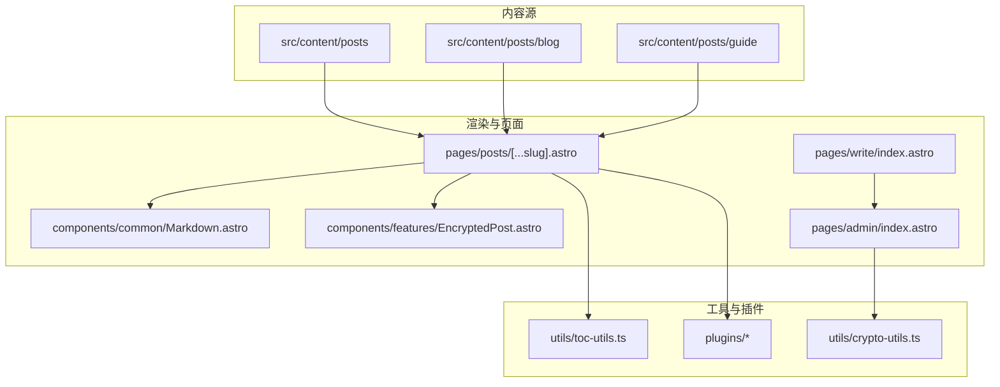
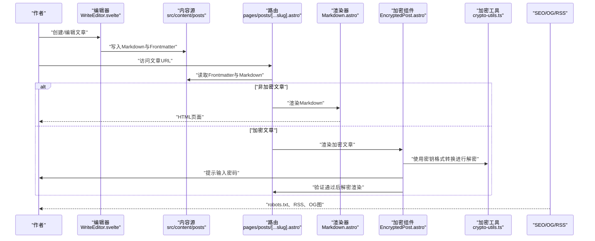
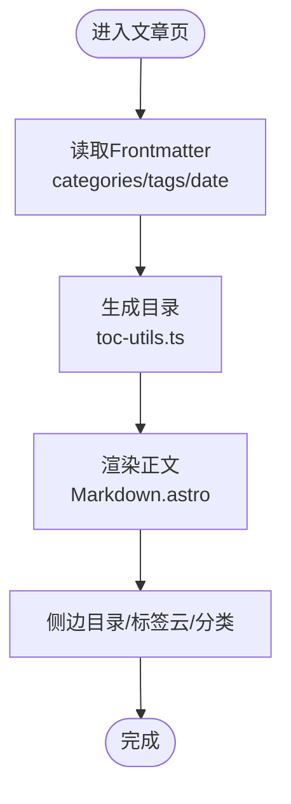
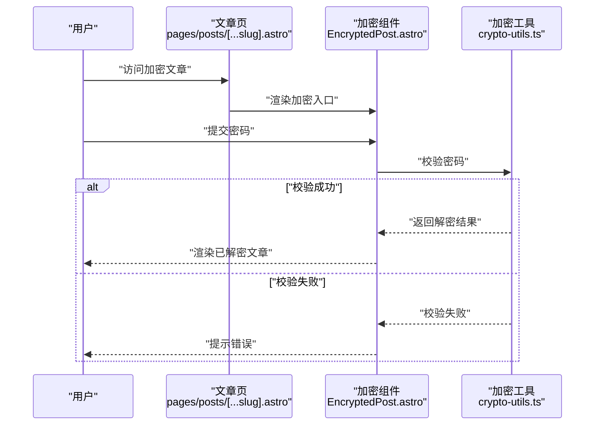
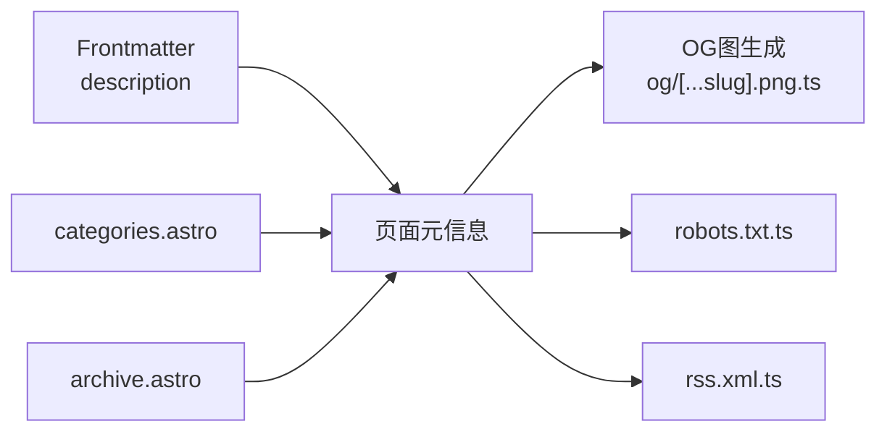
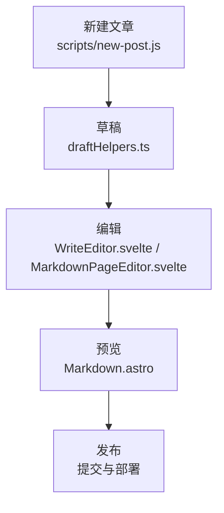
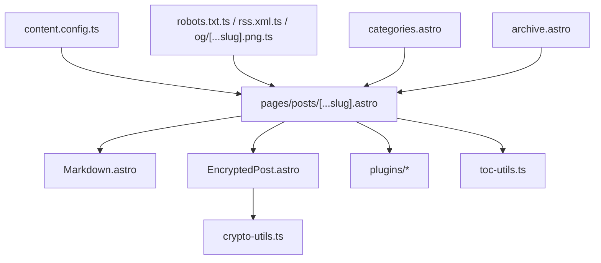

# 文章内容管理

<cite>
**本文引用的文件**
- [content.config.ts](file://src/content.config.ts)
- [post.ts](file://src/types/post.ts)
- [Markdown.astro](file://src/components/common/Markdown.astro)
- [EncryptedPost.astro](file://src/components/features/EncryptedPost.astro)
- [crypto-utils.ts](file://src/utils/crypto-utils.ts)
- [posts/encrypted-post.md](file://src/content/posts/encrypted-post.md)
- [posts/markdown-tutorial.md](file://src/content/posts/markdown-tutorial.md)
- [posts/code-examples.md](file://src/content/posts/code-examples.md)
- [posts/markdown-mermaid.md](file://src/content/posts/markdown-mermaid.md)
- [posts/markdown-plantuml.md](file://src/content/posts/markdown-plantuml.md)
- [posts/draft.md](file://src/content/posts/draft.md)
- [posts/video.md](file://src/content/posts/video.md)
- [posts/index.md](file://src/content/posts/guide/index.md)
- [posts/blog/git-use.md](file://src/content/posts/blog/git-use.md)
- [_frontmatter.json](file://_frontmatter.json)
- [new-post.js](file://scripts/new-post.js)
- [remark-mermaid.js](file://src/plugins/remark-mermaid.js)
- [remark-plantuml.js](file://src/plugins/remark-plantuml.js)
- [rehype-mermaid.mjs](file://src/plugins/rehype-mermaid.mjs)
- [rehype-plantuml.mjs](file://src/plugins/rehype-plantuml.mjs)
- [mermaid-render-script.js](file://src/plugins/mermaid-render-script.js)
- [plantuml-encoder.js](file://src/plugins/plantuml-encoder.js)
- [plantuml-render-script.js](file://src/plugins/plantuml-render-script.js)
- [toc-utils.ts](file://src/utils/toc-utils.ts)
- [SidebarTOC.astro](file://src/components/widget/SidebarTOC.astro)
- [categories.astro](file://src/pages/categories.astro)
- [archive.astro](file://src/pages/archive.astro)
- [robots.txt.ts](file://src/pages/robots.txt.ts)
- [rss.xml.ts](file://src/pages/rss.xml.ts)
- [og/[...slug].png.ts](file://src/pages/og/[...slug].png.ts)
- [write/index.astro](file://src/pages/write/index.astro)
- [posts/[...slug].astro](file://src/pages/posts/[...slug].astro)
- [admin/index.astro](file://src/pages/admin/index.astro)
- [admin/bangumi.astro](file://src/pages/admin/bangumi.astro)
- [admin/friends.astro](file://src/pages/admin/friends.astro)
- [admin/moments.astro](file://src/pages/admin/moments.astro)
- [admin/notebooks.astro](file://src/pages/admin/notebooks.astro)
- [MarkdownPageEditor.svelte](file://src/components/edit/MarkdownPageEditor.svelte)
- [EditToolbar.svelte](file://src/components/edit/EditToolbar.svelte)
- [FileCodeEditor.svelte](file://src/components/edit/FileCodeEditor.svelte)
- [WriteEditor.svelte](file://src/components/edit/WriteEditor.svelte)
- [editConfig.ts](file://src/config/editConfig.ts)
- [siteConfig.ts](file://src/config/siteConfig.ts)
- [content-utils.ts](file://src/utils/content-utils.ts)
- [draftHelpers.ts](file://src/utils/draftHelpers.ts)
- [editMode.ts](file://src/utils/editMode.ts)
- [zh_CN.ts](file://src/i18n/languages/zh_CN.ts)
</cite>

## 目录
1. [简介](#简介)
2. [项目结构](#项目结构)
3. [核心组件](#核心组件)
4. [架构总览](#架构总览)
5. [详细组件分析](#详细组件分析)
6. [依赖关系分析](#依赖关系分析)
7. [性能考量](#性能考量)
8. [故障排查指南](#故障排查指南)
9. [结论](#结论)
10. [附录](#附录)

## 简介
本文件面向Firefly-Mod的文章内容管理系统，系统基于Astro + Svelte构建，采用内容优先（Content First）策略，通过Markdown与Frontmatter进行文章内容与元数据管理。本文档聚焦以下主题：
- 文章内容组织与管理：分类、标签、目录结构
- Markdown编写规范：标题、段落、列表、链接等
- Frontmatter元数据字段：标题、描述、发布时间、作者、分类与标签等
- 文章工作流：创建、编辑、预览、发布
- 加密文章与访问控制：密钥格式转换与兼容性
- SEO优化：元描述、关键词、Open Graph
- 模板与批量操作、内容迁移

## 项目结构
文章内容主要位于src/content/posts目录，采用分层目录组织：
- posts：文章正文与示例
  - blog：博客类文章
  - guide：指南索引
  - images：图片资源
  - draft.md：草稿示例
  - encrypted-post.md：加密文章示例
  - markdown-*.md：Markdown扩展示例
  - video.md：视频示例
- content.config.ts：内容源配置，声明内容集合与路径映射
- types/post.ts：文章类型定义
- components/common/Markdown.astro：Markdown渲染组件
- components/features/EncryptedPost.astro：加密文章渲染组件
- utils/crypto-utils.ts：加密与解密工具
- plugins/*：Markdown与渲染插件（Mermaid、PlantUML等）
- pages/posts/[...slug].astro：文章页面路由
- pages/write/index.astro：写作入口
- pages/admin/*：后台管理页面
- utils/toc-utils.ts：目录生成工具
- components/widget/SidebarTOC.astro：侧边目录组件
- pages/categories.astro / archive.astro：分类与归档页
- pages/robots.txt.ts、rss.xml.ts、og/[...slug].png.ts：SEO与分享资源
- scripts/new-post.js：新建文章脚本
- _frontmatter.json：默认Frontmatter模板

**图表来源**
- [content.config.ts](file://src/content.config.ts)
- [Markdown.astro](file://src/components/common/Markdown.astro)
- [EncryptedPost.astro](file://src/components/features/EncryptedPost.astro)
- [toc-utils.ts](file://src/utils/toc-utils.ts)
- [crypto-utils.ts](file://src/utils/crypto-utils.ts)
- [posts/encrypted-post.md](file://src/content/posts/encrypted-post.md)
- [posts/markdown-tutorial.md](file://src/content/posts/markdown-tutorial.md)
- [posts/markdown-mermaid.md](file://src/content/posts/markdown-mermaid.md)
- [posts/markdown-plantuml.md](file://src/content/posts/markdown-plantuml.md)
- [posts/draft.md](file://src/content/posts/draft.md)
- [posts/index.md](file://src/content/posts/guide/index.md)
- [posts/blog/git-use.md](file://src/content/posts/blog/git-use.md)
- [pages/posts/[...slug].astro](file://src/pages/posts/[...slug].astro)
- [pages/write/index.astro](file://src/pages/write/index.astro)
- [pages/admin/index.astro](file://src/pages/admin/index.astro)

**章节来源**
- [content.config.ts](file://src/content.config.ts)
- [post.ts](file://src/types/post.ts)
- [Markdown.astro](file://src/components/common/Markdown.astro)
- [EncryptedPost.astro](file://src/components/features/EncryptedPost.astro)
- [toc-utils.ts](file://src/utils/toc-utils.ts)
- [crypto-utils.ts](file://src/utils/crypto-utils.ts)
- [posts/encrypted-post.md](file://src/content/posts/encrypted-post.md)
- [posts/markdown-tutorial.md](file://src/content/posts/markdown-tutorial.md)
- [posts/markdown-mermaid.md](file://src/content/posts/markdown-mermaid.md)
- [posts/markdown-plantuml.md](file://src/content/posts/markdown-plantuml.md)
- [posts/draft.md](file://src/content/posts/draft.md)
- [posts/index.md](file://src/content/posts/guide/index.md)
- [posts/blog/git-use.md](file://src/content/posts/blog/git-use.md)
- [pages/posts/[...slug].astro](file://src/pages/posts/[...slug].astro)
- [pages/write/index.astro](file://src/pages/write/index.astro)
- [pages/admin/index.astro](file://src/pages/admin/index.astro)

## 核心组件
- 内容配置与类型
  - content.config.ts：声明内容集合与路径映射，决定哪些目录作为文章源
  - types/post.ts：定义文章类型，包含slug、title、description、date、author、categories、tags、cover、encrypted等字段
- 渲染组件
  - Markdown.astro：统一的Markdown渲染器，支持语法高亮、表格、代码块等
  - EncryptedPost.astro：加密文章渲染器，负责输入密码、校验与解密
- 工具与插件
  - crypto-utils.ts：提供加密与解密能力，配合加密文章访问控制
  - toc-utils.ts：生成文章目录，供SidebarTOC.astro使用
  - plugins/*：remark与rehype插件，支持Mermaid图、PlantUML图等扩展渲染
- 页面与路由
  - pages/posts/[...slug].astro：动态路由解析文章slug，加载Frontmatter与Markdown内容
  - pages/write/index.astro：写作入口，结合编辑器组件
  - pages/admin/*：后台管理界面，用于批量与高级操作
- 编辑器生态
  - MarkdownPageEditor.svelte、EditToolbar.svelte、FileCodeEditor.svelte、WriteEditor.svelte：提供可视化与代码混合编辑体验
  - editConfig.ts：编辑器配置
  - draftHelpers.ts、editMode.ts：草稿与编辑模式辅助

**章节来源**
- [content.config.ts](file://src/content.config.ts)
- [post.ts](file://src/types/post.ts)
- [Markdown.astro](file://src/components/common/Markdown.astro)
- [EncryptedPost.astro](file://src/components/features/EncryptedPost.astro)
- [crypto-utils.ts](file://src/utils/crypto-utils.ts)
- [toc-utils.ts](file://src/utils/toc-utils.ts)
- [remark-mermaid.js](file://src/plugins/remark-mermaid.js)
- [remark-plantuml.js](file://src/plugins/remark-plantuml.js)
- [rehype-mermaid.mjs](file://src/plugins/rehype-mermaid.mjs)
- [rehype-plantuml.mjs](file://src/plugins/rehype-plantuml.mjs)
- [mermaid-render-script.js](file://src/plugins/mermaid-render-script.js)
- [plantuml-encoder.js](file://src/plugins/plantuml-encoder.js)
- [plantuml-render-script.js](file://src/plugins/plantuml-render-script.js)
- [pages/posts/[...slug].astro](file://src/pages/posts/[...slug].astro)
- [pages/write/index.astro](file://src/pages/write/index.astro)
- [pages/admin/index.astro](file://src/pages/admin/index.astro)
- [MarkdownPageEditor.svelte](file://src/components/edit/MarkdownPageEditor.svelte)
- [EditToolbar.svelte](file://src/components/edit/EditToolbar.svelte)
- [FileCodeEditor.svelte](file://src/components/edit/FileCodeEditor.svelte)
- [WriteEditor.svelte](file://src/components/edit/WriteEditor.svelte)
- [editConfig.ts](file://src/config/editConfig.ts)
- [draftHelpers.ts](file://src/utils/draftHelpers.ts)
- [editMode.ts](file://src/utils/editMode.ts)

## 架构总览
文章从内容源到最终页面的流转如下：

**图表来源**
- [pages/write/index.astro](file://src/pages/write/index.astro)
- [MarkdownPageEditor.svelte](file://src/components/edit/MarkdownPageEditor.svelte)
- [pages/posts/[...slug].astro](file://src/pages/posts/[...slug].astro)
- [Markdown.astro](file://src/components/common/Markdown.astro)
- [EncryptedPost.astro](file://src/components/features/EncryptedPost.astro)
- [crypto-utils.ts](file://src/utils/crypto-utils.ts)
- [robots.txt.ts](file://src/pages/robots.txt.ts)
- [rss.xml.ts](file://src/pages/rss.xml.ts)
- [og/[...slug].png.ts](file://src/pages/og/[...slug].png.ts)

## 详细组件分析

### 文章内容组织与分类
- 目录结构
  - posts：主内容区，按主题分目录（如blog、guide、images等）
  - 分类与标签：通过Frontmatter中的categories与tags进行组织
- 分类与归档
  - categories.astro：展示分类与标签云
  - archive.astro：按日期归档文章
- 目录生成
  - toc-utils.ts：提取标题层级生成目录
  - SidebarTOC.astro：侧边目录组件

**图表来源**
- [toc-utils.ts](file://src/utils/toc-utils.ts)
- [SidebarTOC.astro](file://src/components/widget/SidebarTOC.astro)
- [categories.astro](file://src/pages/categories.astro)
- [archive.astro](file://src/pages/archive.astro)

**章节来源**
- [toc-utils.ts](file://src/utils/toc-utils.ts)
- [SidebarTOC.astro](file://src/components/widget/SidebarTOC.astro)
- [categories.astro](file://src/pages/categories.astro)
- [archive.astro](file://src/pages/archive.astro)

### Frontmatter字段定义与使用
- 字段清单（示例来源于仓库中的文章与配置）
  - title：文章标题
  - description：文章描述（用于SEO与摘要）
  - date：发布/更新时间
  - author：作者信息
  - categories：分类数组
  - tags：标签数组
  - cover：封面图
  - encrypted：是否加密（布尔）
  - password：加密密码（字符串）
  - lang：语言（多语言场景）
  - slug：自定义URL片段（可选）
- 默认模板
  - _frontmatter.json：提供默认Frontmatter字段与示例值，便于新建文章时参考

**章节来源**
- [_frontmatter.json](file://_frontmatter.json)
- [posts/encrypted-post.md](file://src/content/posts/encrypted-post.md)
- [posts/draft.md](file://src/content/posts/draft.md)
- [posts/index.md](file://src/content/posts/guide/index.md)
- [post.ts](file://src/types/post.ts)

### Markdown编写规范
- 标题层级：建议使用H1作为主标题，H2-H4用于章节划分，避免跳跃
- 段落与换行：段落之间留空行；强制换行使用两个以上空格+回车
- 列表：有序与无序列表混用时注意缩进与层级
- 链接：内链使用相对路径或slug；外链使用绝对URL
- 图片：建议使用本地资源路径，并提供alt文本
- 代码：行内代码使用反引号；代码块指定语言以启用高亮
- 引用与分割线：使用>与---进行内容分隔
- 扩展语法：Mermaid图、PlantUML图等通过插件支持

**章节来源**
- [posts/markdown-tutorial.md](file://src/content/posts/markdown-tutorial.md)
- [posts/code-examples.md](file://src/content/posts/code-examples.md)
- [posts/markdown-mermaid.md](file://src/content/posts/markdown-mermaid.md)
- [posts/markdown-plantuml.md](file://src/content/posts/markdown-plantuml.md)
- [Markdown.astro](file://src/components/common/Markdown.astro)

### 加密文章与访问控制
- 实现方式
  - Frontmatter中设置encrypted为true并提供password
  - EncryptedPost.astro负责渲染加密入口与密码输入
  - crypto-utils.ts提供加密/解密逻辑（对称加密示例）
- 访问流程
  1) 用户访问加密文章URL
  2) 页面显示密码输入框
  3) 提交密码后进行校验
  4) 校验通过后解密并渲染文章内容
  5) 校验失败则提示错误并保持加密状态

**图表来源**
- [EncryptedPost.astro](file://src/components/features/EncryptedPost.astro)
- [crypto-utils.ts](file://src/utils/crypto-utils.ts)
- [posts/encrypted-post.md](file://src/content/posts/encrypted-post.md)

**章节来源**
- [EncryptedPost.astro](file://src/components/features/EncryptedPost.astro)
- [crypto-utils.ts](file://src/utils/crypto-utils.ts)
- [posts/encrypted-post.md](file://src/content/posts/encrypted-post.md)

### 密钥格式转换与兼容性增强
- 密钥格式转换改进
  - 加密工具采用PBKDF2算法，使用100,000次迭代确保安全性
  - 盐值和初始化向量（IV）从密码和slug派生，保证相同输入产生确定性输出
  - 输出格式包含盐值（16字节）、IV（12字节）、认证标签（16字节）和密文
- 兼容性保障
  - 前端解密使用Web Crypto API，确保跨浏览器兼容性
  - 密码缓存机制支持sessionStorage，提升用户体验
  - 安全过滤机制防止XSS攻击，仅允许白名单属性和标签

**更新** 加密基础设施现已支持更严格的密钥格式转换，确保与底层加密工具的完全兼容性和安全性

**章节来源**
- [crypto-utils.ts](file://src/utils/crypto-utils.ts)
- [EncryptedPost.astro](file://src/components/features/EncryptedPost.astro)

### SEO优化配置
- 元描述与关键词：通过Frontmatter的description字段作为元描述来源
- Open Graph：通过pages/og/[...slug].png.ts生成文章OG图
- Robots与RSS：robots.txt.ts与rss.xml.ts分别提供爬虫规则与订阅源
- 归档与分类页：categories.astro与archive.astro提升结构化导航

**图表来源**
- [posts/encrypted-post.md](file://src/content/posts/encrypted-post.md)
- [og/[...slug].png.ts](file://src/pages/og/[...slug].png.ts)
- [robots.txt.ts](file://src/pages/robots.txt.ts)
- [rss.xml.ts](file://src/pages/rss.xml.ts)
- [categories.astro](file://src/pages/categories.astro)
- [archive.astro](file://src/pages/archive.astro)

**章节来源**
- [posts/encrypted-post.md](file://src/content/posts/encrypted-post.md)
- [og/[...slug].png.ts](file://src/pages/og/[...slug].png.ts)
- [robots.txt.ts](file://src/pages/robots.txt.ts)
- [rss.xml.ts](file://src/pages/rss.xml.ts)
- [categories.astro](file://src/pages/categories.astro)
- [archive.astro](file://src/pages/archive.astro)

### 文章工作流程：创建、编辑、预览、发布
- 创建
  - 使用scripts/new-post.js快速生成新文章骨架
  - 在src/content/posts下创建Markdown文件，填写Frontmatter
- 编辑
  - pages/write/index.astro进入写作界面
  - MarkdownPageEditor.svelte提供实时预览
  - EditToolbar.svelte提供常用快捷操作
  - FileCodeEditor.svelte适合需要直接编辑源码的场景
- 预览
  - Markdown.astro即时渲染，支持Mermaid、PlantUML等扩展
  - SidebarTOC.astro显示目录，便于导航
- 发布
  - 提交至版本控制系统，触发部署
  - 归档与分类页自动更新

**图表来源**
- [new-post.js](file://scripts/new-post.js)
- [draftHelpers.ts](file://src/utils/draftHelpers.ts)
- [pages/write/index.astro](file://src/pages/write/index.astro)
- [MarkdownPageEditor.svelte](file://src/components/edit/MarkdownPageEditor.svelte)
- [WriteEditor.svelte](file://src/components/edit/WriteEditor.svelte)
- [Markdown.astro](file://src/components/common/Markdown.astro)

**章节来源**
- [new-post.js](file://scripts/new-post.js)
- [draftHelpers.ts](file://src/utils/draftHelpers.ts)
- [pages/write/index.astro](file://src/pages/write/index.astro)
- [MarkdownPageEditor.svelte](file://src/components/edit/MarkdownPageEditor.svelte)
- [WriteEditor.svelte](file://src/components/edit/WriteEditor.svelte)
- [Markdown.astro](file://src/components/common/Markdown.astro)

### 文章模板、批量操作与内容迁移
- 模板
  - _frontmatter.json提供默认字段模板，便于统一风格
  - posts/guide/index.md作为指南索引，可作为模板参考
- 批量操作
  - pages/admin/*提供后台管理入口，适合批量处理与高级操作
  - editMode.ts与editConfig.ts控制编辑模式与行为
- 内容迁移
  - content.config.ts定义内容集合，迁移时需确保路径与集合一致
  - 插件系统（remark/rehype）可帮助转换与升级Markdown扩展

**章节来源**
- [_frontmatter.json](file://_frontmatter.json)
- [posts/index.md](file://src/content/posts/guide/index.md)
- [pages/admin/index.astro](file://src/pages/admin/index.astro)
- [pages/admin/bangumi.astro](file://src/pages/admin/bangumi.astro)
- [pages/admin/friends.astro](file://src/pages/admin/friends.astro)
- [pages/admin/moments.astro](file://src/pages/admin/moments.astro)
- [pages/admin/notebooks.astro](file://src/pages/admin/notebooks.astro)
- [editMode.ts](file://src/utils/editMode.ts)
- [editConfig.ts](file://src/config/editConfig.ts)
- [content.config.ts](file://src/content.config.ts)

## 依赖关系分析
- 内容层
  - content.config.ts声明内容集合，pages/posts/[...slug].astro依赖其进行内容读取
- 渲染层
  - Markdown.astro与EncryptedPost.astro分别处理普通与加密文章
  - plugins/*为Markdown扩展提供语法支持
- 工具层
  - crypto-utils.ts为加密文章提供安全支撑
  - toc-utils.ts为目录生成提供基础
- 页面层
  - categories.astro、archive.astro、robots.txt.ts、rss.xml.ts、og/[...slug].png.ts共同构成SEO与导航体系

**图表来源**
- [content.config.ts](file://src/content.config.ts)
- [pages/posts/[...slug].astro](file://src/pages/posts/[...slug].astro)
- [Markdown.astro](file://src/components/common/Markdown.astro)
- [EncryptedPost.astro](file://src/components/features/EncryptedPost.astro)
- [crypto-utils.ts](file://src/utils/crypto-utils.ts)
- [toc-utils.ts](file://src/utils/toc-utils.ts)
- [robots.txt.ts](file://src/pages/robots.txt.ts)
- [rss.xml.ts](file://src/pages/rss.xml.ts)
- [og/[...slug].png.ts](file://src/pages/og/[...slug].png.ts)
- [categories.astro](file://src/pages/categories.astro)
- [archive.astro](file://src/pages/archive.astro)

**章节来源**
- [content.config.ts](file://src/content.config.ts)
- [pages/posts/[...slug].astro](file://src/pages/posts/[...slug].astro)
- [Markdown.astro](file://src/components/common/Markdown.astro)
- [EncryptedPost.astro](file://src/components/features/EncryptedPost.astro)
- [crypto-utils.ts](file://src/utils/crypto-utils.ts)
- [toc-utils.ts](file://src/utils/toc-utils.ts)
- [robots.txt.ts](file://src/pages/robots.txt.ts)
- [rss.xml.ts](file://src/pages/rss.xml.ts)
- [og/[...slug].png.ts](file://src/pages/og/[...slug].png.ts)
- [categories.astro](file://src/pages/categories.astro)
- [archive.astro](file://src/pages/archive.astro)

## 性能考量
- 目录生成：toc-utils.ts仅在需要时计算，避免重复渲染开销
- 渲染优化：Markdown.astro按需加载语法高亮与扩展，减少首屏负担
- 加密校验：crypto-utils.ts应尽量使用轻量算法，避免阻塞UI
- 插件加载：Mermaid与PlantUML渲染按需触发，避免全局初始化成本
- SEO资源：OG图与RSS在服务端生成，降低客户端计算压力

## 故障排查指南
- 文章不显示或404
  - 检查content.config.ts中的内容集合是否包含目标路径
  - 确认Frontmatter字段完整且命名正确
- 加密文章无法解密
  - 核对Frontmatter中encrypted与password设置
  - 检查crypto-utils.ts的校验逻辑与输入一致性
  - 验证密钥格式转换是否符合新要求
- 目录不显示
  - 确认文章标题层级符合预期（H2及以上）
  - 检查toc-utils.ts与SidebarTOC.astro的集成
- SEO异常
  - 检查robots.txt.ts与rss.xml.ts的输出
  - 确认文章description字段存在且合理
- 编辑器问题
  - 确认WriteEditor.svelte与MarkdownPageEditor.svelte的依赖加载
  - 检查editConfig.ts与editMode.ts的配置项

**章节来源**
- [content.config.ts](file://src/content.config.ts)
- [posts/encrypted-post.md](file://src/content/posts/encrypted-post.md)
- [crypto-utils.ts](file://src/utils/crypto-utils.ts)
- [toc-utils.ts](file://src/utils/toc-utils.ts)
- [SidebarTOC.astro](file://src/components/widget/SidebarTOC.astro)
- [robots.txt.ts](file://src/pages/robots.txt.ts)
- [rss.xml.ts](file://src/pages/rss.xml.ts)
- [pages/write/index.astro](file://src/pages/write/index.astro)
- [MarkdownPageEditor.svelte](file://src/components/edit/MarkdownPageEditor.svelte)
- [WriteEditor.svelte](file://src/components/edit/WriteEditor.svelte)
- [editConfig.ts](file://src/config/editConfig.ts)
- [editMode.ts](file://src/utils/editMode.ts)

## 结论
Firefly-Mod通过清晰的内容组织、完善的Frontmatter元数据、强大的Markdown渲染与扩展、以及完备的SEO与后台管理，构建了高效易用的文章内容管理体系。加密文章与访问控制进一步增强了内容的安全性；密钥格式转换的改进确保了与底层加密基础设施的兼容性和安全性；目录与分类归档提升了可发现性；编辑器生态则显著降低了创作门槛。

## 附录
- 示例文章
  - posts/markdown-tutorial.md：Markdown基础教程
  - posts/markdown-mermaid.md：Mermaid图示例
  - posts/markdown-plantuml.md：PlantUML图示例
  - posts/encrypted-post.md：加密文章示例
  - posts/draft.md：草稿示例
- 插件与渲染
  - remark-mermaid.js / rehype-mermaid.mjs：Mermaid支持
  - remark-plantuml.js / rehype-plantuml.mjs：PlantUML支持
  - mermaid-render-script.js：Mermaid运行时脚本
  - plantuml-encoder.js / plantuml-render-script.js：PlantUML编码与渲染脚本
- 配置与工具
  - siteConfig.ts：站点级配置
  - content-utils.ts：内容工具集
  - draftHelpers.ts：草稿辅助
  - editMode.ts：编辑模式
  - editConfig.ts：编辑器配置
  - zh_CN.ts：中文国际化配置