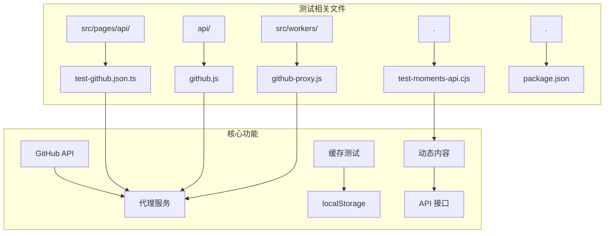
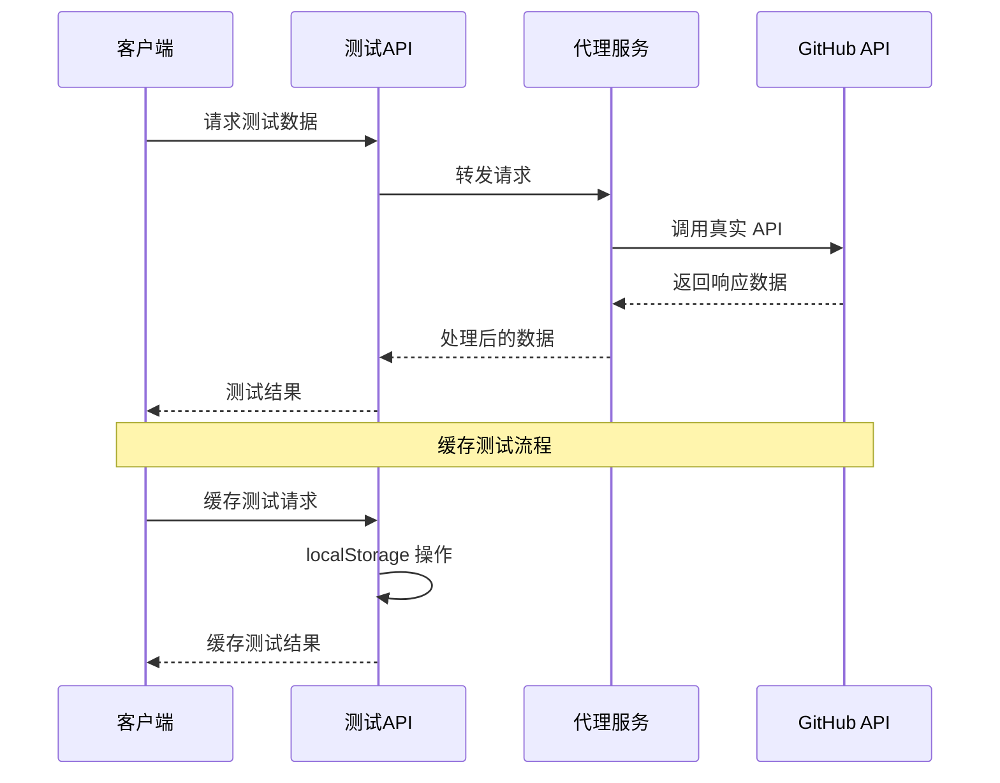
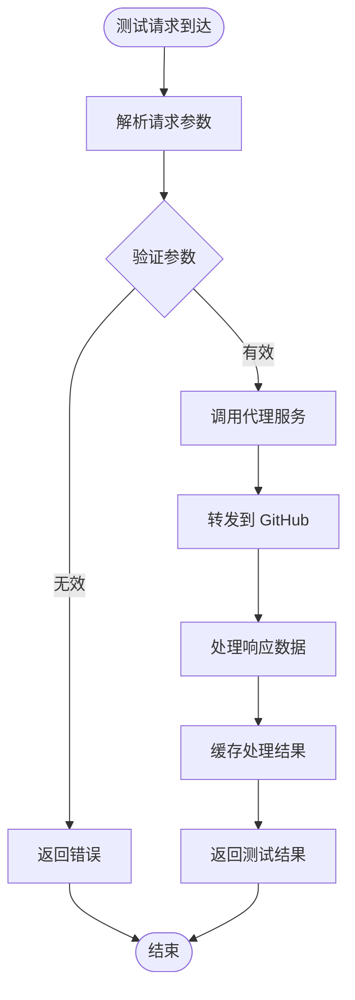
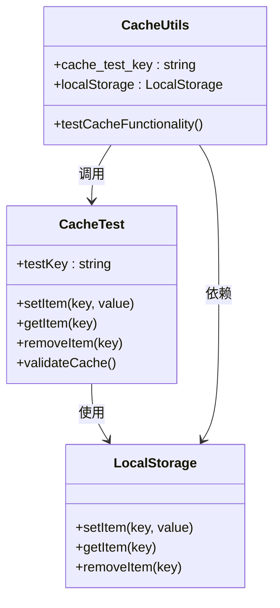
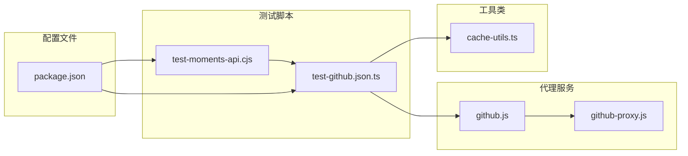

# 测试脚本

<cite>
**本文档引用的文件**
- [test-github.json.ts](file://src/pages/api/test-github.json.ts)
- [test-moments-api.cjs](file://test-moments-api.cjs)
- [github.js](file://api/github.js)
- [github-proxy.js](file://src/workers/github-proxy.js)
- [package.json](file://package.json)
</cite>

## 目录
1. [简介](#简介)
2. [项目结构](#项目结构)
3. [核心组件](#核心组件)
4. [架构概览](#架构概览)
5. [详细组件分析](#详细组件分析)
6. [依赖关系分析](#依赖关系分析)
7. [性能考虑](#性能考虑)
8. [故障排除指南](#故障排除指南)
9. [结论](#结论)

## 简介

本文档详细分析了 my-blog 项目中的测试脚本组件，重点关注 GitHub API 测试和动态内容测试功能。该项目是一个基于 Astro 的静态网站生成器，包含丰富的前端组件和后端 API 接口。

测试脚本主要涉及以下功能：
- GitHub API 测试接口
- 动态内容 API 测试
- 缓存机制测试
- 代理服务测试

## 项目结构

项目采用模块化的组织方式，测试相关的文件主要分布在以下几个目录：

**图表来源**
- [test-github.json.ts:1-50](file://src/pages/api/test-github.json.ts#L1-L50)
- [github.js:1-30](file://api/github.js#L1-L30)
- [github-proxy.js:1-50](file://src/workers/github-proxy.js#L1-L50)

**章节来源**
- [test-github.json.ts:1-50](file://src/pages/api/test-github.json.ts#L1-L50)
- [github.js:1-30](file://api/github.js#L1-L30)
- [test-moments-api.cjs:1-50](file://test-moments-api.cjs#L1-L50)

## 核心组件

### GitHub API 测试组件

GitHub API 测试组件提供了对 GitHub 服务的测试接口，主要用于验证 API 连接性和数据获取功能。

**章节来源**
- [test-github.json.ts:1-50](file://src/pages/api/test-github.json.ts#L1-L50)
- [github.js:1-30](file://api/github.js#L1-L30)

### 动态内容测试组件

动态内容测试组件通过 CJS 脚本实现，用于测试各种动态 API 接口的功能。

**章节来源**
- [test-moments-api.cjs:1-50](file://test-moments-api.cjs#L1-L50)

### 缓存测试机制

项目实现了基于 localStorage 的缓存测试机制，用于验证缓存功能的正确性。

**章节来源**
- [cache-utils.ts:15-25](file://src/utils/cache-utils.ts#L15-L25)

## 架构概览

项目采用前后端分离的架构设计，测试脚本通过 API 接口与后端服务进行交互：

**图表来源**
- [test-github.json.ts:1-50](file://src/pages/api/test-github.json.ts#L1-L50)
- [github-proxy.js:1-50](file://src/workers/github-proxy.js#L1-L50)

## 详细组件分析

### GitHub API 测试接口

GitHub API 测试接口提供了专门的测试端点，用于验证 GitHub 集成功能：

**图表来源**
- [test-github.json.ts:1-50](file://src/pages/api/test-github.json.ts#L1-L50)
- [github-proxy.js:1-50](file://src/workers/github-proxy.js#L1-L50)

**章节来源**
- [test-github.json.ts:1-50](file://src/pages/api/test-github.json.ts#L1-L50)
- [github.js:1-30](file://api/github.js#L1-L30)

### 缓存测试机制

缓存测试机制通过 localStorage 实现，提供了一种简单有效的缓存功能验证方法：

**图表来源**
- [cache-utils.ts:15-25](file://src/utils/cache-utils.ts#L15-L25)

**章节来源**
- [cache-utils.ts:15-25](file://src/utils/cache-utils.ts#L15-L25)

### 动态内容测试

动态内容测试通过 CJS 脚本实现，提供了灵活的测试环境配置：

**章节来源**
- [test-moments-api.cjs:1-50](file://test-moments-api.cjs#L1-L50)

## 依赖关系分析

项目中的测试脚本依赖关系如下：

**图表来源**
- [test-github.json.ts:1-50](file://src/pages/api/test-github.json.ts#L1-L50)
- [github.js:1-30](file://api/github.js#L1-L30)
- [github-proxy.js:1-50](file://src/workers/github-proxy.js#L1-L50)
- [cache-utils.ts:15-25](file://src/utils/cache-utils.ts#L15-L25)

**章节来源**
- [package.json:1-50](file://package.json#L1-L50)

## 性能考虑

测试脚本在设计时考虑了以下性能因素：

1. **缓存优化**：使用 localStorage 减少重复的 API 调用
2. **异步处理**：采用异步模式提高响应速度
3. **资源管理**：合理管理内存和网络资源
4. **错误处理**：实现健壮的错误处理机制

## 故障排除指南

### 常见问题及解决方案

1. **GitHub API 连接失败**
   - 检查网络连接状态
   - 验证 API 密钥配置
   - 查看代理服务器状态

2. **缓存功能异常**
   - 清除浏览器缓存
   - 检查 localStorage 权限
   - 验证缓存键值格式

3. **测试脚本执行错误**
   - 检查 Node.js 版本兼容性
   - 验证依赖包安装状态
   - 查看详细的错误日志

**章节来源**
- [test-github.json.ts:1-50](file://src/pages/api/test-github.json.ts#L1-L50)
- [test-moments-api.cjs:1-50](file://test-moments-api.cjs#L1-L50)

## 结论

该项目的测试脚本组件设计合理，功能完整，涵盖了 GitHub API 测试、动态内容测试和缓存功能验证等多个方面。通过代理服务的设计，实现了对外部 API 的安全访问和测试。整体架构清晰，易于维护和扩展。

建议在未来的工作中：
- 增加更完善的错误处理机制
- 优化缓存策略以提高性能
- 添加更多的测试用例覆盖边缘情况
- 改进测试报告的可视化展示