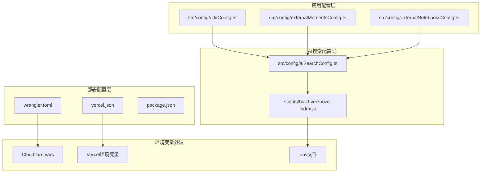
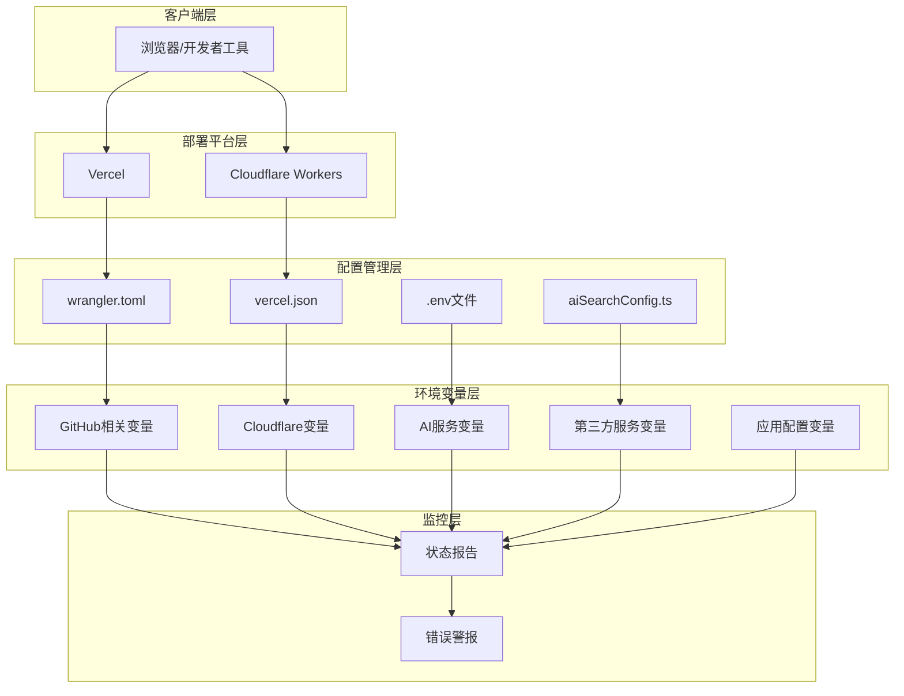
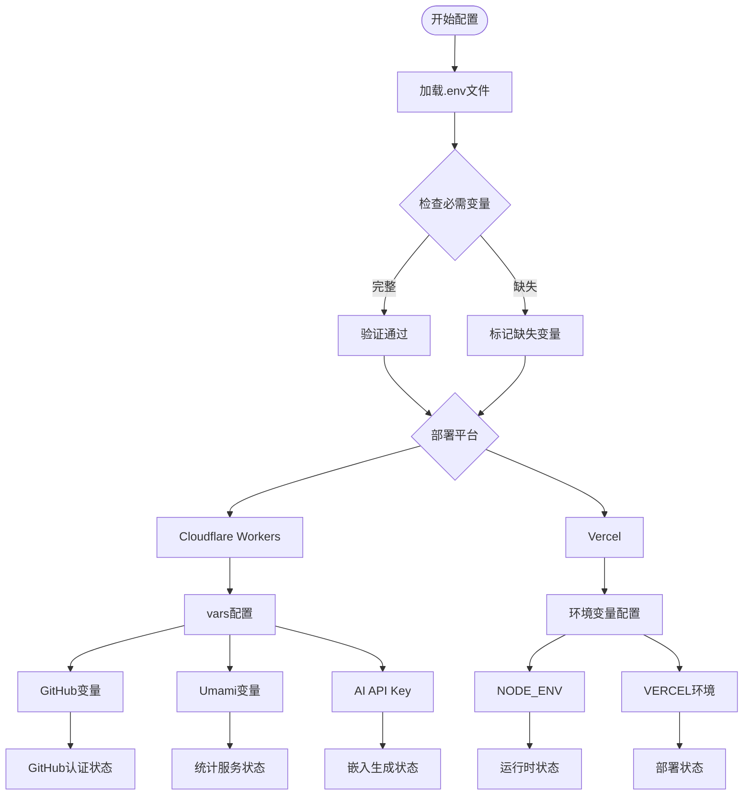
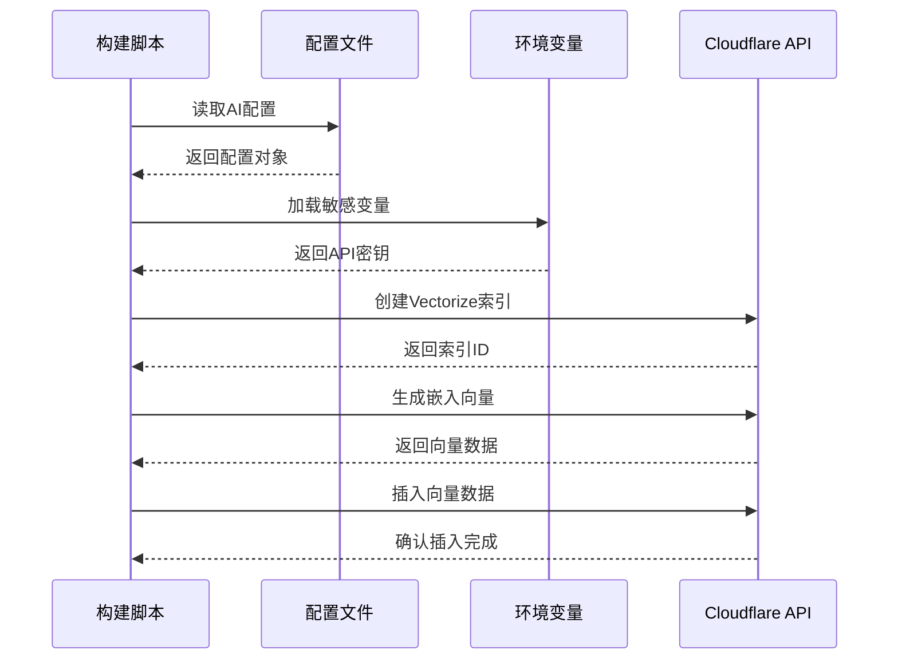
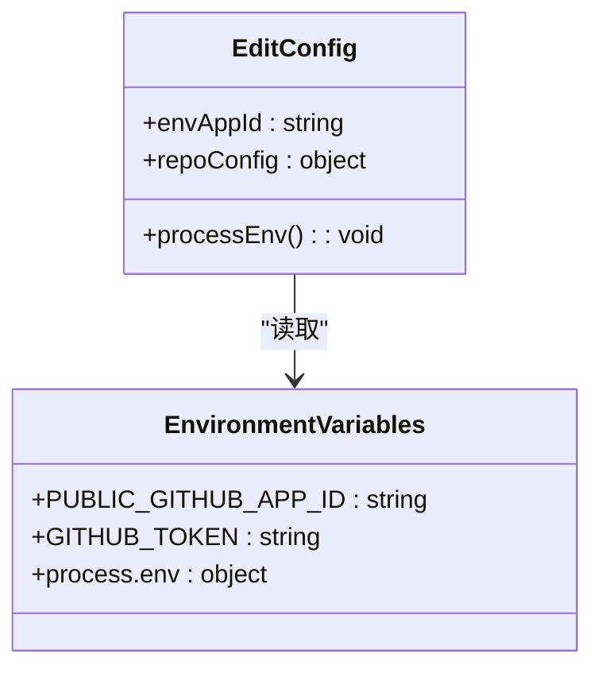
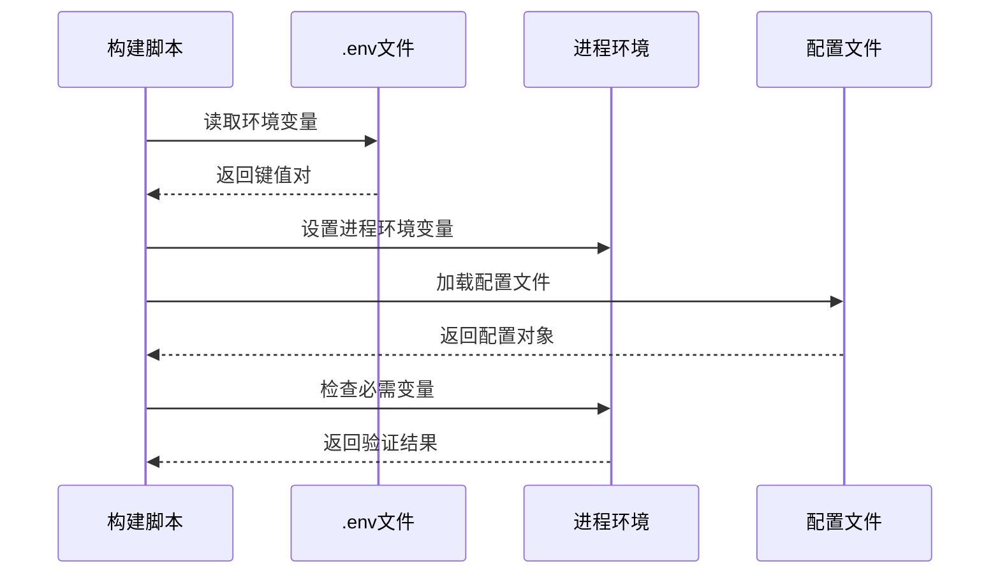

# 环境变量诊断系统

<cite>
**本文档引用的文件**
- [wrangler.toml](file://wrangler.toml)
- [vercel.json](file://vercel.json)
- [scripts/build-vectorize-index.js](file://scripts/build-vectorize-index.js)
- [package.json](file://package.json)
- [src/config/aiSearchConfig.ts](file://src/config/aiSearchConfig.ts)
- [src/config/editConfig.ts](file://src/config/editConfig.ts)
- [src/config/externalMomentsConfig.ts](file://src/config/externalMomentsConfig.ts)
- [src/config/externalNotebooksConfig.ts](file://src/config/externalNotebooksConfig.ts)
</cite>

## 更新摘要
**变更内容**
- 更新了部署配置架构图以反映最新的Cloudflare Workers和Vercel配置
- 新增了AI搜索配置和向量索引构建脚本的详细说明
- 完善了环境变量处理流程和平台支持说明
- 增强了第三方服务集成的配置细节

## 目录
1. [简介](#简介)
2. [项目结构](#项目结构)
3. [核心组件](#核心组件)
4. [架构概览](#架构概览)
5. [详细组件分析](#详细组件分析)
6. [依赖关系分析](#依赖关系分析)
7. [性能考虑](#性能考虑)
8. [故障排除指南](#故障排除指南)
9. [结论](#结论)

## 简介

环境变量诊断系统是本博客项目中的一个关键基础设施组件，负责验证和监控应用程序运行所需的环境变量配置。该系统通过专门的API端点提供实时的环境变量状态检查，确保GitHub应用认证、Cloudflare服务集成、以及各种第三方服务的正确配置。

系统支持多种部署环境（Vercel和Cloudflare Workers），并提供了灵活的配置管理机制，包括本地开发环境、生产环境和CI/CD流程中的环境变量处理。最新的更新增强了对AI搜索功能的支持，包括Vectorize向量数据库和Cloudflare Workers AI的集成配置。

## 项目结构

项目采用模块化的架构设计，环境变量诊断系统主要分布在以下关键位置：



**图表来源**
- [wrangler.toml:1-36](file://wrangler.toml#L1-L36)
- [vercel.json:1-40](file://vercel.json#L1-L40)
- [scripts/build-vectorize-index.js:1-388](file://scripts/build-vectorize-index.js#L1-L388)

**章节来源**
- [wrangler.toml:1-36](file://wrangler.toml#L1-L36)
- [vercel.json:1-40](file://vercel.json#L1-L40)
- [scripts/build-vectorize-index.js:1-388](file://scripts/build-vectorize-index.js#L1-L388)

## 核心组件

### 部署平台配置

系统支持两种主要的部署平台，每种都有特定的环境变量配置要求：

#### Vercel部署配置
- **构建命令**：`pnpm build`
- **输出目录**：`dist`
- **安装命令**：`pnpm install`
- **框架类型**：`astro`
- **安全头部**：包含X-Content-Type-Options、X-Frame-Options、X-XSS-Protection等安全配置

#### Cloudflare Workers配置
- **Worker名称**：`my-blog`
- **兼容性日期**：`2026-06-21`
- **主入口文件**：`src/worker.js`
- **资产目录**：`./dist`
- **Node版本**：`22`

### AI搜索和向量索引配置

系统集成了完整的AI搜索功能，包括：

- **Vectorize向量数据库**：用于存储和查询文章向量
- **Cloudflare Workers AI**：提供本地嵌入生成能力
- **第三方AI API**：支持自定义嵌入模型（如Qwen/Qwen3-Embedding-8B）
- **索引管理**：支持全量重建和增量更新

**章节来源**
- [vercel.json:1-40](file://vercel.json#L1-L40)
- [wrangler.toml:1-36](file://wrangler.toml#L1-L36)
- [src/config/aiSearchConfig.ts:1-30](file://src/config/aiSearchConfig.ts#L1-L30)

## 架构概览

环境变量诊断系统的整体架构采用分层设计，确保了良好的可维护性和扩展性：



**图表来源**
- [wrangler.toml:8-36](file://wrangler.toml#L8-L36)
- [vercel.json:6-39](file://vercel.json#L6-L39)
- [src/config/aiSearchConfig.ts:8-29](file://src/config/aiSearchConfig.ts#L8-L29)

## 详细组件分析

### 环境变量配置矩阵

系统使用多层次的环境变量配置策略：



**图表来源**
- [wrangler.toml:14-24](file://wrangler.toml#L14-L24)
- [vercel.json:2-5](file://vercel.json#L2-L5)

### AI搜索配置分析

AI搜索功能的配置采用了集中式管理模式：

#### 配置文件结构
- **API地址**：`https://api-inference.modelscope.cn/v1`
- **对话模型**：`deepseek-ai/DeepSeek-V4-Flash`
- **嵌入模型**：`Qwen/Qwen3-Embedding-8B`
- **向量维度**：`1024`
- **索引名称**：`blog-ai-search`

#### 向量索引构建流程


**图表来源**
- [scripts/build-vectorize-index.js:224-274](file://scripts/build-vectorize-index.js#L224-L274)
- [src/config/aiSearchConfig.ts:8-29](file://src/config/aiSearchConfig.ts#L8-L29)

**章节来源**
- [src/config/aiSearchConfig.ts:1-30](file://src/config/aiSearchConfig.ts#L1-L30)
- [scripts/build-vectorize-index.js:1-388](file://scripts/build-vectorize-index.js#L1-L388)

### 配置文件分析

#### 编辑配置中的环境变量

编辑功能配置中包含了公共GitHub应用ID的环境变量处理：



**图表来源**
- [src/config/editConfig.ts:40-47](file://src/config/editConfig.ts#L40-L47)

#### 外部数据源配置

外部Moments和Notebooks配置展示了环境变量在不同场景下的使用模式：

- **GITHUB_TOKEN**：用于GitHub API访问
- **条件加载**：当环境变量存在时才启用相应功能
- **共享认证**：说说和笔记功能共享相同的管理员密码哈希

**章节来源**
- [src/config/editConfig.ts:1-48](file://src/config/editConfig.ts#L1-L48)
- [src/config/externalMomentsConfig.ts:1-43](file://src/config/externalMomentsConfig.ts#L1-L43)
- [src/config/externalNotebooksConfig.ts:1-83](file://src/config/externalNotebooksConfig.ts#L1-L83)

### 脚本级环境变量处理

构建向量索引脚本展示了复杂的环境变量处理逻辑：



**图表来源**
- [scripts/build-vectorize-index.js:40-58](file://scripts/build-vectorize-index.js#L40-L58)

**章节来源**
- [scripts/build-vectorize-index.js:40-77](file://scripts/build-vectorize-index.js#L40-L77)

## 依赖关系分析

环境变量诊断系统与项目其他组件存在密切的依赖关系：

```mermaid
graph LR
subgraph "部署配置"
CF[wrangler.toml]
VC[vercel.json]
PKG[package.json]
end
subgraph "AI配置"
AISC[aiSearchConfig.ts]
BV[build-vectorize-index.js]
end
subgraph "应用配置"
EC[editConfig.ts]
MC[externalMomentsConfig.ts]
NC[externalNotebooksConfig.ts]
end
subgraph "环境变量"
ENV[.env文件]
VAR[Cloudflare vars]
ENV --> BV
ENV --> EC
ENV --> MC
ENV --> NC
VAR --> CF
PKG --> VC
AISC --> BV
EC --> AISC
MC --> AISC
NC --> AISC
```

**图表来源**
- [wrangler.toml:1-36](file://wrangler.toml#L1-L36)
- [vercel.json:1-40](file://vercel.json#L1-L40)
- [scripts/build-vectorize-index.js:1-388](file://scripts/build-vectorize-index.js#L1-L388)

**章节来源**
- [wrangler.toml:1-36](file://wrangler.toml#L1-L36)
- [vercel.json:1-40](file://vercel.json#L1-L40)
- [scripts/build-vectorize-index.js:1-388](file://scripts/build-vectorize-index.js#L1-L388)

## 性能考虑

环境变量诊断系统在设计时充分考虑了性能优化：

### 实时检查优化
- **轻量级响应**：只返回必要的诊断信息
- **缓存友好的设计**：避免不必要的计算开销
- **快速验证**：直接读取进程环境变量，无需额外I/O操作

### 内存使用优化
- **按需分配**：只创建必要的数据结构
- **字符串优化**：使用简洁的状态表示
- **无副作用**：不修改任何环境变量或配置

### AI搜索性能优化
- **批量处理**：支持向量插入和嵌入生成的批量操作
- **增量更新**：只处理发生变化的内容
- **缓存管理**：使用manifest文件跟踪已处理的内容

**章节来源**
- [scripts/build-vectorize-index.js:224-320](file://scripts/build-vectorize-index.js#L224-L320)

## 故障排除指南

### 常见问题诊断

#### GitHub应用认证问题
- **症状**：`GH_APP_ID`或`GH_PRIVATE_KEY`显示为未设置
- **解决方案**：检查Cloudflare Dashboard中的Secret配置
- **验证方法**：重新部署后再次运行诊断端点

#### Cloudflare集成问题
- **症状**：Vectorize或AI服务相关变量缺失
- **解决方案**：确认Cloudflare Workers配置中的vars部分
- **验证方法**：检查`wrangler.toml`中的变量定义

#### AI搜索配置问题
- **症状**：向量索引创建或嵌入生成失败
- **解决方案**：验证CLOUDFLARE_API_TOKEN和CLOUDFLARE_ACCOUNT_ID配置
- **验证方法**：检查.env文件中的敏感变量设置

#### 第三方服务配置
- **症状**：Umami统计或其他第三方服务不可用
- **解决方案**：验证相应的API密钥和端点配置
- **验证方法**：检查环境变量的格式和完整性

**章节来源**
- [wrangler.toml:14-24](file://wrangler.toml#L14-L24)
- [scripts/build-vectorize-index.js:74-77](file://scripts/build-vectorize-index.js#L74-L77)

## 结论

环境变量诊断系统为本博客项目提供了强大的基础设施监控能力。通过统一的API接口和多平台支持，系统确保了关键服务的正确配置和稳定运行。

### 主要优势
- **全面覆盖**：检查所有关键环境变量
- **实时反馈**：提供即时的状态报告
- **多平台支持**：同时支持Vercel和Cloudflare Workers
- **AI功能集成**：完整的向量搜索和嵌入生成功能
- **易于集成**：简单的API调用即可获取诊断结果

### 未来改进方向
- **增强错误详情**：提供更多具体的配置建议
- **自动化修复**：支持自动检测和修复常见配置问题
- **历史记录**：保存诊断历史以便趋势分析
- **通知机制**：集成到现有的监控和告警系统
- **AI性能监控**：增加向量索引和嵌入生成的性能指标

该系统为项目的可靠运行提供了重要保障，是现代Web应用不可或缺的基础设施组件。最新的更新进一步增强了对AI搜索功能的支持，为用户提供了更丰富的智能化体验。