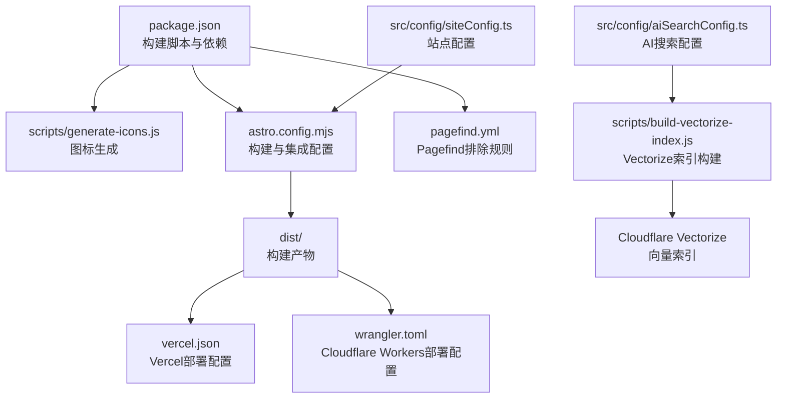
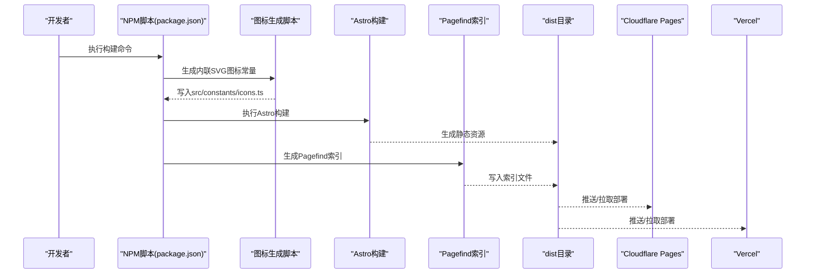
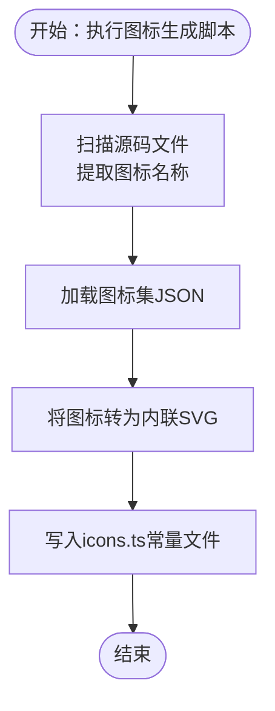
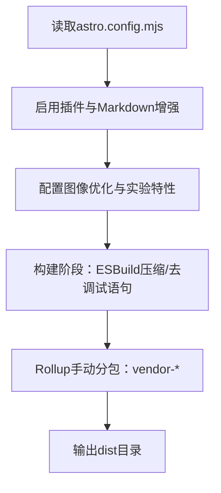
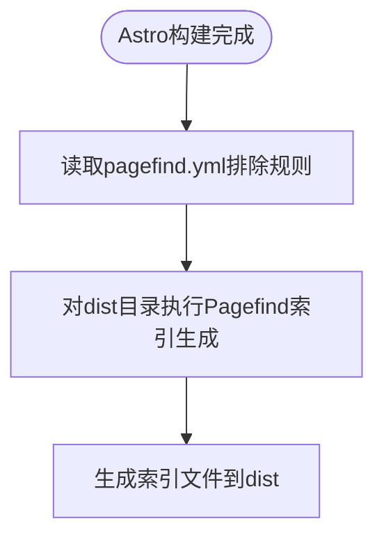
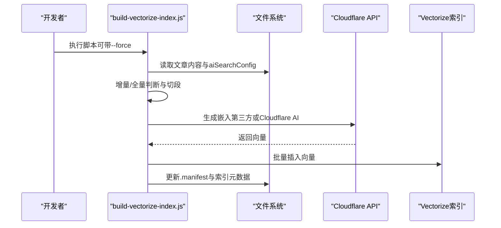
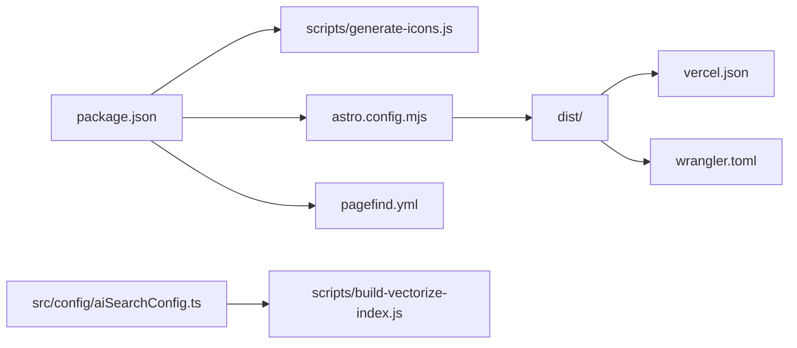

# 构建与部署

<cite>
**本文引用的文件**
- [package.json](file://package.json)
- [astro.config.mjs](file://astro.config.mjs)
- [pagefind.yml](file://pagefind.yml)
- [vercel.json](file://vercel.json)
- [wrangler.toml](file://wrangler.toml)
- [scripts/generate-icons.js](file://scripts/generate-icons.js)
- [scripts/build-vectorize-index.js](file://scripts/build-vectorize-index.js)
- [src/config/siteConfig.ts](file://src/config/siteConfig.ts)
- [src/config/aiSearchConfig.ts](file://src/config/aiSearchConfig.ts)
</cite>

## 更新摘要
**变更内容**
- 新增Vercel SSR适配器功能说明，提供服务器端渲染能力
- 更新构建流程以支持SSR渲染优化
- 增强性能考量章节，包含SSR相关的缓存和渲染策略
- 更新故障排除指南，增加SSR相关问题诊断

## 目录
1. [简介](#简介)
2. [项目结构](#项目结构)
3. [核心组件](#核心组件)
4. [架构总览](#架构总览)
5. [详细组件分析](#详细组件分析)
6. [依赖关系分析](#依赖关系分析)
7. [性能考量](#性能考量)
8. [故障排除指南](#故障排除指南)
9. [结论](#结论)
10. [附录](#附录)

## 简介
本文件面向Firefly-Mod项目的构建与部署，系统性阐述以下内容：
- 构建流程三阶段：图标生成、Astro构建、Pagefind索引生成
- CI/CD工作流配置思路（基于现有脚本与配置）
- 多平台部署策略：Cloudflare Pages、Vercel、Netlify
- Cloudflare Workers部署：API密钥、环境变量、KV/Vectorize绑定与域名
- 构建优化：代码分割、资源压缩、缓存策略
- 部署后监控与维护：健康检查、性能监控、错误追踪
- 故障排除：常见问题与解决方案
- 多环境部署：开发、测试、生产差异配置

**更新** 新增Vercel SSR适配器功能，提供服务器端渲染能力，通过astro.config.mjs中的vercel适配器实现，提升性能、SEO和用户体验。

## 项目结构
本项目采用Astro静态站点框架，结合Pagefind全文搜索、Cloudflare Workers与Vectorize实现AI搜索能力。关键构建与部署相关文件分布如下：
- 构建脚本与任务：scripts目录
- 构建配置：astro.config.mjs、pagefind.yml
- 平台配置：vercel.json（Vercel）、wrangler.toml（Cloudflare Workers）
- 配置中心：src/config（站点配置、AI搜索配置）

图表来源
- [package.json:1-112](file://package.json#L1-L112)
- [astro.config.mjs:1-307](file://astro.config.mjs#L1-L307)
- [pagefind.yml:1-7](file://pagefind.yml#L1-L7)
- [vercel.json:1-40](file://vercel.json#L1-L40)
- [wrangler.toml:1-36](file://wrangler.toml#L1-L36)
- [scripts/generate-icons.js:1-275](file://scripts/generate-icons.js#L1-L275)
- [scripts/build-vectorize-index.js:1-388](file://scripts/build-vectorize-index.js#L1-L388)
- [src/config/siteConfig.ts:1-322](file://src/config/siteConfig.ts#L1-L322)
- [src/config/aiSearchConfig.ts:1-30](file://src/config/aiSearchConfig.ts#L1-L30)

章节来源
- [package.json:1-112](file://package.json#L1-L112)
- [astro.config.mjs:1-307](file://astro.config.mjs#L1-L307)
- [pagefind.yml:1-7](file://pagefind.yml#L1-L7)
- [vercel.json:1-40](file://vercel.json#L1-L40)
- [wrangler.toml:1-36](file://wrangler.toml#L1-L36)

## 核心组件
- 构建脚本与命令
  - 图标生成：通过扫描源码中的图标使用情况，动态生成内联SVG常量文件，减少运行时请求与闪烁。
  - Astro构建：执行Astro静态站点构建，产出dist目录。
  - Pagefind索引：在Astro构建完成后，对dist目录生成全文搜索索引。
  - Vectorize索引：按文章内容切段生成向量并上传至Cloudflare Vectorize，支持AI搜索。
- 构建配置
  - Astro配置：集成Svelte、Expressive Code、MDX、Sitemap等插件；配置图像优化、队列渲染、代理与构建优化（代码分割、压缩、缓存头）。
  - Pagefind配置：排除不需要索引的选择器，确保搜索体验与性能平衡。
  - 平台配置：Vercel与Cloudflare Pages通过配置文件声明缓存头与安全头；Cloudflare Workers通过wrangler.toml绑定静态资源、KV与Vectorize。

**更新** Vercel SSR适配器：通过vercel依赖提供服务器端渲染能力，优化首屏渲染时间和SEO表现，支持动态内容的SSR渲染。

章节来源
- [package.json:5-18](file://package.json#L5-L18)
- [scripts/generate-icons.js:1-275](file://scripts/generate-icons.js#L1-L275)
- [astro.config.mjs:47-307](file://astro.config.mjs#L47-L307)
- [pagefind.yml:1-7](file://pagefind.yml#L1-L7)
- [vercel.json:1-40](file://vercel.json#L1-L40)
- [wrangler.toml:1-36](file://wrangler.toml#L1-L36)

## 架构总览
下图展示从源码到部署产物的关键路径与集成点：

图表来源
- [package.json:9](file://package.json#L9)
- [scripts/generate-icons.js:207-275](file://scripts/generate-icons.js#L207-L275)
- [astro.config.mjs:47-307](file://astro.config.mjs#L47-L307)
- [pagefind.yml:1-7](file://pagefind.yml#L1-L7)
- [vercel.json:1-40](file://vercel.json#L1-L40)
- [wrangler.toml:1-36](file://wrangler.toml#L1-L36)

## 详细组件分析

### 图标生成组件
- 目标：在构建前扫描Svelte/Astro/TS文件中的图标使用，生成内联SVG常量，减少HTTP请求与FOUC。
- 关键流程：
  - 扫描源码目录，匹配多种图标使用模式（HTML属性、JS对象、函数调用等）。
  - 动态加载图标集JSON，提取对应图标并转为内联SVG。
  - 生成src/constants/icons.ts，包含获取SVG与可用性检测的工具函数。
- 性能影响：将图标内联可显著降低首屏渲染时的网络往返，适合高频图标。

图表来源
- [scripts/generate-icons.js:207-275](file://scripts/generate-icons.js#L207-L275)

章节来源
- [scripts/generate-icons.js:1-275](file://scripts/generate-icons.js#L1-L275)

### Astro构建组件
- 目标：生成静态站点产物，配置图像优化、Markdown增强、Sitemap、代理与构建优化。
- 关键配置要点：
  - 图像优化：全局约束布局，按需输出WebP/AVIF。
  - 实验特性：可选Rust编译器与队列渲染，按平台稳定性决定启用。
  - 插件集成：Svelte、Expressive Code、MDX、Sitemap、Swup等。
  - 构建优化：ESBuild压缩、移除console/debugger、Rollup手动分包、CSS压缩与内联阈值。
  - 开发代理：本地API代理到8787端口。
- 缓存策略：通过Vercel或Cloudflare Pages的headers配置实现静态资源长期缓存与HTML即时验证。

**更新** SSR渲染优化：队列渲染特性可提升SSR场景下的渲染性能，减少首屏等待时间，改善用户体验。

图表来源
- [astro.config.mjs:47-307](file://astro.config.mjs#L47-L307)

章节来源
- [astro.config.mjs:47-307](file://astro.config.mjs#L47-L307)

### Pagefind索引组件
- 目标：在dist目录生成全文搜索索引，提升站内搜索体验。
- 配置要点：
  - 排除选择器：针对KaTeX、自定义忽略标记与搜索面板，避免噪声。
  - 构建顺序：必须在Astro构建之后执行。
- 使用建议：与站点URL、语言、sitemap配置配合，确保索引覆盖完整页面。

图表来源
- [pagefind.yml:1-7](file://pagefind.yml#L1-L7)
- [package.json:9](file://package.json#L9)

章节来源
- [pagefind.yml:1-7](file://pagefind.yml#L1-L7)
- [package.json:9](file://package.json#L9)

### Vectorize索引组件（AI搜索）
- 目标：将文章内容按标题层级切段，生成向量并上传至Cloudflare Vectorize，支撑AI搜索。
- 关键流程：
  - 读取站点AI搜索配置（索引名、维度、批大小等）。
  - 读取环境变量（Cloudflare API Token、Account ID，可选第三方AI API Key）。
  - 增量更新：对比manifest，仅对新增/变更文章重新切段与向量化，删除已删除文章对应的向量。
  - 分批上传：按批次插入Vectorize，支持第三方Embedding API或Cloudflare Workers AI。
- 与Workers集成：通过wrangler.toml绑定Vectorize与KV命名空间，实现运行时查询。

图表来源
- [scripts/build-vectorize-index.js:324-388](file://scripts/build-vectorize-index.js#L324-L388)
- [src/config/aiSearchConfig.ts:1-30](file://src/config/aiSearchConfig.ts#L1-L30)
- [wrangler.toml:26-36](file://wrangler.toml#L26-L36)

章节来源
- [scripts/build-vectorize-index.js:1-388](file://scripts/build-vectorize-index.js#L1-L388)
- [src/config/aiSearchConfig.ts:1-30](file://src/config/aiSearchConfig.ts#L1-L30)
- [wrangler.toml:1-36](file://wrangler.toml#L1-L36)

### 配置中心（站点与AI搜索）
- 站点配置：集中管理站点标题、URL、关键词、导航、页面开关、图像优化、分析等。
- AI搜索配置：集中管理Vectorize索引名、维度、批大小、Embedding模型与API地址等，供前端组件、构建脚本与Worker共享。

章节来源
- [src/config/siteConfig.ts:1-322](file://src/config/siteConfig.ts#L1-L322)
- [src/config/aiSearchConfig.ts:1-30](file://src/config/aiSearchConfig.ts#L1-L30)

## 依赖关系分析
- 构建脚本依赖：
  - package.json中的build命令串联图标生成、Astro构建与Pagefind索引生成。
  - scripts/generate-icons.js依赖图标集包与源码扫描。
  - scripts/build-vectorize-index.js依赖aiSearchConfig与环境变量。
- 平台配置依赖：
  - vercel.json声明构建命令、输出目录与安全头。
  - wrangler.toml声明静态资源目录、KV/Vectorize绑定与变量。

**更新** Vercel适配器依赖：package.json中包含vercel依赖，为SSR功能提供基础支持。

图表来源
- [package.json:9](file://package.json#L9)
- [scripts/generate-icons.js:1-275](file://scripts/generate-icons.js#L1-L275)
- [astro.config.mjs:47-307](file://astro.config.mjs#L47-L307)
- [pagefind.yml:1-7](file://pagefind.yml#L1-L7)
- [vercel.json:1-40](file://vercel.json#L1-L40)
- [wrangler.toml:1-36](file://wrangler.toml#L1-L36)
- [scripts/build-vectorize-index.js:1-388](file://scripts/build-vectorize-index.js#L1-L388)
- [src/config/aiSearchConfig.ts:1-30](file://src/config/aiSearchConfig.ts#L1-L30)

章节来源
- [package.json:5-18](file://package.json#L5-L18)
- [astro.config.mjs:47-307](file://astro.config.mjs#L47-L307)
- [vercel.json:1-40](file://vercel.json#L1-L40)
- [wrangler.toml:1-36](file://wrangler.toml#L1-L36)

## 性能考量
- 代码分割与懒加载
  - Rollup manualChunks按依赖库与功能模块拆分，减少首屏体积与提升缓存命中。
  - 动态导入与条件加载，避免无关模块进入首屏bundle。
- 资源压缩与清理
  - ESBuild压缩与drop console/debugger，减小产物体积。
  - CSS内联阈值与CSS代码分割策略，平衡HTTP请求数与缓存效率。
- 缓存策略
  - 静态资源（/_astro/*、/assets/*）长期缓存，HTML文件每次验证。
  - 平台headers配置（Vercel、Cloudflare Pages）统一注入安全与缓存头。
- 图像优化
  - 限定输出格式（WebP/AVIF），控制质量，按需启用响应式图像。
- 构建优化
  - 队列渲染与可选Rust编译器，按平台稳定性权衡启用。

**更新** SSR性能优化：
  - 队列渲染特性可提升SSR场景下的并发处理能力
  - 长期缓存策略适用于SSR渲染的静态内容
  - Vercel平台的SSR适配器提供更好的首屏渲染性能

章节来源
- [astro.config.mjs:256-304](file://astro.config.mjs#L256-L304)
- [vercel.json:6-39](file://vercel.json#L6-L39)

## 故障排除指南
- 构建失败（图标生成）
  - 现象：图标集加载失败或图标缺失。
  - 排查：确认图标集包安装、图标名称格式正确、扫描模式覆盖目标文件类型。
  - 参考：[scripts/generate-icons.js:96-117](file://scripts/generate-icons.js#L96-L117)
- 构建失败（Pagefind索引）
  - 现象：索引生成报错或dist目录为空。
  - 排查：确认Astro构建先于Pagefind执行；检查pagefind.yml排除规则是否误排除正文。
  - 参考：[package.json:9](file://package.json#L9)、[pagefind.yml:1-7](file://pagefind.yml#L1-L7)
- 构建失败（Vectorize索引）
  - 现象：Cloudflare API调用失败或索引不存在。
  - 排查：检查CLOUDFLARE_API_TOKEN与ACCOUNT_ID；确认索引维度与模型配置一致；必要时使用--force重建。
  - 参考：[scripts/build-vectorize-index.js:74-77](file://scripts/build-vectorize-index.js#L74-L77)、[src/config/aiSearchConfig.ts:18-29](file://src/config/aiSearchConfig.ts#L18-L29)
- 部署失败（Vercel）
  - 现象：构建命令失败或缓存头不生效。
  - 排查：确认vercel.json的buildCommand与outputDirectory；检查framework字段与headers配置。
  - 参考：[vercel.json:1-40](file://vercel.json#L1-L40)
- 部署失败（Cloudflare Pages/Workers）
  - 现象：静态资源未被正确缓存或Workers变量未生效。
  - 排查：确认wrangler.toml的assets目录、KV/Vectorize绑定与vars；在Dashboard中设置Secret变量。
  - 参考：[wrangler.toml:1-36](file://wrangler.toml#L1-L36)

**更新** SSR相关故障排除：
  - Vercel SSR适配器初始化失败：检查vercel依赖版本兼容性和配置正确性
  - SSR渲染性能问题：确认队列渲染配置和缓存策略设置
  - 动态内容SSR异常：验证组件的SSR兼容性和必要的客户端水合配置

章节来源
- [scripts/generate-icons.js:96-117](file://scripts/generate-icons.js#L96-L117)
- [package.json:9](file://package.json#L9)
- [pagefind.yml:1-7](file://pagefind.yml#L1-L7)
- [scripts/build-vectorize-index.js:74-77](file://scripts/build-vectorize-index.js#L74-L77)
- [src/config/aiSearchConfig.ts:18-29](file://src/config/aiSearchConfig.ts#L18-L29)
- [vercel.json:1-40](file://vercel.json#L1-L40)
- [wrangler.toml:1-36](file://wrangler.toml#L1-L36)

## 结论
本项目通过"图标生成 + Astro构建 + Pagefind索引"的三阶段流水线，结合Cloudflare Workers与Vectorize实现AI搜索能力，并通过Vercel与Cloudflare Pages提供稳定部署。借助明确的配置中心与平台配置文件，可在多环境下复用相同构建逻辑，实现高效、可维护的发布流程。

**更新** 新增的Vercel SSR适配器功能进一步提升了应用的性能表现，通过服务器端渲染优化了首屏加载速度和SEO效果，为用户提供了更流畅的浏览体验。

## 附录

### CI/CD工作流配置思路
- 触发条件：推送主分支或创建Release标签
- 步骤建议：
  - 安装依赖（pnpm）
  - 类型检查与代码质量检查（Biome/Lint）
  - 图标生成、Astro构建、Pagefind索引生成
  - 可选：Vectorize索引增量更新（生产环境）
  - 部署：分别触发Vercel与Cloudflare Pages/Workers的部署入口
- 代码质量与安全：
  - 使用Biome进行格式化与检查
  - 为敏感变量（Cloudflare API Token、AI API Key）配置在CI环境的安全存储

**更新** SSR构建优化：在CI环境中启用队列渲染特性，确保SSR构建过程的稳定性和性能。

章节来源
- [package.json:14-15](file://package.json#L14-L15)
- [scripts/build-vectorize-index.js:40-58](file://scripts/build-vectorize-index.js#L40-L58)

### 多平台部署步骤

#### Cloudflare Pages
- 配置要点：
  - 项目根目录放置vercel.json（用于声明构建命令与headers）
  - 在Pages设置中关联仓库，选择框架为Astro
  - 设置自定义域名与SSL证书
- 缓存与安全：
  - 通过vercel.json的headers配置注入安全与缓存头

章节来源
- [vercel.json:1-40](file://vercel.json#L1-L40)

#### Vercel
- 配置要点：
  - vercel.json声明buildCommand、outputDirectory、framework与headers
  - 在Vercel仪表盘中设置环境变量（如分析、CDN等）
  - 启用SSR适配器以获得更好的性能表现
- 缓存与安全：
  - 通过headers统一注入安全与缓存策略

**更新** Vercel SSR配置：确保vercel.json中正确配置framework为astro，并启用相应的SSR适配器以获得最佳性能。

章节来源
- [vercel.json:1-40](file://vercel.json#L1-L40)

#### Netlify
- 配置要点：
  - 在Netlify中设置构建命令与发布目录
  - 添加headers重写与安全头（通过netlify.toml或仪表盘）
- 注意事项：
  - 确认静态资源缓存策略与HTML刷新策略与平台一致

[本节为通用部署指导，不直接分析具体文件，故无章节来源]

### Cloudflare Workers部署
- 部署入口：wrangler.toml中main指向src/worker.js
- 静态资源：assets.directory指向dist
- 绑定：
  - KV命名空间：VISITOR_KV
  - Vectorize索引：VECTORIZE
  - AI绑定：AI
- 环境变量：
  - 必填：CLOUDFLARE_API_TOKEN、CLOUDFLARE_ACCOUNT_ID
  - 可选：AI_API_KEY（第三方Embedding API）
  - 在Dashboard的Variables and Secrets中配置
- 域名绑定：
  - 在Cloudflare DNS中为Workers子域配置CNAME或记录，指向workers.dev或自定义域名

章节来源
- [wrangler.toml:1-36](file://wrangler.toml#L1-L36)
- [scripts/build-vectorize-index.js:40-58](file://scripts/build-vectorize-index.js#L40-L58)

### 多环境部署策略
- 开发环境：
  - NODE_ENV为development，启用队列渲染与可选Rust编译器
  - 本地代理到后端API（8787）
- 测试环境：
  - 使用独立的Vectorize索引与KV命名空间
  - 验证Pagefind索引完整性与搜索结果
- 生产环境：
  - 启用严格缓存与安全头
  - 使用--force重建Vectorize索引（定期全量同步）
  - 监控Workers与Pages的健康状态与性能指标
  - 启用Vercel SSR适配器以优化生产环境性能

**更新** 多环境SSR配置：
  - 开发环境：启用队列渲染和Rust编译器以提升构建性能
  - 测试环境：验证SSR渲染的正确性和性能表现
  - 生产环境：启用Vercel SSR适配器并配置适当的缓存策略

章节来源
- [astro.config.mjs:42-44](file://astro.config.mjs#L42-L44)
- [astro.config.mjs:244-249](file://astro.config.mjs#L244-L249)
- [vercel.json:6-39](file://vercel.json#L6-L39)
- [scripts/build-vectorize-index.js:332-346](file://scripts/build-vectorize-index.js#L332-L346)