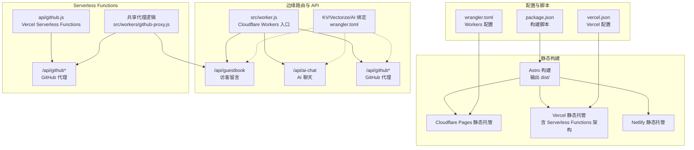
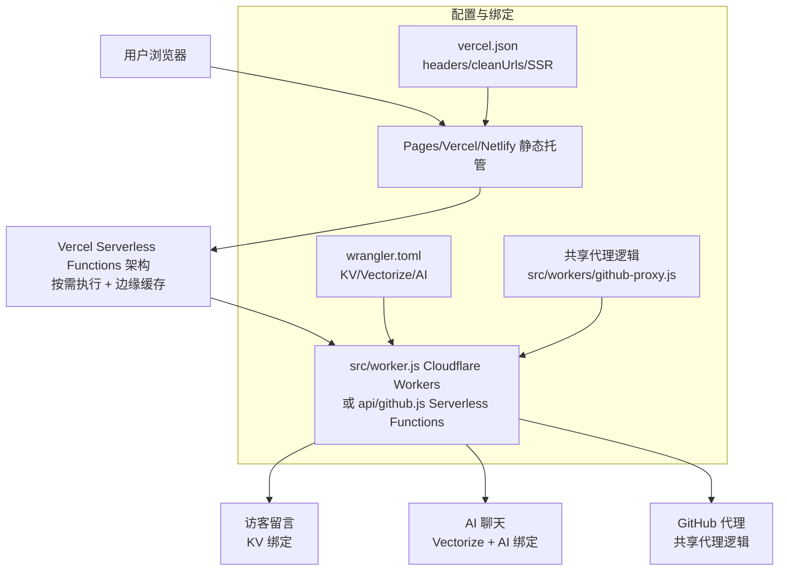
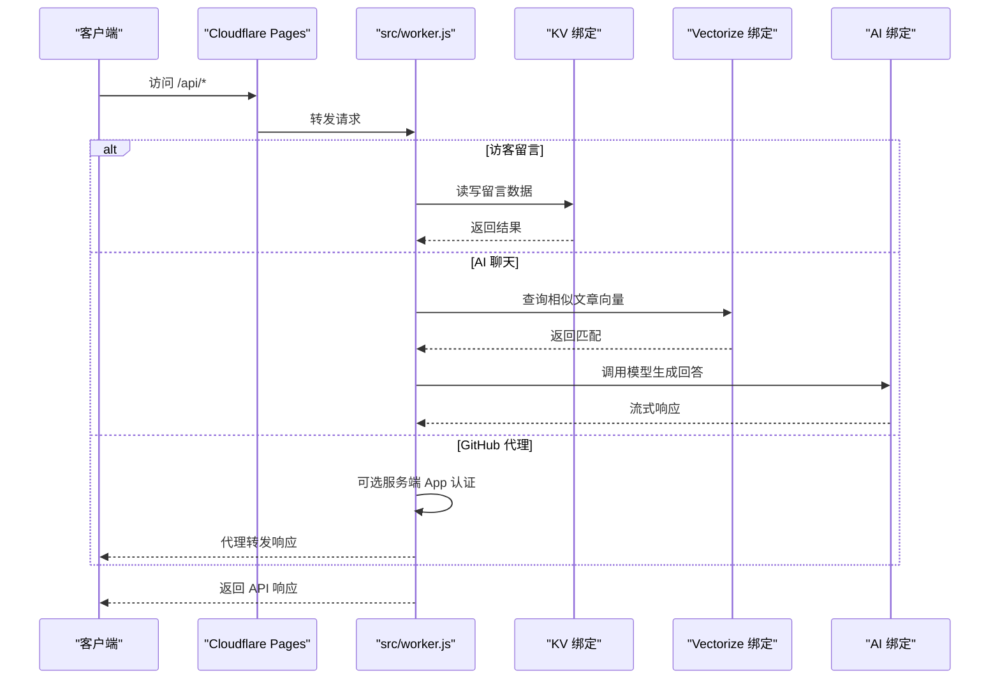
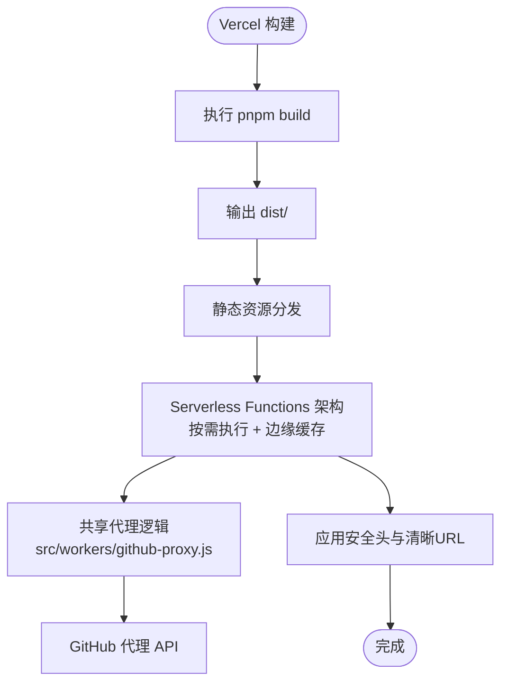
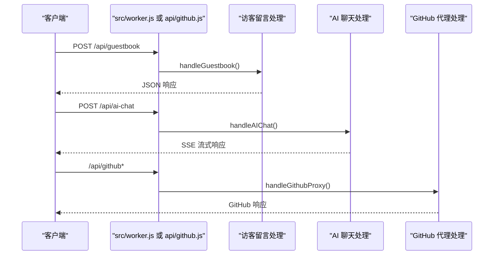
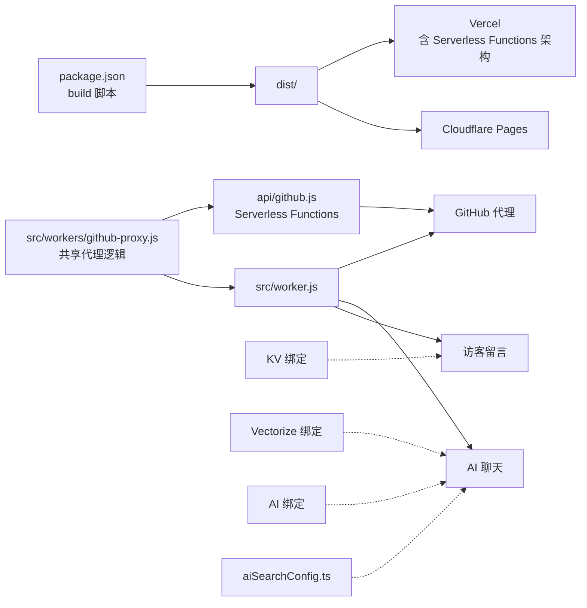

# 部署平台配置

<cite>
**本文引用的文件**
- [vercel.json](file://vercel.json)
- [wrangler.toml](file://wrangler.toml)
- [package.json](file://package.json)
- [src/worker.js](file://src/worker.js)
- [src/workers/ai-chat.js](file://src/workers/ai-chat.js)
- [src/workers/github-proxy.js](file://src/workers/github-proxy.js)
- [src/workers/guestbook.js](file://src/workers/guestbook.js)
- [src/workers/utils/rate-limit.js](file://src/workers/utils/rate-limit.js)
- [src/workers/utils/streaming.js](file://src/workers/utils/streaming.js)
- [src/config/aiSearchConfig.ts](file://src/config/aiSearchConfig.ts)
- [src/config/siteConfig.ts](file://src/config/siteConfig.ts)
- [src/pages/calendar.astro](file://src/pages/calendar.astro)
- [src/pages/list.astro](file://src/pages/list.astro)
- [src/pages/posts/[...slug].astro](file://src/pages/posts/[...slug].astro)
- [src/components/widget/Profile.astro](file://src/components/widget/Profile.astro)
- [src/components/layout/HomeHero.astro](file://src/components/layout/HomeHero.astro)
- [src/components/layout/Navbar.astro](file://src/components/layout/Navbar.astro)
- [src/components/layout/PostPage.astro](file://src/components/layout/PostPage.astro)
- [src/pages/robots.txt.ts](file://src/pages/robots.txt.ts)
- [README.md](file://README.md)
- [.trae/skills/fqzlr-blog/SKILL.md](file://.trae/skills/fqzlr-blog/SKILL.md)
</cite>

## 更新摘要
**变更内容**
- 移除 Astro Vercel 适配器配置说明，改为 Vercel Serverless Functions 部署支持
- 新增 Vercel Serverless Functions 部署架构的详细配置说明
- 更新依赖关系分析，反映双平台部署策略
- 完善多平台部署架构对比分析，突出 Serverless Functions 优势

## 目录
1. [简介](#简介)
2. [项目结构](#项目结构)
3. [核心组件](#核心组件)
4. [架构总览](#架构总览)
5. [详细组件分析](#详细组件分析)
6. [依赖关系分析](#依赖关系分析)
7. [性能考量](#性能考量)
8. [故障排查指南](#故障排查指南)
9. [结论](#结论)
10. [附录](#附录)

## 简介
本指南面向 Firefly-Mod 项目在多平台的部署配置，重点覆盖：
- Cloudflare Pages 的静态托管与 Workers 边缘路由
- Vercel 的静态托管与 Serverless Functions（含服务器端渲染架构）
- Netlify 等其他静态托管的通用步骤
- Cloudflare Workers 的 API 密钥、环境变量与域名解析
- 多平台对比、部署验证、迁移与回滚策略

**更新** 移除了 Astro Vercel 适配器配置，新增 Vercel Serverless Functions 部署支持说明，完善双平台部署架构

## 项目结构
该项目采用 Astro 静态站点生成，构建产物 dist 作为静态资源分发；同时通过 Cloudflare Workers 提供动态 API（访客留言、AI 聊天、GitHub 代理等），并通过 KV/Vectorize/AI 绑定实现状态与 AI 能力。Vercel 平台现已支持 Serverless Functions 部署架构，提供更好的性能和成本效益。

**图表来源**
- [vercel.json:1-39](file://vercel.json#L1-L39)
- [wrangler.toml:1-36](file://wrangler.toml#L1-L36)
- [package.json:9](file://package.json#L9)
- [src/worker.js:1-27](file://src/worker.js#L1-L27)
- [.trae/skills/fqzlr-blog/SKILL.md:304-320](file://.trae/skills/fqzlr-blog/SKILL.md#L304-L320)

**章节来源**
- [vercel.json:1-39](file://vercel.json#L1-L39)
- [wrangler.toml:1-36](file://wrangler.toml#L1-L36)
- [package.json:9](file://package.json#L9)
- [src/worker.js:1-27](file://src/worker.js#L1-L27)
- [.trae/skills/fqzlr-blog/SKILL.md:304-320](file://.trae/skills/fqzlr-blog/SKILL.md#L304-L320)

## 核心组件
- 静态构建与输出
  - 构建命令与输出目录由包脚本与 vercel.json 配置共同决定，确保 Pages/Vercel/Netlify 均指向 dist。
- 边缘路由与 API
  - src/worker.js 作为 Cloudflare Workers 统一入口，按路径分发至访客留言、AI 聊天、GitHub 代理处理函数。
- Serverless Functions
  - api/github.js 作为 Vercel Serverless Functions 入口，提供与 Workers 相同的 GitHub 代理功能。
- 共享代理逻辑
  - src/workers/github-proxy.js 提供共享的代理逻辑，被 Workers 和 Serverless Functions 共同使用。
- KV/Vectorize/AI 绑定
  - wrangler.toml 中声明 KV、Vectorize、AI 绑定，供 Worker 使用。
- AI 搜索配置
  - src/config/aiSearchConfig.ts 提供 API 地址、模型、维度、索引名等，需与 Workers 配置保持一致。

**章节来源**
- [package.json:9](file://package.json#L9)
- [src/worker.js:1-27](file://src/worker.js#L1-L27)
- [wrangler.toml:26-36](file://wrangler.toml#L26-L36)
- [src/config/aiSearchConfig.ts:1-30](file://src/config/aiSearchConfig.ts#L1-L30)
- [.trae/skills/fqzlr-blog/SKILL.md:304-320](file://.trae/skills/fqzlr-blog/SKILL.md#L304-L320)

## 架构总览
下图展示部署到不同平台时的请求流转与能力映射，特别标注了 Vercel Serverless Functions 架构优势：

**图表来源**
- [src/worker.js:5-26](file://src/worker.js#L5-L26)
- [wrangler.toml:26-36](file://wrangler.toml#L26-L36)
- [vercel.json:6-39](file://vercel.json#L6-L39)
- [.trae/skills/fqzlr-blog/SKILL.md:304-320](file://.trae/skills/fqzlr-blog/SKILL.md#L304-L320)

## 详细组件分析

### Cloudflare Pages 部署配置
- 静态托管
  - 构建命令与输出目录：参见包脚本与 Pages 构建设置。
  - 资源托管：wrangler.toml 中 assets.directory 指向 dist。
- Worker 设置
  - main 指向 src/worker.js，compatibility_date 与当前日期一致。
  - 变量与密钥：vars 区域配置 NODE_VERSION、Umami 相关参数；敏感信息通过 Dashboard 的 Variables and Secrets 添加（如 AI_API_KEY、UMAMI_TOKEN、GitHub App 认证）。
  - 绑定：kv_namespaces、vectorize、ai 绑定分别映射到 KV、Vectorize、AI。
- 域名与环境变量
  - 在 Pages 项目设置中添加环境变量与 Secret。
  - 域名解析指向 Pages 项目。
- AI 搜索索引
  - 索引名需与 aiSearchConfig.ts 中 indexName 一致，使用 wrangler CLI 创建索引。

**图表来源**
- [src/worker.js:9-19](file://src/worker.js#L9-L19)
- [src/workers/guestbook.js:83-105](file://src/workers/guestbook.js#L83-L105)
- [src/workers/ai-chat.js:254-282](file://src/workers/ai-chat.js#L254-L282)
- [src/workers/github-proxy.js:160-213](file://src/workers/github-proxy.js#L160-L213)
- [wrangler.toml:26-36](file://wrangler.toml#L26-L36)

**章节来源**
- [README.md:152-181](file://README.md#L152-L181)
- [wrangler.toml:1-36](file://wrangler.toml#L1-L36)
- [src/config/aiSearchConfig.ts:27-29](file://src/config/aiSearchConfig.ts#L27-L29)

### Vercel 部署配置
- 构建与输出
  - buildCommand、outputDirectory、installCommand 指向 pnpm 与 dist。
  - framework 设为 astro。
- **Serverless Functions 部署架构**
  - Vercel 平台现已支持 Serverless Functions 部署架构，提供更好的性能和成本效益。
  - Serverless Functions 适用于按需执行的 API，如 GitHub 代理等。
  - 与传统 Edge Functions 相比，Serverless Functions 提供更完整的 Node.js 运行时环境。
- 边缘函数（可选）
  - 项目同时支持 Edge Functions（如 api/github.js），可在 vercel.json 中通过 headers 等配置增强安全与缓存。
- 清晰 URL 与安全头
  - cleanUrls 开启；headers 中设置安全相关响应头（X-Content-Type-Options、X-Frame-Options、X-XSS-Protection、Referrer-Policy）。
- 缓存策略
  - 对 _astro 资源设置 public, max-age=31536000, immutable，提升静态资源命中率。
  - Serverless Functions 利用 Vercel 的智能缓存策略，自动优化重复访问性能。

**图表来源**
- [vercel.json:2-39](file://vercel.json#L2-L39)
- [package.json:9](file://package.json#L9)
- [.trae/skills/fqzlr-blog/SKILL.md:304-320](file://.trae/skills/fqzlr-blog/SKILL.md#L304-L320)

**章节来源**
- [vercel.json:1-39](file://vercel.json#L1-L39)
- [package.json:9](file://package.json#L9)
- [.trae/skills/fqzlr-blog/SKILL.md:304-320](file://.trae/skills/fqzlr-blog/SKILL.md#L304-L320)

### Netlify 等其他静态托管
- 通用步骤
  - 使用 pnpm 安装依赖，执行构建命令生成 dist。
  - 在 Netlify 等平台设置构建命令与发布目录为 dist。
  - 配置重写/静态资源处理以匹配 Astro 输出结构。
- 差异点
  - Netlify 的构建工具链与 Vercel 略有差异，需在平台设置中调整安装与构建命令。
  - 若使用边缘函数，Netlify 的 Functions 与 Vercel Serverless Functions 在能力与部署方式上存在差异，需评估迁移成本。

**章节来源**
- [package.json:9](file://package.json#L9)
- [vercel.json:2-4](file://vercel.json#L2-L4)

### Cloudflare Workers API 密钥与环境变量
- 密钥与变量
  - 在 Dashboard 的 Workers & Pages → Settings → Variables and Secrets 中添加：
    - AI_API_KEY（可选，第三方 LLM/Embedding）
    - UMAMI_TOKEN（可选，统计）
    - GH_APP_ID、GH_PRIVATE_KEY（可选，服务端 GitHub App 认证）
    - ALLOWED_ORIGINS（可选，跨域白名单）
- KV/Vectorize/AI 绑定
  - KV：用于访客留言计数与列表等状态数据。
  - Vectorize：用于 AI 搜索的向量索引。
  - AI：用于模型推理（默认 Workers AI，也可配置第三方）。

**章节来源**
- [wrangler.toml:14-24](file://wrangler.toml#L14-L24)
- [wrangler.toml:26-36](file://wrangler.toml#L26-L36)
- [src/workers/ai-chat.js:44-62](file://src/workers/ai-chat.js#L44-L62)

### API 路由与处理逻辑
- 访客留言（/api/guestbook）
  - 支持列表、详情、新增、投票等操作；使用 KV 存储；内置速率限制。
- AI 聊天（/api/ai-chat）
  - 支持 CORS 与速率限制；可选使用第三方 API 或 Workers AI；结合 Vectorize 进行检索增强。
- GitHub 代理（/api/github*）
  - 支持服务端 GitHub App 认证，自动签发 JWT 并换取安装令牌；可选客户端认证透传。
  - **更新** 现在支持两种部署方式：Cloudflare Workers 或 Vercel Serverless Functions。

**图表来源**
- [src/worker.js:9-19](file://src/worker.js#L9-L19)
- [src/workers/guestbook.js:222-259](file://src/workers/guestbook.js#L222-L259)
- [src/workers/ai-chat.js:199-397](file://src/workers/ai-chat.js#L199-L397)
- [src/workers/github-proxy.js:160-213](file://src/workers/github-proxy.js#L160-L213)

**章节来源**
- [src/worker.js:1-27](file://src/worker.js#L1-L27)
- [src/workers/guestbook.js:1-259](file://src/workers/guestbook.js#L1-L259)
- [src/workers/ai-chat.js:1-397](file://src/workers/ai-chat.js#L1-L397)
- [src/workers/github-proxy.js:1-254](file://src/workers/github-proxy.js#L1-L254)

### Vercel Serverless Functions 页面示例
- GitHub 代理（api/github.js）
  - 使用 Vercel Serverless Functions 提供 GitHub API 代理服务
  - 支持服务端 GitHub App 认证，自动签发 JWT 并换取安装令牌
  - 与 Cloudflare Workers 的 GitHub 代理功能相同
- 共享代理逻辑
  - src/workers/github-proxy.js 提供共享的代理逻辑，被 Workers 和 Serverless Functions 共同使用
  - 确保双平台部署的一致性

**章节来源**
- [.trae/skills/fqzlr-blog/SKILL.md:304-320](file://.trae/skills/fqzlr-blog/SKILL.md#L304-L320)
- [src/workers/github-proxy.js:1-254](file://src/workers/github-proxy.js#L1-L254)

## 依赖关系分析
- 构建链路
  - package.json 的 build 脚本负责生成图标、静态构建与 Pagefind 索引；vercel.json 与 Pages 配置确保静态托管正确。
- 边缘路由依赖
  - src/worker.js 依赖各处理模块；Serverless Functions api/github.js 依赖共享代理逻辑。
  - AI 聊天依赖 KV/Vectorize/AI 绑定；GitHub 代理依赖服务端认证能力。
- 配置一致性
  - aiSearchConfig.ts 中的 indexName、维度、模型等需与 wrangler.toml 与实际部署的 Vectorize/模型保持一致。
- **双平台部署依赖**
  - Cloudflare Workers 与 Vercel Serverless Functions 共享相同的代理逻辑
  - 双平台部署策略确保功能一致性与成本优化

**图表来源**
- [package.json:9](file://package.json#L9)
- [src/worker.js:1-3](file://src/worker.js#L1-L3)
- [src/config/aiSearchConfig.ts:27-29](file://src/config/aiSearchConfig.ts#L27-L29)
- [wrangler.toml:26-36](file://wrangler.toml#L26-L36)
- [.trae/skills/fqzlr-blog/SKILL.md:304-320](file://.trae/skills/fqzlr-blog/SKILL.md#L304-L320)

**章节来源**
- [package.json:9](file://package.json#L9)
- [src/worker.js:1-27](file://src/worker.js#L1-L27)
- [src/config/aiSearchConfig.ts:1-30](file://src/config/aiSearchConfig.ts#L1-L30)
- [wrangler.toml:26-36](file://wrangler.toml#L26-L36)
- [.trae/skills/fqzlr-blog/SKILL.md:304-320](file://.trae/skills/fqzlr-blog/SKILL.md#L304-L320)

## 性能考量
- 静态资源缓存
  - Vercel 的 _astro 资源设置长期缓存，显著降低带宽与延迟。
- **Serverless Functions 性能优化**
  - Vercel 的智能缓存策略自动优化重复访问性能
  - Serverless Functions 采用按需执行模式，减少资源浪费
  - 共享代理逻辑确保双平台部署的一致性能表现
- 边缘计算
  - Cloudflare Workers 将 API 与静态资源就近分发，降低跨地域延迟。
- AI 推理与检索
  - 使用 Vectorize 进行向量检索，结合 Workers AI 或第三方 API；合理设置批大小与速率限制，避免突发流量导致限流。
- 构建时间
  - 图像优化与内容层构建可能增加耗时，建议在 CI 中缓存依赖与产物。

**章节来源**
- [vercel.json:28-36](file://vercel.json#L28-L36)
- [src/workers/ai-chat.js:73-96](file://src/workers/ai-chat.js#L73-L96)
- [src/workers/utils/rate-limit.js:1-46](file://src/workers/utils/rate-limit.js#L1-L46)
- [.trae/skills/fqzlr-blog/SKILL.md:304-320](file://.trae/skills/fqzlr-blog/SKILL.md#L304-L320)

## 故障排查指南
- 访客留言异常
  - 检查 KV 绑定是否正确，确认 VISITOR_KV 命名空间已创建并同步到 wrangler.toml。
  - 查看速率限制配置，避免频繁提交触发 429。
- AI 聊天失败
  - 确认 AI_API_KEY、AI 绑定与模型配置；若使用 Vectorize，检查索引是否存在且维度匹配。
  - 关注流式响应读取逻辑，确保客户端正确处理 SSE。
- GitHub 代理错误
  - 若启用服务端认证，确认 GH_APP_ID、GH_PRIVATE_KEY 是否正确；检查安装令牌有效期与权限。
  - **更新** 检查部署平台：Cloudflare Workers 或 Vercel Serverless Functions。
- 跨域与安全头
  - Vercel 的 headers 配置可帮助缓解常见安全风险；若使用 Cloudflare，可通过 Worker 设置 CORS 与 Origin 白名单。
- **双平台部署问题**
  - 确保共享代理逻辑在两个平台保持一致
  - 检查平台特定的环境变量配置
  - 验证 API 路由在不同平台的兼容性

**章节来源**
- [src/workers/guestbook.js:118-173](file://src/workers/guestbook.js#L118-L173)
- [src/workers/ai-chat.js:199-397](file://src/workers/ai-chat.js#L199-L397)
- [src/workers/github-proxy.js:160-213](file://src/workers/github-proxy.js#L160-L213)
- [vercel.json:6-27](file://vercel.json#L6-L27)
- [.trae/skills/fqzlr-blog/SKILL.md:304-320](file://.trae/skills/fqzlr-blog/SKILL.md#L304-L320)

## 结论
- Cloudflare Pages 与 Workers 提供一体化的边缘体验，适合需要 KV/Vectorize/AI 能力的站点。
- Vercel 在静态托管与安全头方面配置简洁，**新增的 Serverless Functions 部署架构**提供更好的性能和成本效益，同时支持按需执行模式。
- Netlify 等平台可作为替代方案，但需关注构建工具链与边缘函数能力差异。
- **双平台部署策略** 确保功能一致性与成本优化，共享代理逻辑保证跨平台兼容性。
- 部署前后务必验证健康检查、SSL 证书与 CDN 缓存清理，确保用户体验与安全性。

## 附录

### 多平台对比与迁移建议
- 性能特点
  - Cloudflare Workers 在全球节点具备更低延迟与更强边缘能力；Vercel 在静态资源与安全头方面配置友好，**新增的 Serverless Functions 部署架构**提供更好的性能和成本效益。
- 成本考虑
  - Cloudflare Workers 与 Pages 的用量与定价不同，Vercel Serverless Functions 提供更灵活的成本控制。
- 功能限制
  - 不同平台的边缘函数能力、KV/Vectorize/AI 绑定存在差异，迁移前需核对配置与能力矩阵。
  - **Vercel Serverless Functions** 相比传统 Edge Functions 提供更完整的 Node.js 运行时环境。
- 迁移步骤
  - 在目标平台创建项目，设置构建命令与输出目录，同步环境变量与密钥，验证静态资源与 API 路由。
  - **更新** 确保共享代理逻辑在新平台正确部署，验证 GitHub 代理功能。
- 回滚策略
  - 保留上一版本的构建产物与配置快照；出现问题时回退到上一稳定版本的 Pages/Vercel/Netlify 部署记录。
  - **双平台回滚**：可临时切换到单一平台部署，确保服务稳定性。

**章节来源**
- [README.md:138-181](file://README.md#L138-L181)
- [vercel.json:1-39](file://vercel.json#L1-L39)
- [wrangler.toml:1-36](file://wrangler.toml#L1-L36)
- [.trae/skills/fqzlr-blog/SKILL.md:304-320](file://.trae/skills/fqzlr-blog/SKILL.md#L304-L320)

### Vercel Serverless Functions 配置最佳实践
- **GitHub 代理(api/github.js)**
  - 使用 Vercel Serverless Functions 提供 GitHub API 代理服务
  - 支持服务端 GitHub App 认证，自动签发 JWT 并换取安装令牌
  - 与 Cloudflare Workers 功能完全一致
- **共享代理逻辑**
  - src/workers/github-proxy.js 提供统一的代理逻辑
  - 确保双平台部署的一致性与可靠性
- **性能优化**
  - 利用 Vercel 的智能缓存策略
  - 按需执行模式减少资源浪费
  - 合理设置超时与内存限制

**章节来源**
- [.trae/skills/fqzlr-blog/SKILL.md:304-320](file://.trae/skills/fqzlr-blog/SKILL.md#L304-L320)
- [src/workers/github-proxy.js:1-254](file://src/workers/github-proxy.js#L1-L254)