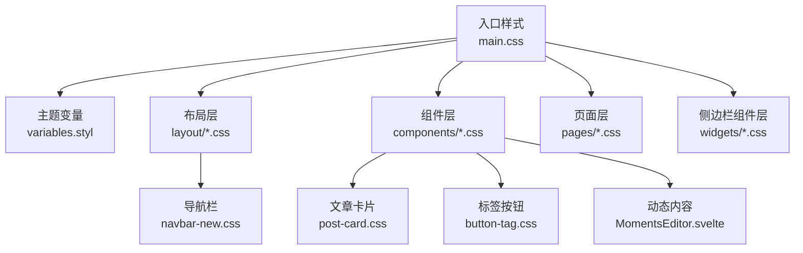
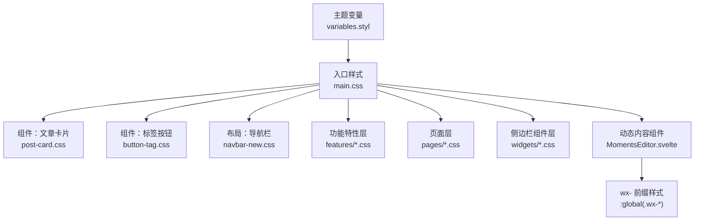
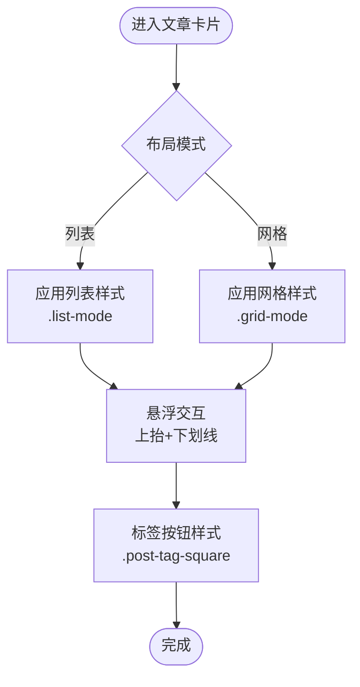
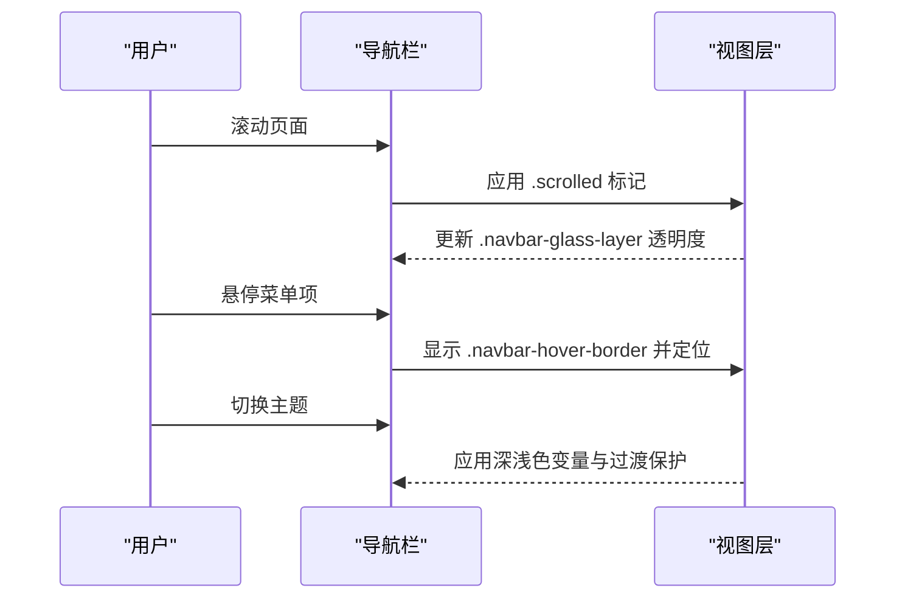
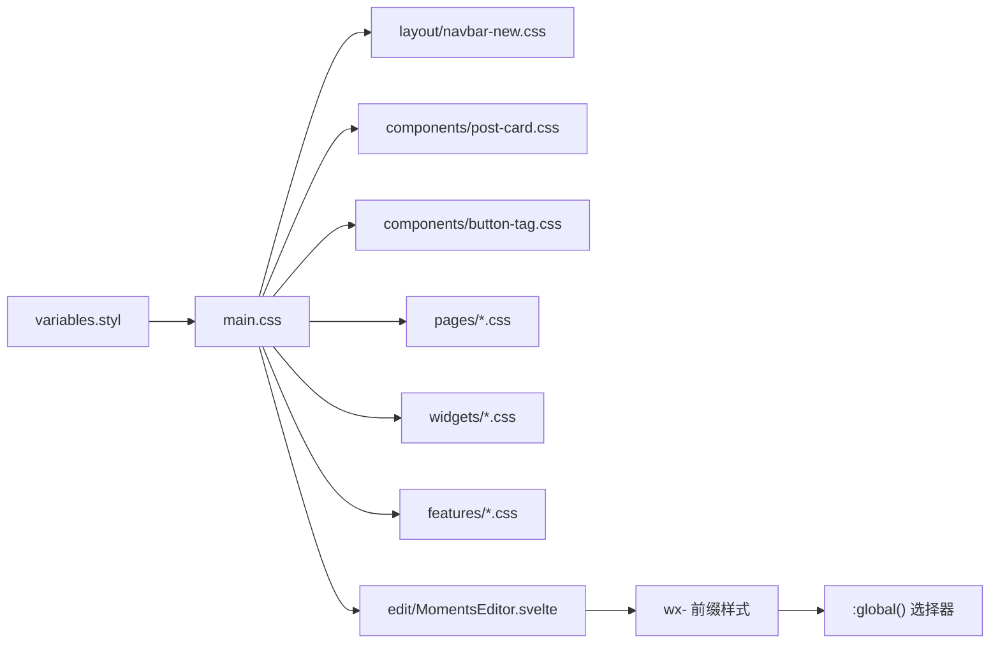

# 组件样式管理

<cite>
**本文引用的文件**
- [main.css](file://src/styles/main.css)
- [variables.styl](file://src/styles/variables.styl)
- [button-tag.css](file://src/styles/components/button-tag.css)
- [post-card.css](file://src/styles/components/post-card.css)
- [navbar-new.css](file://src/styles/layout/navbar-new.css)
- [MomentsEditor.svelte](file://src/components/edit/MomentsEditor.svelte)
- [MomentsCover.astro](file://src/components/moments/MomentsCover.astro)
- [ai-search.css](file://src/styles/components/ai-search.css)
- [grid.css](file://src/styles/layout/grid.css)
</cite>

## 更新摘要
**变更内容**
- 新增 CSS 作用域最佳实践章节，重点介绍 wx- 前缀类选择器的全局作用域应用策略
- 更新动态注入 DOM 元素的样式处理机制说明
- 增强 Svelte 组件中样式隔离与全局样式的平衡策略
- 补充实际代码示例展示 wx- 前缀在动态内容中的应用

## 目录
1. [简介](#简介)
2. [项目结构](#项目结构)
3. [核心组件](#核心组件)
4. [架构总览](#架构总览)
5. [详细组件分析](#详细组件分析)
6. [CSS 作用域最佳实践](#css-作用域最佳实践)
7. [依赖关系分析](#依赖关系分析)
8. [性能考量](#性能考量)
9. [故障排查指南](#故障排查指南)
10. [结论](#结论)
11. [附录](#附录)

## 简介
本文件系统性阐述 Firefly-Mod 的组件样式管理体系，围绕以下目标展开：
- 样式组织原则：样式隔离、作用域与 CSS 模块化思路
- 命名规范：BEM 方法论与组件前缀实践
- 继承与覆盖：默认样式基线与自定义扩展策略
- 复杂组件样式：表单控件、导航菜单、卡片组件的设计要点
- **CSS 作用域最佳实践**：wx- 前缀类选择器的全局作用域应用策略
- 测试方法：视觉回归与跨浏览器兼容性验证
- 维护策略：重构、版本管理与文档更新

## 项目结构
样式体系采用"分层导入 + 组件化拆分"的组织方式：
- 入口主样式集中导入各层样式，形成统一主题与工具类基线
- 变量层集中定义主题变量，支撑深浅色模式与组件一致性
- 组件层按功能域划分，每个组件拥有独立样式文件，便于维护与复用
- 布局层聚焦导航、网格等全局布局样式



**图表来源**
- [main.css:16-66](file://src/styles/main.css#L16-L66)
- [variables.styl:1-157](file://src/styles/variables.styl#L1-L157)
- [navbar-new.css:1-426](file://src/styles/layout/navbar-new.css#L1-L426)
- [post-card.css:1-255](file://src/styles/components/post-card.css#L1-L255)
- [button-tag.css:1-12](file://src/styles/components/button-tag.css#L1-L12)
- [MomentsEditor.svelte:175-1093](file://src/components/edit/MomentsEditor.svelte#L175-L1093)

**章节来源**
- [main.css:16-66](file://src/styles/main.css#L16-L66)

## 核心组件
本节聚焦样式组织中的关键要素与最佳实践。

- 样式隔离与作用域
  - 通过分层导入与组件级样式文件实现"逻辑隔离"，避免全局污染
  - 使用主题变量与工具类统一颜色、间距与过渡，降低耦合度
  - **wx- 前缀策略**：为动态注入的 DOM 元素提供全局样式访问能力
- CSS 模块化思路
  - 以组件为单位拆分样式，配合 Astro/Svelte 组件的类名命名，形成"组件即样式边界"的模块化效果
- 命名规范与 BEM 实施
  - 类名采用"块-元素-修饰符"结构，结合组件前缀确保可读性与唯一性
  - 示例：导航容器使用 .navbar-* 前缀，卡片使用 .post-card-* 前缀，动态内容使用 .wx-* 前缀
- 默认样式与自定义扩展
  - 通过变量层定义默认值，组件层基于变量进行覆盖
  - 提供"极简模式"与"主题切换保护"等开关，支持运行时样式降级与性能优化

**章节来源**
- [main.css:114-611](file://src/styles/main.css#L114-L611)
- [variables.styl:1-157](file://src/styles/variables.styl#L1-L157)
- [MomentsEditor.svelte:780-912](file://src/components/edit/MomentsEditor.svelte#L780-L912)

## 架构总览
整体架构强调"变量驱动 + 层次化导入 + 组件化样式"，并通过工具类与 @layer 机制实现主题切换与过渡的可控性。



**图表来源**
- [main.css:16-66](file://src/styles/main.css#L16-L66)
- [variables.styl:1-157](file://src/styles/variables.styl#L1-L157)
- [post-card.css:1-255](file://src/styles/components/post-card.css#L1-L255)
- [button-tag.css:1-12](file://src/styles/components/button-tag.css#L1-L12)
- [navbar-new.css:1-426](file://src/styles/layout/navbar-new.css#L1-L426)
- [MomentsEditor.svelte:780-912](file://src/components/edit/MomentsEditor.svelte#L780-L912)

## 详细组件分析

### 文章卡片组件样式
- 设计要点
  - 外框与圆角：统一 2px 边框与大圆角，支持深浅色模式切换
  - 悬浮交互：上抬与下划线强调，增强可点击性
  - 响应式布局：列表/网格双模式，移动端与桌面端差异化处理
  - 标签样式：无圆角方框，悬停反色，保证对比度
- 关键类名与行为
  - .post-card-wrapper：容器与边框
  - .post-card-title：标题下划线与装饰条
  - .list-mode/.grid-mode：布局切换
  - .post-tag-square：标签按钮



**图表来源**
- [post-card.css:1-255](file://src/styles/components/post-card.css#L1-L255)

**章节来源**
- [post-card.css:1-255](file://src/styles/components/post-card.css#L1-L255)

### 导航栏组件样式
- 设计要点
  - pill 容器与滚动缩放：通过过渡与 will-change 优化滚动体验
  - 液态玻璃层：在滚动后渐显，兼顾美观与性能
  - hover 指示器：边框滑动指示，强调当前项
  - Banner 模式：根据壁纸场景动态切换透明与模糊
- 关键类名与行为
  - .navbar-pill：容器与过渡
  - .navbar-glass-layer：玻璃层显示控制
  - .navbar-hover-border：hover 指示器
  - .navbar-logo-text：文字缩放与淡出



**图表来源**
- [navbar-new.css:1-426](file://src/styles/layout/navbar-new.css#L1-L426)

**章节来源**
- [navbar-new.css:1-426](file://src/styles/layout/navbar-new.css#L1-L426)

### 标签按钮组件样式
- 设计要点
  - 无圆角方框，强调几何感
  - 深浅色模式下边框颜色随主题变化
  - 悬停反色，保证对比度与反馈
- 关键类名与行为
  - .tag-border：标签边框
  - 深浅色模式分支：:root.dark 选择器

**章节来源**
- [button-tag.css:1-12](file://src/styles/components/button-tag.css#L1-L12)

### 复杂组件样式设计：表单控件、导航菜单、卡片组件
- 表单控件
  - 建议采用统一的输入边框、圆角与过渡，结合变量层控制颜色与尺寸
  - 通过 .btn-* 与 .input-* 前缀区分不同语义
- 导航菜单
  - 使用 .dropdown-* 前缀，配合 .dropdown-container 控制可见性与过渡
  - hover/focus 状态通过伪元素或边框变化提供反馈
- 卡片组件
  - 以 .card-* 前缀命名，结合 .card-base 作为基类，通过修饰类扩展样式

[本节为概念性说明，不直接分析具体文件]

## CSS 作用域最佳实践

### wx- 前缀类选择器的全局作用域应用策略

在 Svelte 组件中处理动态注入 DOM 元素时，采用 wx- 前缀类选择器的全局作用域应用策略，有效解决了样式隔离与动态内容显示之间的平衡问题。

#### 核心策略

**1. 动态内容的样式隔离**
- 使用 wx- 前缀标识动态注入的内容元素
- 通过 :global() 选择器确保样式在任何上下文中都能正确应用
- 避免 Svelte 默认的样式作用域影响动态生成的 HTML

**2. 样式继承与覆盖机制**
- wx- 前缀样式作为全局样式基础，确保动态内容的视觉一致性
- 支持深浅色模式下的条件样式应用
- 与组件内部样式形成互补关系

#### 实际应用场景

**动态注入 DOM 元素处理**
```javascript
// 在 MomentsEditor.svelte 中
function renderExternalMoments() {
    const feed = document.getElementById("moments-feed");
    if (!feed) return;

    // 清除之前注入的外部说说
    feed.querySelectorAll(".wx-feed-item-external").forEach((el) => el.remove());

    // 创建新的动态元素
    const item = document.createElement("div");
    item.className = "wx-feed-item wx-feed-item-external";
    // ... 其他属性设置
}
```

**全局样式定义**
```css
/* wx- 前缀：朋友圈风格卡片（:global 用于动态注入的 DOM） */
:global(.wx-feed-header) {
    display: flex;
    align-items: flex-start;
    gap: 10px;
    margin-bottom: 10px;
}

:global(.wx-avatar) {
    width: 40px;
    height: 40px;
    border-radius: 8px;
    object-fit: cover;
    flex-shrink: 0;
}

:global(.wx-feed-content) {
    padding-left: 10px;
    word-break: break-word;
    overflow-wrap: break-word;
}
```

#### 最佳实践原则

**1. 命名约定**
- 使用 wx- 前缀标识动态内容样式
- 保持与静态内容相同的 BEM 命名结构
- 区分动态注入元素与组件内部元素

**2. 样式组织**
- 将 wx- 前缀样式集中在一个区域
- 与组件内部样式形成清晰的边界
- 支持响应式和主题切换

**3. 性能考虑**
- 避免过度使用复杂的全局选择器
- 优先使用简单类名组合
- 确保样式计算的高效性

**章节来源**
- [MomentsEditor.svelte:175-200](file://src/components/edit/MomentsEditor.svelte#L175-L200)
- [MomentsEditor.svelte:780-912](file://src/components/edit/MomentsEditor.svelte#L780-L912)
- [MomentsCover.astro:19](file://src/components/moments/MomentsCover.astro#L19)

### 其他全局样式应用示例

**AI 搜索组件中的全局样式应用**
```css
.ai-msg__content :global(p) {
    margin: 0.5em 0;
}

.ai-msg__content :global(code) {
    font-family: 'Courier New', monospace;
    background: rgba(0,0,0,0.1);
    padding: 2px 4px;
    border-radius: 3px;
}
```

**网格布局中的全局选择器**
```css
:global(#sidebar-toc:has(~ #main-grid-wrapper #article-toc-wrapper)),
:global(#article-toc-wrapper ~ * #sidebar-toc) {
    display: none;
}
```

**章节来源**
- [ai-search.css:525-575](file://src/styles/components/ai-search.css#L525-L575)
- [grid.css:76-77](file://src/styles/layout/grid.css#L76-L77)

## 依赖关系分析
样式依赖遵循"入口集中导入 + 变量优先"的原则，避免循环依赖与重复定义。



**图表来源**
- [main.css:16-66](file://src/styles/main.css#L16-L66)
- [variables.styl:1-157](file://src/styles/variables.styl#L1-L157)
- [navbar-new.css:1-426](file://src/styles/layout/navbar-new.css#L1-L426)
- [post-card.css:1-255](file://src/styles/components/post-card.css#L1-L255)
- [button-tag.css:1-12](file://src/styles/components/button-tag.css#L1-L12)
- [MomentsEditor.svelte:780-912](file://src/components/edit/MomentsEditor.svelte#L780-L912)

**章节来源**
- [main.css:16-66](file://src/styles/main.css#L16-L66)

## 性能考量
- 主题切换动画与过渡
  - 使用 @layer components 定义主题切换动画，配合 .is-theme-transitioning 与 View Transitions API，减少不必要的过渡与重绘
- 渲染上下文隔离
  - 在主题切换期间对复杂元素启用 contain，限制重排范围
- 滚动与 GPU 加速
  - 通过 will-change、transform: translateZ(0) 与 backface-visibility 提升滚动流畅度
- 选择器复杂度控制
  - 优先使用简单类名组合，避免深层后代选择器导致的匹配成本上升
- **wx- 前缀性能优化**
  - 全局样式选择器的使用需谨慎，避免过度影响样式计算性能
  - 动态注入元素的数量控制，及时清理不再使用的元素

**章节来源**
- [main.css:114-246](file://src/styles/main.css#L114-L246)
- [navbar-new.css:234-247](file://src/styles/layout/navbar-new.css#L234-L247)
- [MomentsEditor.svelte:175-200](file://src/components/edit/MomentsEditor.svelte#L175-L200)

## 故障排查指南
- 样式未生效
  - 检查 main.css 是否正确导入对应组件样式
  - 确认变量层是否已加载，深浅色模式选择器是否正确
  - **wx- 前缀样式检查**：确认 :global() 选择器正确应用，动态注入元素类名匹配
- 主题切换异常
  - 查验 .is-theme-transitioning 与 .use-view-transition 的类名冲突
  - 确认 @layer components 中的过渡保护规则未被覆盖
- 响应式问题
  - 对照 .list-mode 与 .grid-mode 的媒体查询断点，确认容器类名正确传递
- 性能抖动
  - 检查是否存在过度使用复杂选择器或频繁触发重排的操作
  - 确认 will-change 与 contain 的使用范围合理
  - **wx- 前缀性能检查**：监控动态注入元素数量，避免内存泄漏

**章节来源**
- [main.css:114-246](file://src/styles/main.css#L114-L246)
- [post-card.css:188-228](file://src/styles/components/post-card.css#L188-L228)
- [MomentsEditor.svelte:175-200](file://src/components/edit/MomentsEditor.svelte#L175-L200)

## 结论
Firefly-Mod 的样式体系以变量驱动为核心，通过层次化导入与组件化拆分实现高内聚低耦合。配合 BEM 命名与组件前缀，提升了可维护性与可扩展性。在主题切换与性能方面，采用 @layer 与过渡保护策略，兼顾了视觉体验与运行效率。

**新增的 CSS 作用域最佳实践**显著增强了动态内容的样式管理能力，通过 wx- 前缀类选择器的全局作用域应用策略，有效解决了 Svelte 组件中动态注入 DOM 元素的样式问题。这一策略在保证样式隔离的同时，提供了灵活的全局样式访问能力，是现代前端组件化开发的重要实践。

建议在后续迭代中持续完善命名规范、补充测试流程，并保持变量层与组件样式的同步演进。同时，wx- 前缀策略应作为标准实践推广到其他需要动态内容渲染的组件中。

## 附录
- 命名规范建议
  - 组件前缀：.comp-（如 .comp-button）
  - 元素：.comp__element
  - 修饰：.comp--modifier
  - 状态：.is-state 或 .has-condition
  - **动态内容：.wx-**（如 .wx-feed-item，.wx-avatar）
- 测试清单
  - 视觉回归：在深浅色模式与多分辨率下截图对比
  - 跨浏览器：Chrome/Firefox/Safari/Edge 的关键交互验证
  - 主题切换：主题切换前后 DOM 结构与类名的一致性校验
  - **wx- 前缀测试**：动态注入元素的样式一致性验证
- 维护建议
  - 重构：合并重复样式、收敛变量使用、精简选择器
  - 版本管理：变更记录与迁移脚本，确保向后兼容
  - 文档更新：变量变更与组件样式更新同步至设计文档与开发手册
  - **wx- 前缀策略**：建立动态内容样式管理规范，确保团队一致使用