# 编辑组件

<cite>
**本文引用的文件**
- [src/pages/write/index.astro](file://src/pages/write/index.astro)
- [src/components/edit/WriteEditor.svelte](file://src/components/edit/WriteEditor.svelte)
- [src/components/edit/MarkdownPageEditor.svelte](file://src/components/edit/MarkdownPageEditor.svelte)
- [src/components/edit/FriendsEditor.svelte](file://src/components/edit/FriendsEditor.svelte)
- [src/components/edit/MomentsEditor.svelte](file://src/components/edit/MomentsEditor.svelte)
- [src/components/edit/BangumiEditor.svelte](file://src/components/edit/BangumiEditor.svelte)
- [src/components/edit/CollectionsEditor.svelte](file://src/components/edit/CollectionsEditor.svelte)
- [src/components/edit/EditToolbar.svelte](file://src/components/edit/EditToolbar.svelte)
- [src/pages/admin/notebooks.astro](file://src/pages/admin/notebooks.astro)
- [src/utils/editMode.ts](file://src/utils/editMode.ts)
- [src/utils/draftHelpers.ts](file://src/utils/draftHelpers.ts)
- [src/pages/api/github.ts](file://src/pages/api/github.ts)
- [src/workers/github-proxy.js](file://src/workers/github-proxy.js)
- [public/assets/js/marked.min.js](file://public/assets/js/marked.min.js)
- [public/assets/js/highlight.min.js](file://public/assets/js/highlight.min.js)
- [src/plugins/remark-mermaid.js](file://src/plugins/remark-mermaid.js)
- [src/plugins/remark-plantuml.js](file://src/plugins/remark-plantuml.js)
- [src/plugins/remark-directive-rehype.js](file://src/plugins/remark-directive-rehype.js)
- [src/config/editConfig.ts](file://src/config/editConfig.ts)
- [src/config/expressiveCodeConfig.ts](file://src/config/expressiveCodeConfig.ts)
- [TROUBLESHOOTING.md](file://TROUBLESHOOTING.md)
</cite>

## 更新摘要
**变更内容**
- 更新了编辑器组件的存储机制：从 Gist 迁移到 Repository，使用 getRepoFile 和 setupRepoDrafts 替代原有的 readGistFile 和 setupGistDrafts
- 文件路径从 gistId/fileName 参数改为直接的文件路径（public/bangumi.json、public/collections.json、public/friends.json、public/moments.json）
- 引入 SHA 版本控制机制，所有编辑器组件都增加了 fileSha 状态管理和版本控制
- 更新了编辑工具栏的 CSS 作用域说明，反映了 wx- 前缀类选择器从本地作用域转换为全局作用域的修复
- 增强了社交媒体编辑界面中动态生成内容的样式应用说明
- 完善了编辑组件体系中样式作用域管理的技术细节
- **编辑工具栏组件进行了代码清理，移除了重复的CSS样式声明，改善了代码组织和减少了冗余**

## 目录
1. [简介](#简介)
2. [项目结构](#项目结构)
3. [核心组件](#核心组件)
4. [架构总览](#架构总览)
5. [详细组件分析](#详细组件分析)
6. [存储机制迁移](#存储机制迁移)
7. [依赖关系分析](#依赖关系分析)
8. [性能考虑](#性能考虑)
9. [故障排除指南](#故障排除指南)
10. [结论](#结论)
11. [附录](#附录)

## 简介
本文件系统性梳理博客系统的"编辑组件"体系，覆盖富文本编辑器、代码编辑器、Markdown 编辑器等多形态编辑能力，深入解析状态管理（内容同步、撤销重做、草稿持久化）、插件系统与扩展机制（语法高亮、Mermaid/PlantUML 图表渲染、指令转换）、配置与主题定制、以及与后端 API 的交互模式（GitHub API 提交、权限校验）。同时提供性能优化与用户体验改进建议。

**更新** 新增权限诊断功能、改进文件处理机制、增强错误报告能力。编辑工具栏现在始终保存验证成功的App ID，提高了认证状态管理的可靠性。修复了 MomentsEditor 组件的 CSS 作用域问题，确保动态注入的 DOM 元素能够正确应用样式。所有编辑器组件已完成从 Gist 到 Repository 的存储机制迁移，引入了 SHA 版本控制机制。**编辑工具栏组件经过代码清理，移除了重复的CSS样式声明，改善了代码组织和减少了冗余，提升了维护性。**

## 项目结构
编辑相关的核心文件主要分布在以下位置：
- 页面入口：写文章页面，负责挂载写编辑器组件
- 编辑器组件：写编辑器、Markdown 页面编辑器、友链编辑器、动态内容编辑器、番组计划编辑器、收藏编辑器、编辑工具栏等
- 工具与配置：编辑模式工具、草稿工具、编辑器配置、主题与可表达代码配置
- API代理：GitHub API 代理服务，支持服务端认证和App ID可用性检测

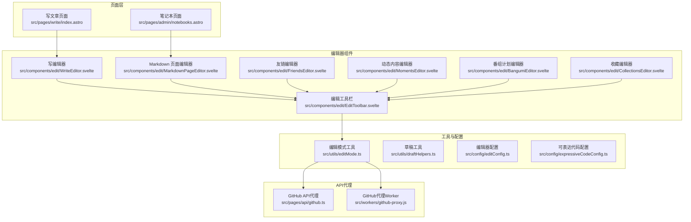

**图表来源**
- [src/pages/write/index.astro](file://src/pages/write/index.astro)
- [src/pages/admin/notebooks.astro](file://src/pages/admin/notebooks.astro)
- [src/components/edit/WriteEditor.svelte](file://src/components/edit/WriteEditor.svelte)
- [src/components/edit/MarkdownPageEditor.svelte](file://src/components/edit/MarkdownPageEditor.svelte)
- [src/components/edit/FriendsEditor.svelte](file://src/components/edit/FriendsEditor.svelte)
- [src/components/edit/MomentsEditor.svelte](file://src/components/edit/MomentsEditor.svelte)
- [src/components/edit/BangumiEditor.svelte](file://src/components/edit/BangumiEditor.svelte)
- [src/components/edit/CollectionsEditor.svelte](file://src/components/edit/CollectionsEditor.svelte)
- [src/components/edit/EditToolbar.svelte](file://src/components/edit/EditToolbar.svelte)
- [src/utils/editMode.ts](file://src/utils/editMode.ts)
- [src/config/editConfig.ts](file://src/config/editConfig.ts)
- [src/config/expressiveCodeConfig.ts](file://src/config/expressiveCodeConfig.ts)
- [src/pages/api/github.ts](file://src/pages/api/github.ts)
- [src/workers/github-proxy.js](file://src/workers/github-proxy.js)

**章节来源**
- [src/pages/write/index.astro](file://src/pages/write/index.astro)
- [src/pages/admin/notebooks.astro](file://src/pages/admin/notebooks.astro)

## 核心组件
- 写编辑器（WriteEditor）：支持标题输入、Markdown 编辑、实时预览、快捷键、草稿与发布流程、GitHub API 提交流程、权限校验与错误提示。
- Markdown 页面编辑器（MarkdownPageEditor）：双栏编辑/预览、格式化按钮、键盘快捷键、草稿恢复与保存。
- 友链编辑器（FriendsEditor）：卡片式展示与内联编辑态切换、字段校验与草稿标记、SHA 版本控制。
- 动态内容编辑器（MomentsEditor）：动态内容卡片的增删改查、置顶、标签与图片展示，支持社交媒体风格的 wx- 前缀样式系统，SHA 版本控制。
- 番组计划编辑器（BangumiEditor）：动漫、书籍、游戏、音乐、影视等多分类管理，外部数据合并，SHA 版本控制。
- 收藏编辑器（CollectionsEditor）：API 收藏管理，分类与启用状态控制，SHA 版本控制。
- 编辑工具栏（EditToolbar）：统一的编辑操作界面，包含认证状态管理、草稿管理、批量提交、密钥导入等功能。
- 页面级编辑器（notebooks.astro）：笔记本条目编辑、Markdown 渲染与提交。

这些组件共同构成"编辑组件体系"，统一使用 Markdown 作为内容模型，结合 marked 与 highlight 实现渲染与高亮，并通过插件扩展 Mermaid/PlantUML 等图表渲染能力。

**更新** 所有编辑器组件已完成存储机制迁移，使用 getRepoFile 和 setupRepoDrafts 替代原有的 readGistFile 和 setupGistDrafts，文件路径从 gistId/fileName 参数改为直接的文件路径，引入了 SHA 版本控制机制。编辑工具栏新增GitHub代理App ID可用性检测功能，通过`isProxyAppIdAvailable()`函数检测服务端环境变量中的App ID可用性，改进用户界面体验。编辑工具栏现在始终保存验证成功的App ID，提高了认证状态管理的可靠性。MomentsEditor 组件修复了 CSS 作用域问题，确保动态注入的 DOM 元素能够正确应用 wx- 前缀样式。**编辑工具栏组件经过代码清理，移除了重复的CSS样式声明，改善了代码组织和减少了冗余，提升了维护性。**

**章节来源**
- [src/components/edit/WriteEditor.svelte](file://src/components/edit/WriteEditor.svelte)
- [src/components/edit/MarkdownPageEditor.svelte](file://src/components/edit/MarkdownPageEditor.svelte)
- [src/components/edit/FriendsEditor.svelte](file://src/components/edit/FriendsEditor.svelte)
- [src/components/edit/MomentsEditor.svelte](file://src/components/edit/MomentsEditor.svelte)
- [src/components/edit/BangumiEditor.svelte](file://src/components/edit/BangumiEditor.svelte)
- [src/components/edit/CollectionsEditor.svelte](file://src/components/edit/CollectionsEditor.svelte)
- [src/components/edit/EditToolbar.svelte](file://src/components/edit/EditToolbar.svelte)
- [src/pages/admin/notebooks.astro](file://src/pages/admin/notebooks.astro)

## 架构总览
编辑组件的运行时架构围绕"页面 → 编辑器 → 工具/配置 → API代理 → GitHub API"的层次展开。页面负责初始化与主题注入，编辑器负责内容输入与状态管理，工具层提供认证、草稿、代理等功能，配置层提供主题与行为开关，API代理层处理GitHub API的认证与请求转发。

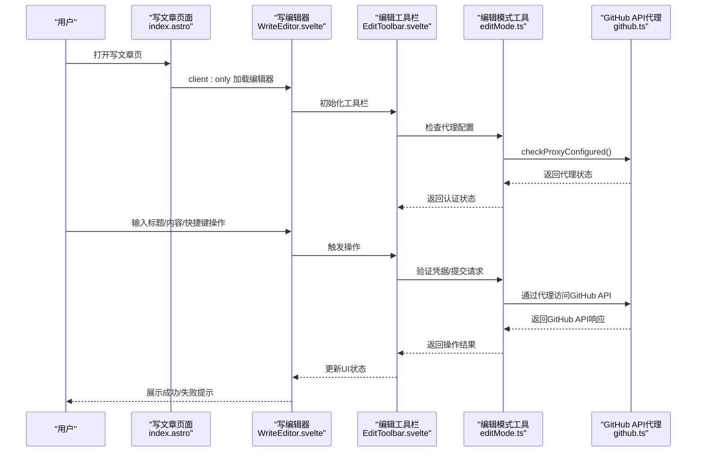

**图表来源**
- [src/pages/write/index.astro](file://src/pages/write/index.astro)
- [src/components/edit/WriteEditor.svelte](file://src/components/edit/WriteEditor.svelte)
- [src/components/edit/EditToolbar.svelte](file://src/components/edit/EditToolbar.svelte)
- [src/utils/editMode.ts](file://src/utils/editMode.ts)
- [src/pages/api/github.ts](file://src/pages/api/github.ts)

## 详细组件分析

### 编辑工具栏（EditToolbar）
- 功能要点
  - 统一编辑操作界面：包含编辑、取消、保存草稿、导入密钥、批量提交、帮助等按钮。
  - 认证状态管理：根据服务端代理配置和本地存储状态显示不同的认证状态。
  - App ID可用性检测：通过`isProxyAppIdAvailable()`函数检测服务端环境变量中的GitHub App ID可用性，改进用户界面体验。
  - 草稿管理：显示页面草稿数量和总草稿数量，支持草稿的增删改查。
  - 批量提交：支持一次性提交所有暂存的更改。
  - 权限诊断：集成权限诊断功能，提供详细的权限检查和错误报告。
- 状态管理
  - 编辑模式、认证状态、验证状态、模态框状态等。
  - 与草稿工具协作，实时更新草稿数量。
  - 始终保存验证成功的App ID，提高认证状态管理的可靠性。
- 用户界面体验改进
  - 当服务端代理配置可用且App ID存在时，工具栏会显示相应的提示信息，减少用户的困惑。
  - 认证状态按钮的颜色和样式根据认证状态动态变化，提供直观的视觉反馈。
  - 增强的错误报告机制，提供详细的错误信息和解决方案。
- **代码维护性改进**
  - **移除了重复的CSS样式声明**：清理了编辑工具栏组件中重复的样式规则，改善了代码组织结构。
  - **优化了样式定义**：通过移除冗余样式，减少了CSS文件大小，提升了加载性能。
  - **增强了代码可维护性**：清理后的样式结构更加清晰，便于后续维护和扩展。

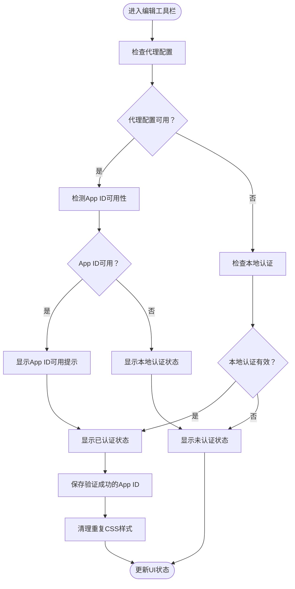

**图表来源**
- [src/components/edit/EditToolbar.svelte](file://src/components/edit/EditToolbar.svelte)
- [src/utils/editMode.ts](file://src/utils/editMode.ts)

**章节来源**
- [src/components/edit/EditToolbar.svelte](file://src/components/edit/EditToolbar.svelte)

### 写编辑器（WriteEditor）
- 功能要点
  - 标题输入与内容编辑：支持标题输入框与 Markdown 文本域，实时预览面板。
  - 工具栏与快捷键：格式化按钮、Ctrl+S 保存草稿、Tab 插入缩进、粘贴拦截提示。
  - 发布流程：认证状态检查、草稿快照生成、调用发布接口、更新 SHA、清理草稿、提示反馈。
  - 错误处理：网络异常、权限不足、解析错误等分支处理与用户提示。
- 状态管理
  - 原始内容快照、编辑模式、保存状态、加载状态、权限状态、预览模式等。
  - 与草稿工具协作，实现本地草稿的保存与恢复。
- 插件与渲染
  - 使用 marked 进行 Markdown 解析，highlight 进行代码高亮。
  - 通过 remark-mermaid、remark-plantuml、remark-directive-rehype 扩展图表与指令渲染。
- 主题与配置
  - 页面注入主题色变量，编辑器样式适配深浅色主题。
  - 编辑器配置与可表达代码配置用于控制渲染细节与主题风格。

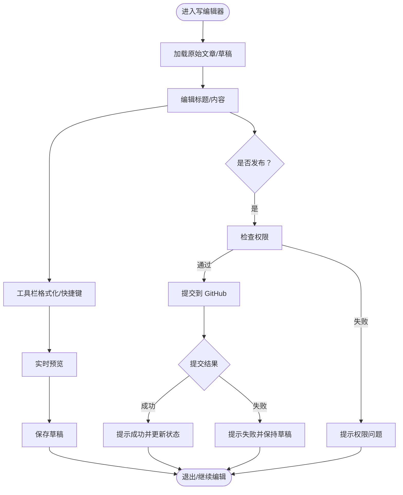

**图表来源**
- [src/components/edit/WriteEditor.svelte](file://src/components/edit/WriteEditor.svelte)
- [src/utils/draftHelpers.ts](file://src/utils/draftHelpers.ts)
- [src/config/editConfig.ts](file://src/config/editConfig.ts)
- [src/config/expressiveCodeConfig.ts](file://src/config/expressiveCodeConfig.ts)

**章节来源**
- [src/components/edit/WriteEditor.svelte](file://src/components/edit/WriteEditor.svelte)
- [src/pages/write/index.astro](file://src/pages/write/index.astro)
- [public/assets/js/marked.min.js](file://public/assets/js/marked.min.js)
- [public/assets/js/highlight.min.js](file://public/assets/js/highlight.min.js)
- [src/plugins/remark-mermaid.js](file://src/plugins/remark-mermaid.js)
- [src/plugins/remark-plantuml.js](file://src/plugins/remark-plantuml.js)
- [src/plugins/remark-directive-rehype.js](file://src/plugins/remark-directive-rehype.js)
- [src/utils/draftHelpers.ts](file://src/utils/draftHelpers.ts)
- [src/config/editConfig.ts](file://src/config/editConfig.ts)
- [src/config/expressiveCodeConfig.ts](file://src/config/expressiveCodeConfig.ts)

### Markdown 页面编辑器（MarkdownPageEditor）
- 功能要点
  - 双栏布局：左侧编辑区、右侧预览区，支持响应式切换。
  - 工具栏：加粗、斜体、代码块、列表、链接、图片、分割线等常用格式。
  - 键盘快捷键：Tab 插入空格、Ctrl+S 保存草稿。
  - 草稿恢复：启动时从本地存储恢复草稿。
- 状态管理
  - 编辑态/展示态切换、原始内容备份、当前内容、预览内容、草稿标识。
- 渲染与高亮
  - 使用 marked 进行 Markdown 到 HTML 的转换；highlight 进行代码块高亮。

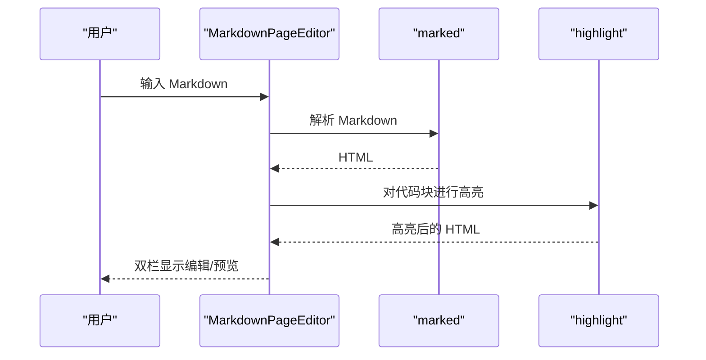

**图表来源**
- [src/components/edit/MarkdownPageEditor.svelte](file://src/components/edit/MarkdownPageEditor.svelte)
- [public/assets/js/marked.min.js](file://public/assets/js/marked.min.js)
- [public/assets/js/highlight.min.js](file://public/assets/js/highlight.min.js)

**章节来源**
- [src/components/edit/MarkdownPageEditor.svelte](file://src/components/edit/MarkdownPageEditor.svelte)

### 友链编辑器（FriendsEditor）
- 功能要点
  - 卡片展示态与编辑态切换：展示友链基本信息与头像占位符；编辑态为内联表单。
  - 字段更新：标题、描述、站点 URL、标签等，支持草稿标记。
  - 图片加载错误处理：头像加载失败时隐藏图片。
  - SHA 版本控制：集成文件版本控制机制。
- 状态管理
  - 卡片数据结构、草稿状态、标签颜色映射、文件 SHA 管理。
- 存储机制
  - 使用 getRepoFile("public/friends.json") 读取仓库文件。
  - 通过 setupRepoDrafts 管理草稿和提交流程。

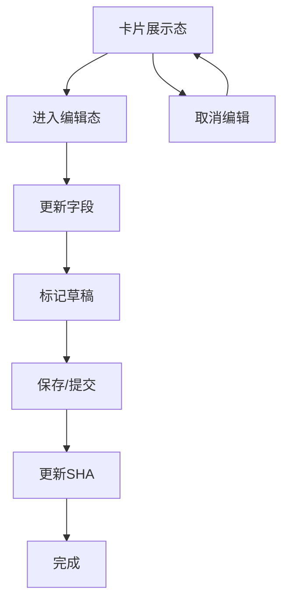

**图表来源**
- [src/components/edit/FriendsEditor.svelte](file://src/components/edit/FriendsEditor.svelte)

**章节来源**
- [src/components/edit/FriendsEditor.svelte](file://src/components/edit/FriendsEditor.svelte)

### 动态内容编辑器（MomentsEditor）
- 功能要点
  - 动态内容卡片：头像、用户名、发布时间、位置、内容文本、图片网格、标签等。
  - 操作按钮：编辑、删除、置顶等。
  - 样式系统：采用 wx- 前缀的社交媒体风格样式，支持动态注入的 DOM 元素。
  - CSS 作用域：通过 :global 修饰符确保 wx- 类选择器在动态生成的内容中也能正确应用样式。
  - SHA 版本控制：集成文件版本控制机制。
- 状态管理
  - 数据项数组、置顶状态、标签集合、图片列表、文件 SHA 等。
  - 支持从服务器加载数据并与本地 SSR 渲染的内容合并。
  - 动态注入外部内容到 DOM 中，保持编辑态与展示态的一致性。
- 存储机制
  - 使用 getRepoFile("public/moments.json") 读取仓库文件。
  - 通过 setupRepoDrafts 管理草稿和提交流程。

**更新** 修复了 CSS 作用域问题，将 wx- 前缀类选择器从本地作用域转换为全局作用域，确保动态注入的 DOM 元素能够正确应用样式。这解决了社交媒体编辑界面中动态生成内容的样式应用问题。

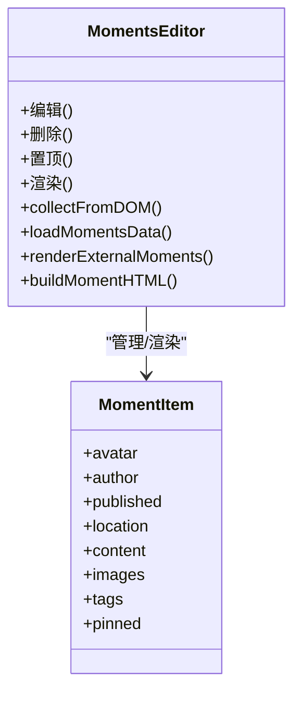

**图表来源**
- [src/components/edit/MomentsEditor.svelte](file://src/components/edit/MomentsEditor.svelte)

**章节来源**
- [src/components/edit/MomentsEditor.svelte](file://src/components/edit/MomentsEditor.svelte)

### 番组计划编辑器（BangumiEditor）
- 功能要点
  - 多分类管理：动漫、书籍、游戏、音乐、影视等五种分类。
  - 外部数据合并：从仓库文件合并外部数据与本地 SSR 数据。
  - 状态管理：观看状态（想看、看过、在看、搁置、抛弃）。
  - SHA 版本控制：集成文件版本控制机制。
- 状态管理
  - 项目数据结构、分类映射、状态映射、原始数据备份等。
  - 支持从页面传入的初始数据和 DOM 收集的数据。
- 存储机制
  - 使用 getRepoFile("public/bangumi.json") 读取仓库文件。
  - 通过 setupRepoDrafts 管理草稿和提交流程。

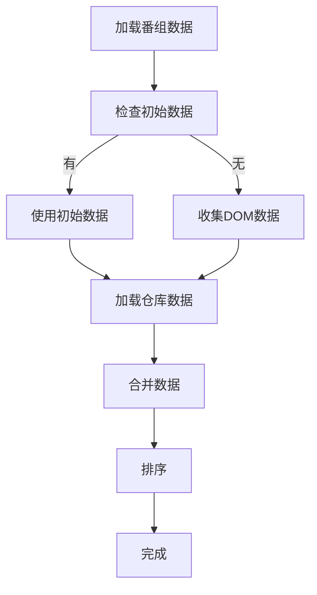

**图表来源**
- [src/components/edit/BangumiEditor.svelte](file://src/components/edit/BangumiEditor.svelte)

**章节来源**
- [src/components/edit/BangumiEditor.svelte](file://src/components/edit/BangumiEditor.svelte)

### 收藏编辑器（CollectionsEditor）
- 功能要点
  - API 收藏管理：名称、URL、描述、分类、图标等字段管理。
  - 分类与启用状态：支持分类过滤和启用/禁用控制。
  - 自动图标获取：根据 URL 自动生成 favicon 图标。
  - SHA 版本控制：集成文件版本控制机制。
- 状态管理
  - 收藏项目数组、启用状态过滤、分类统计等。
  - 支持从 props 接收的初始数据解析。
- 存储机制
  - 使用 getRepoFile("public/collections.json") 读取仓库文件。
  - 通过 setupRepoDrafts 管理草稿和提交流程。

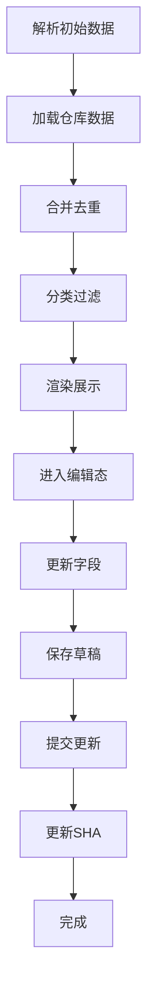

**图表来源**
- [src/components/edit/CollectionsEditor.svelte](file://src/components/edit/CollectionsEditor.svelte)

**章节来源**
- [src/components/edit/CollectionsEditor.svelte](file://src/components/edit/CollectionsEditor.svelte)

### 页面级编辑器（notebooks.astro）
- 功能要点
  - 笔记本条目编辑：工具栏按钮、Markdown 输入区、预览区、提交按钮。
  - 样式与主题：深浅色主题下的编辑器与预览区样式适配。
- 状态管理
  - 当前条目内容、预览内容、列表展示、编辑栏可见性等。

**章节来源**
- [src/pages/admin/notebooks.astro](file://src/pages/admin/notebooks.astro)

## 存储机制迁移

### 从 Gist 到 Repository 的重大变更
编辑器组件已完成从 Gist 到 Repository 的存储机制迁移，主要变更包括：

#### 1. API 调用方式变更
- **原有方式**：使用 readGistFile(gistId, fileName) 读取 Gist 文件
- **新方式**：使用 getRepoFile("public/bangumi.json") 读取仓库文件

#### 2. 文件路径参数变更
- **原有参数**：gistId/fileName 形式的复合路径
- **新参数**：直接的文件路径字符串，如 "public/bangumi.json"

#### 3. 版本控制机制引入
所有编辑器组件都增加了 fileSha 状态管理和 SHA 版本控制：
```typescript
let fileSha = $state<string | null>(null);
const drafts = setupRepoDrafts({
  // ...
  getSha: () => fileSha,
  setSha: (v) => (fileSha = v),
  // ...
});
```

#### 4. 草稿系统升级
- **原有方式**：setupGistDrafts 管理 Gist 草稿
- **新方式**：setupRepoDrafts 管理仓库草稿，支持 SHA 版本控制

#### 5. 具体组件变更

**FriendsEditor（友链编辑器）**
- 文件路径：从 gistId/fileName → "public/friends.json"
- 增加 fileSha 状态管理
- 使用 getRepoFile("public/friends.json") 替代 readGistFile

**MomentsEditor（动态内容编辑器）**
- 文件路径：从 gistId/fileName → "public/moments.json"
- 增加 fileSha 状态管理
- 使用 getRepoFile("public/moments.json") 替代 readGistFile

**BangumiEditor（番组计划编辑器）**
- 文件路径：从 gistId/fileName → "public/bangumi.json"
- 增加 fileSha 状态管理
- 使用 getRepoFile("public/bangumi.json") 替代 readGistFile

**CollectionsEditor（收藏编辑器）**
- 文件路径：从 gistId/fileName → "public/collections.json"
- 增加 fileSha 状态管理
- 使用 getRepoFile("public/collections.json") 替代 readGistFile

#### 6. 版本控制流程
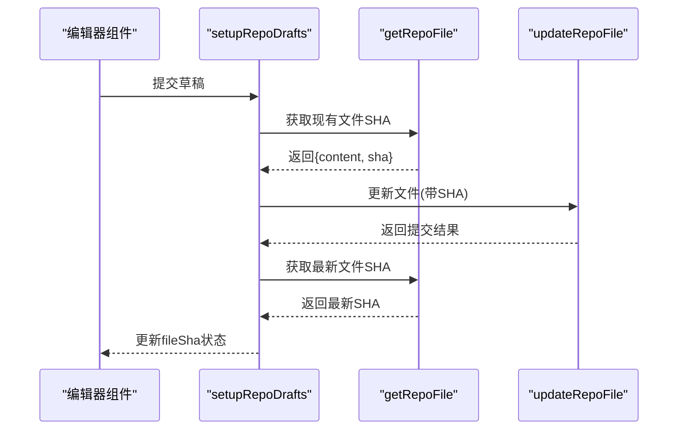

**图表来源**
- [src/utils/draftHelpers.ts](file://src/utils/draftHelpers.ts)
- [src/utils/editMode.ts](file://src/utils/editMode.ts)

**章节来源**
- [src/components/edit/FriendsEditor.svelte](file://src/components/edit/FriendsEditor.svelte)
- [src/components/edit/MomentsEditor.svelte](file://src/components/edit/MomentsEditor.svelte)
- [src/components/edit/BangumiEditor.svelte](file://src/components/edit/BangumiEditor.svelte)
- [src/components/edit/CollectionsEditor.svelte](file://src/components/edit/CollectionsEditor.svelte)
- [src/utils/draftHelpers.ts](file://src/utils/draftHelpers.ts)
- [src/utils/editMode.ts](file://src/utils/editMode.ts)

## 依赖关系分析
- 组件依赖
  - 写编辑器依赖 marked、highlight、remark-* 插件、草稿工具、编辑器配置与可表达代码配置。
  - Markdown 页面编辑器依赖 marked、highlight。
  - 友链、动态内容、番组计划、收藏编辑器为纯前端组件，依赖通用样式与图标库。
  - 编辑工具栏依赖编辑模式工具、草稿工具、编辑器配置。
  - 所有编辑器组件依赖新的 getRepoFile 和 setupRepoDrafts 工具。
- 外部依赖
  - marked：Markdown 解析。
  - highlight：代码高亮。
  - remark-mermaid、remark-plantuml、remark-directive-rehype：图表与指令扩展。
- 配置与主题
  - editConfig.ts：编辑器行为与功能开关。
  - expressiveCodeConfig.ts：可表达代码渲染主题与样式。
  - 页面通过 data-theme-hue 注入主题色，编辑器样式适配深浅色。
- API代理
  - editMode.ts：提供GitHub API代理、认证、草稿管理等功能，支持 getRepoFile、updateRepoFile 等仓库操作。
  - github.ts：Astro API路由，处理GitHub API代理请求。
  - github-proxy.js：Cloudflare Worker，提供服务端认证和App ID检测。

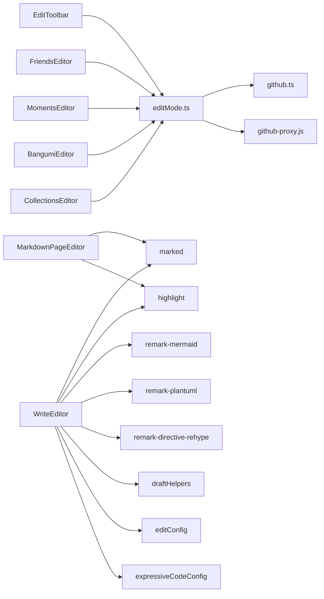

**图表来源**
- [src/components/edit/EditToolbar.svelte](file://src/components/edit/EditToolbar.svelte)
- [src/components/edit/WriteEditor.svelte](file://src/components/edit/WriteEditor.svelte)
- [src/components/edit/MarkdownPageEditor.svelte](file://src/components/edit/MarkdownPageEditor.svelte)
- [src/components/edit/FriendsEditor.svelte](file://src/components/edit/FriendsEditor.svelte)
- [src/components/edit/MomentsEditor.svelte](file://src/components/edit/MomentsEditor.svelte)
- [src/components/edit/BangumiEditor.svelte](file://src/components/edit/BangumiEditor.svelte)
- [src/components/edit/CollectionsEditor.svelte](file://src/components/edit/CollectionsEditor.svelte)
- [src/utils/editMode.ts](file://src/utils/editMode.ts)
- [public/assets/js/marked.min.js](file://public/assets/js/marked.min.js)
- [public/assets/js/highlight.min.js](file://public/assets/js/highlight.min.js)
- [src/plugins/remark-mermaid.js](file://src/plugins/remark-mermaid.js)
- [src/plugins/remark-plantuml.js](file://src/plugins/remark-plantuml.js)
- [src/plugins/remark-directive-rehype.js](file://src/plugins/remark-directive-rehype.js)
- [src/utils/draftHelpers.ts](file://src/utils/draftHelpers.ts)
- [src/config/editConfig.ts](file://src/config/editConfig.ts)
- [src/config/expressiveCodeConfig.ts](file://src/config/expressiveCodeConfig.ts)
- [src/pages/api/github.ts](file://src/pages/api/github.ts)
- [src/workers/github-proxy.js](file://src/workers/github-proxy.js)

**章节来源**
- [src/components/edit/EditToolbar.svelte](file://src/components/edit/EditToolbar.svelte)
- [src/components/edit/WriteEditor.svelte](file://src/components/edit/WriteEditor.svelte)
- [src/components/edit/MarkdownPageEditor.svelte](file://src/components/edit/MarkdownPageEditor.svelte)
- [src/utils/editMode.ts](file://src/utils/editMode.ts)
- [src/pages/api/github.ts](file://src/pages/api/github.ts)
- [src/workers/github-proxy.js](file://src/workers/github-proxy.js)

## 性能考虑
- 渲染优化
  - 使用虚拟滚动或分页加载大量动态内容，避免一次性渲染过多节点。
  - 在 Markdown 解析与高亮阶段采用节流/防抖，减少频繁重排。
  - MomentsEditor 组件优化了动态内容的渲染性能，通过 :global 作用域确保样式应用效率。
  - 所有编辑器组件都采用了 SHA 版本控制，避免不必要的文件读取。
- 资源加载
  - 将 marked、highlight 等外部脚本按需加载，避免阻塞首屏。
  - 图片懒加载与占位符，提升列表渲染性能。
  - 仓库文件采用按需加载策略，首次进入时才触发文件读取。
- 存储与草稿
  - 草稿仅保存必要字段，避免大体积内容频繁写入本地存储。
  - 定期清理过期草稿，限制草稿数量与大小。
  - 新的草稿系统支持批量提交，减少网络请求次数。
- 网络请求
  - 发布/提交采用幂等与去重策略，避免重复提交。
  - 对网络异常进行指数退避与重试，提升稳定性。
  - 编辑工具栏的App ID可用性检测通过一次性的代理配置检查实现，避免频繁的网络请求。
  - SHA 版本控制机制避免了不必要的文件更新冲突。
- 权限诊断
  - 权限诊断功能采用异步检查机制，避免阻塞主流程。
  - 诊断结果缓存机制，减少重复检查的开销。
- 版本控制优化
  - SHA 缓存机制避免重复查询文件元信息。
  - 批量操作时复用已获取的 SHA 值。
  - 错误处理中自动重新获取 SHA，确保版本一致性。
- **代码维护性优化**
  - **清理重复CSS样式**：移除了编辑工具栏组件中的重复样式声明，减少了CSS文件大小。
  - **改善代码组织**：通过移除冗余样式，提升了代码的可读性和可维护性。
  - **减少冗余计算**：清理后的样式结构更加简洁，减少了浏览器的样式计算开销。

## 故障排除指南
- 发布失败
  - 检查权限：确认密钥导入与 GitHub App 权限配置正确。
  - 检查网络：确保网络连通，查看浏览器开发者工具中的请求与响应。
  - 查看日志：编辑器会捕获解析错误并输出到控制台，定位具体问题。
  - SHA 冲突：如果遇到版本冲突，检查文件是否被其他进程修改。
- 预览不更新
  - 确认 Markdown 解析逻辑正常，检查 marked 版本与配置。
  - 检查 highlight 是否对代码块进行了高亮，若失败则回退为普通文本。
- 草稿丢失
  - 确认本地存储可用，检查草稿工具的序列化/反序列化逻辑。
  - 若跨设备/浏览器使用，建议迁移到服务端草稿存储方案。
  - 新的草稿系统支持自动恢复，重启后会自动恢复未提交的更改。
- App ID不可用
  - 检查服务端环境变量配置，确认GH_APP_ID设置正确。
  - 确认编辑工具栏显示App ID可用性检测结果，如果不可用则需要手动输入App ID。
  - 查看代理配置检查接口的响应，确认代理服务正常运行。
- 权限诊断失败
  - 使用内置的权限诊断功能检查认证状态和仓库访问权限。
  - 查看详细的错误日志，确认具体的权限问题。
  - 检查GitHub App的权限设置和安装状态。
- 样式应用问题
  - 确认 wx- 前缀类选择器使用了 :global 修饰符，确保动态注入的 DOM 元素能够正确应用样式。
  - 检查 CSS 作用域配置，避免样式被意外隔离。
  - 验证动态内容的 HTML 结构与样式类名匹配。
  - **编辑工具栏样式问题**：如果遇到编辑工具栏样式异常，检查是否正确应用了清理后的CSS样式。
- 存储机制问题
  - 检查文件路径是否正确，确认使用的是 "public/bangumi.json"、"public/collections.json"、"public/friends.json"、"public/moments.json" 等新路径。
  - 验证仓库权限，确保有足够的权限读取和写入目标文件。
  - 检查 SHA 版本控制，如果文件被外部修改，需要重新获取最新版本。
- 版本控制冲突
  - 如果出现 SHA 冲突，系统会自动重新获取文件最新版本并重试提交。
  - 检查是否有多个编辑器实例同时修改同一文件。
  - 确保网络连接稳定，避免提交过程中断。
- **代码维护性问题**
  - **样式重复问题**：如果发现样式重复或冲突，检查编辑工具栏组件的CSS定义，确认已执行代码清理。
  - **性能问题**：清理后的样式结构更加简洁，如果遇到性能问题，检查是否有其他样式文件导致的冲突。
  - **兼容性问题**：代码清理后可能影响某些特定样式的应用，检查相关组件的样式定义。

**章节来源**
- [src/components/edit/WriteEditor.svelte](file://src/components/edit/WriteEditor.svelte)
- [src/utils/draftHelpers.ts](file://src/utils/draftHelpers.ts)
- [src/components/edit/EditToolbar.svelte](file://src/components/edit/EditToolbar.svelte)
- [src/utils/editMode.ts](file://src/utils/editMode.ts)
- [TROUBLESHOOTING.md](file://TROUBLESHOOTING.md)

## 结论
本编辑组件体系以 Markdown 为核心，结合 marked、highlight 与 remark-* 插件，实现了从基础编辑到图表渲染的完整闭环。通过草稿工具与配置体系，兼顾了易用性与可扩展性。

**重大更新** 所有编辑器组件已完成从 Gist 到 Repository 的存储机制迁移，引入了 SHA 版本控制机制，提供了更可靠的文件版本管理。新的存储机制使用直接的文件路径而非 gistId/fileName 参数，简化了文件定位和管理。编辑工具栏新增GitHub代理App ID可用性检测功能，通过`isProxyAppIdAvailable()`函数检测服务端环境变量中的App ID可用性，改进用户界面体验。编辑工具栏现在始终保存验证成功的App ID，提高了认证状态管理的可靠性。

**CSS 作用域修复** MomentsEditor 组件的 CSS 作用域修复解决了动态注入 DOM 元素的样式应用问题，确保社交媒体编辑界面的 wx- 前缀样式系统能够正确工作。这一修复增强了编辑组件体系的稳定性和兼容性。

**代码维护性改进** 编辑工具栏组件经过代码清理，移除了重复的CSS样式声明，改善了代码组织和减少了冗余。清理后的样式结构更加清晰，减少了CSS文件大小，提升了加载性能，同时增强了代码的可维护性。

后续可在性能优化、跨设备同步与更丰富的插件生态方面持续演进。

## 附录
- 配置项与主题定制
  - 编辑器配置：通过 editConfig.ts 控制编辑器行为与功能开关。
  - 可表达代码配置：通过 expressiveCodeConfig.ts 控制渲染主题与样式。
  - 页面主题：通过 data-theme-hue 注入主题色，编辑器样式适配深浅色。
- 插件系统与扩展
  - Mermaid/PlantUML：通过 remark-mermaid、remark-plantuml 实现图表渲染。
  - 指令转换：通过 remark-directive-rehype 实现自定义指令到 HTML 的转换。
- API 交互模式
  - GitHub API：写编辑器通过认证后提交文章，返回结果并更新本地状态。
  - 权限验证：密钥导入与权限检查贯穿发布流程，失败时给出明确提示。
  - 代理配置检测：通过checkProxyConfigured()函数检测代理配置和App ID可用性，提供更好的用户体验。
  - 仓库操作：新的 getRepoFile、updateRepoFile、createRepoFile 等 API 提供统一的仓库文件操作接口。
- App ID可用性检测
  - 服务端检测：通过代理服务检查环境变量中的GH_APP_ID，如果存在则标记为可用。
  - 客户端显示：编辑工具栏根据检测结果显示相应的提示信息，减少用户的手动输入需求。
  - 自动填充：当App ID可用时，自动填充到密钥导入弹窗中，简化用户操作流程。
  - 始终保存：编辑工具栏现在始终保存验证成功的App ID，提高了认证状态管理的可靠性。
- 权限诊断功能
  - 详细检查：检查GitHub App安装权限、仓库访问权限和token有效性。
  - 错误报告：提供详细的错误信息和解决方案。
  - 实时反馈：权限状态实时更新，提供直观的视觉反馈。
- 文件处理机制改进
  - 增强的错误处理：改进文件读取和处理机制，提供更好的错误报告。
  - 安全性提升：确保私钥文件的安全存储和传输。
  - 用户体验优化：简化认证流程，减少用户操作步骤。
  - 版本控制：引入 SHA 版本控制机制，避免文件冲突和数据不一致。
- CSS 作用域管理
  - wx- 前缀样式系统：采用 :global 修饰符确保动态注入的 DOM 元素能够正确应用样式。
  - 社交媒体风格：提供一致的视觉体验，支持头像、标签、图片网格等元素的样式化。
  - 响应式设计：适配不同屏幕尺寸，确保移动端和桌面端的良好显示效果。
  - **代码清理后的样式管理**：编辑工具栏组件的CSS经过清理，移除了重复声明，提升了样式管理效率。
- 存储机制迁移详情
  - 文件路径标准化：统一使用 "public/bangumi.json"、"public/collections.json"、"public/friends.json"、"public/moments.json" 等路径。
  - 版本控制集成：所有编辑器组件都集成了 SHA 版本控制，确保文件操作的原子性和一致性。
  - 草稿系统升级：从 setupGistDrafts 升级到 setupRepoDrafts，支持更强大的草稿管理和批量提交功能。
  - 性能优化：新的存储机制减少了不必要的文件读取和网络请求，提升了整体性能。
- **代码维护性改进详情**
  - **重复样式清理**：编辑工具栏组件移除了重复的CSS样式声明，改善了代码组织结构。
  - **样式结构优化**：通过移除冗余样式，减少了CSS文件大小，提升了加载性能。
  - **可维护性增强**：清理后的样式定义更加清晰，便于后续维护和扩展。
  - **性能提升**：减少的CSS声明降低了浏览器的样式计算开销，提升了渲染性能。

**章节来源**
- [src/config/editConfig.ts](file://src/config/editConfig.ts)
- [src/config/expressiveCodeConfig.ts](file://src/config/expressiveCodeConfig.ts)
- [src/plugins/remark-mermaid.js](file://src/plugins/remark-mermaid.js)
- [src/plugins/remark-plantuml.js](file://src/plugins/remark-plantuml.js)
- [src/plugins/remark-directive-rehype.js](file://src/plugins/remark-directive-rehype.js)
- [src/components/edit/WriteEditor.svelte](file://src/components/edit/WriteEditor.svelte)
- [src/components/edit/EditToolbar.svelte](file://src/components/edit/EditToolbar.svelte)
- [src/utils/editMode.ts](file://src/utils/editMode.ts)
- [src/pages/api/github.ts](file://src/pages/api/github.ts)
- [src/workers/github-proxy.js](file://src/workers/github-proxy.js)
- [TROUBLESHOOTING.md](file://TROUBLESHOOTING.md)
- [src/components/edit/MomentsEditor.svelte](file://src/components/edit/MomentsEditor.svelte)
- [src/components/edit/FriendsEditor.svelte](file://src/components/edit/FriendsEditor.svelte)
- [src/components/edit/BangumiEditor.svelte](file://src/components/edit/BangumiEditor.svelte)
- [src/components/edit/CollectionsEditor.svelte](file://src/components/edit/CollectionsEditor.svelte)
- [src/utils/draftHelpers.ts](file://src/utils/draftHelpers.ts)