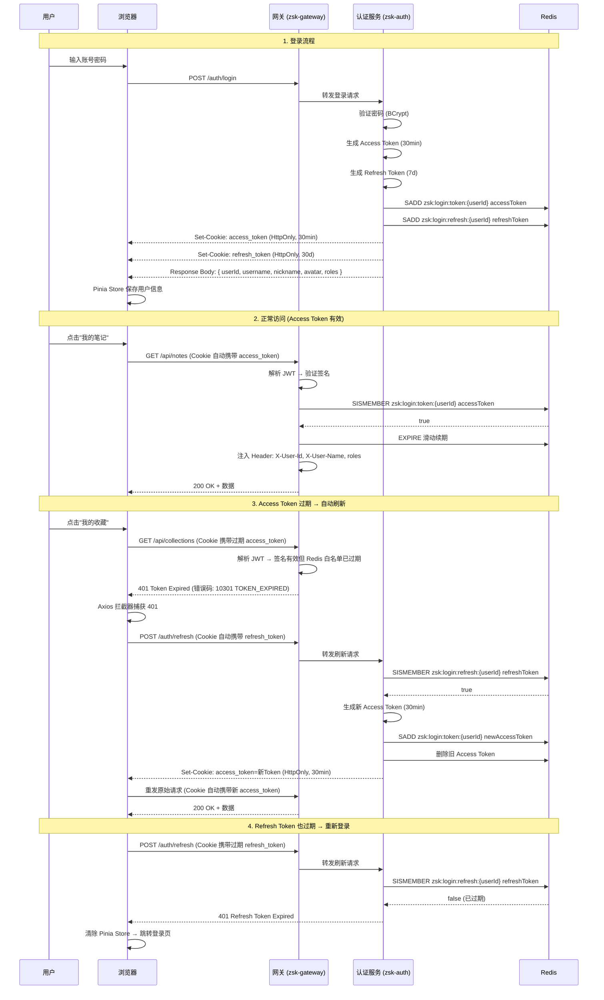

# Token 存储方案设计：从 Session 到 JWT 双 Token 的企业级演进

> 一句话总结：基于 RS256 签名的 Access Token + Refresh Token 双令牌方案，Access Token 存 HttpOnly Cookie 防窃取，Refresh Token 存 Redis 支持主动吊销，前端 Pinia 仅缓存非敏感用户状态，实现安全与体验的平衡。

---

## 一、引子：为什么认证方案如此重要

想象你正在构建一个知识社区平台。用户登录后，系统需要"记住"他是谁、有什么权限。这个看似简单的问题，在分布式微服务架构下变得复杂——你的网关、认证服务、业务服务可能跑在不同的机器上，甚至不同的机房。

**选错方案的代价**：

| 场景 | 后果 |
|------|------|
| Session 粘滞到单节点 | 节点宕机 → 该节点所有用户被踢下线 |
| Token 存 localStorage | XSS 攻击 → 窃取 Token → 冒充用户 |
| 单 Token 无吊销能力 | 用户改密码后旧 Token 仍有效 |
| Token 过短 + 无刷新 | 用户频繁重新登录，体验极差 |
| Token 过长 + 无吊销 | 泄露后长时间有效，安全风险极高 |

这不是假设——每一个从单体走向微服务的系统，都必须回答同一个问题：**如何安全、高效地管理用户身份凭证？**

本文将从 Session vs JWT 的根本取舍出发，深入分析 Cookie / localStorage / Pinia 三种前端存储机制的真实优劣，最终给出我们项目中采用的 **双 Token 方案** 的完整设计。

---

## 二、为什么选择 JWT 而非 Session

### 2.1 Session 机制回顾

传统 Session 方案的工作方式：

```
┌────────┐    1. 登录请求     ┌──────────┐
│ Client │ ───────────────> │  Server  │
│        │                   │          │
│        │ <─────────────── │          │
│        │  2. Set-Cookie:  │          │
│        │  JSESSIONID=abc  │          │
│        │                   │          │
│        │  3. 后续请求      │          │
│        │ ───────────────> │          │
│        │  Cookie: JSESSIONID=abc     │
│        │                   │  4. 根据 Session ID 查找内存中的 Session 数据
│        │ <─────────────── │          │
│        │  5. 响应          │          │
└────────┘                   └──────────┘
```

**核心特征**：服务端保存状态（有状态），客户端只持有一个 Session ID。

### 2.2 JWT 机制回顾

JWT（JSON Web Token）方案的工作方式：

```
┌────────┐    1. 登录请求     ┌──────────┐
│ Client │ ───────────────> │  Server  │
│        │                   │          │
│        │ <─────────────── │          │
│        │  2. 返回 JWT:    │          │
│        │  eyJhbGci...     │          │
│        │                   │          │
│        │  3. 后续请求      │          │
│        │ ───────────────> │          │
│        │  Authorization:  │          │
│        │  Bearer eyJhbGci...        │
│        │                   │  4. 验证签名 + 解析 Claims（无需查库）
│        │ <─────────────── │          │
│        │  5. 响应          │          │
└────────┘                   └──────────┘
```

**核心特征**：Token 自包含用户信息（无状态），服务端无需存储 Session 数据。

### 2.3 真实对比：不是"谁更好"，而是"谁更适合"

| 维度 | Session | JWT | 胜出 |
|------|---------|-----|------|
| **状态管理** | 有状态（服务端存储） | 无状态（Token 自包含） | 看场景 |
| **水平扩展** | 需要 Sticky Session 或 Session 集中存储（Redis） | 天然支持，任何节点可验证 | **JWT** |
| **跨域/跨服务** | Cookie 跨域限制多，需 CORS + CSRF 防护 | Token 通过 Header 传递，无跨域问题 | **JWT** |
| **微服务友好** | 需要共享 Session Store | 各服务独立验证签名即可 | **JWT** |
| **主动吊销** | 服务端直接删除 Session | Token 签发后无法撤回（需黑名单机制） | **Session** |
| **安全性** | Session ID 泄露风险，但可即时失效 | Token 泄露后难以即时失效 | **Session** |
| **带宽消耗** | 仅传 Session ID（~50 字节） | 传完整 Token（~500-1000 字节） | **Session** |
| **移动端适配** | Cookie 机制在 App 端不友好 | Token 方式在 App/小程序/原生端通用 | **JWT** |

### 2.4 为什么 ZSK-Cloud 选择 JWT

我们的系统是 **Spring Cloud 微服务架构**，核心考量如下：

**1）微服务无状态验证**

```
Gateway 验证 Token → 转发到 System 服务 → 转发到 Document 服务
     ↑ 不需要查库          ↑ 不需要查库          ↑ 不需要查库
```

如果用 Session，每个请求都要查 Redis 获取 Session 数据；而 JWT 只需验证签名（本地公钥即可），零网络开销。

**2）RS256 非对称签名——私钥签名、公钥验证**

```
┌─────────────┐         ┌──────────────┐    ┌──────────────┐    ┌──────────────┐
│  zsk-auth   │         │  zsk-gateway │    │ zsk-system   │    │ zsk-document │
│  (持有私钥)  │         │  (持有公钥)   │    │  (持有公钥)   │    │  (持有公钥)   │
│             │         │              │    │              │    │              │
│  签发 Token  │────────>│  验证 Token  │──> │  验证 Token  │──> │  验证 Token  │
│  RS256 签名  │         │  RS256 验证  │    │  RS256 验证  │    │  RS256 验证  │
└─────────────┘         └──────────────┘    └──────────────┘    └──────────────┘
```

只有 `zsk-auth` 持有私钥可以签发 Token，其他服务只持有公钥用于验证。即使某个业务服务被攻破，攻击者也无法伪造 Token。

**3）Token + Redis 混合——兼顾无状态与可吊销**

纯 JWT 的致命问题是"签发即无法撤回"。我们通过 **JWT + Redis 白名单** 解决：

- JWT 本身负责"携带身份信息 + 防篡改"
- Redis 负责控制"Token 是否仍然有效"
- 网关验证时：先验签名（本地），再查 Redis（远程），双重校验

```java
// AuthFilter.java — 网关验证逻辑
Claims claims = JwtUtils.parseToken(token);           // 1. 验证签名（本地公钥）
String userId = claims.get(SecurityConstants.USER_ID).toString();
Boolean isMember = redisService.isMemberOfSet(tokenKey, token);  // 2. 查 Redis 白名单
if (Boolean.FALSE.equals(isMember)) {
    return unauthorizedResponse(exchange, "令牌已过期");  // 3. 不在白名单 → 已被吊销
}
```

这让我们既享受了 JWT 的无状态验证优势，又获得了 Session 级别的主动吊销能力。

---

## 三、前端 Token 存储：Cookie vs localStorage vs Pinia

JWT 选型确定后，下一个关键问题是：**前端拿到 Token 后存哪里？**

这不是一个简单的选择题——三种方案在安全性、持久性、跨域能力上各有取舍。

### 3.1 Cookie 存储

#### 工作原理

```
登录成功 → 服务端 Set-Cookie: access_token=eyJhbGci...; HttpOnly; Secure; SameSite=Lax
         → 浏览器自动保存，后续请求自动携带
```

#### 优势

| 优势 | 说明 |
|------|------|
| **HttpOnly 防 XSS** | JavaScript 无法读取 Cookie，XSS 攻击无法窃取 Token |
| **Secure 仅 HTTPS** | 确保 Token 只在加密连接中传输，防止中间人窃听 |
| **SameSite 防 CSRF** | `SameSite=Lax/Strict` 阻止跨站请求携带 Cookie |
| **自动携带** | 浏览器自动在请求中附加 Cookie，无需前端手动处理 |
| **过期管理** | 浏览器根据 `Expires`/`Max-Age` 自动清理过期 Cookie |

#### 劣势

| 劣势 | 说明 |
|------|------|
| **CSRF 风险** | 即使 SameSite=Lax，GET 请求仍会携带，需额外 CSRF Token |
| **跨域限制** | 不同域名无法共享 Cookie，微前端/多域名场景受限 |
| **大小限制** | 单个 Cookie 最大 4KB，JWT 较长时可能超限 |
| **移动端不友好** | 原生 App / 小程序没有 Cookie 机制 |
| **前端无法感知** | HttpOnly 意味着 JS 读不到，前端无法判断登录状态 |

### 3.2 localStorage 存储

#### 工作原理

```
登录成功 → 前端 JS 接收 Token → localStorage.setItem('access_token', token)
         → 后续请求手动添加 Authorization: Bearer {token}
```

#### 优势

| 优势 | 说明 |
|------|------|
| **无 CSRF 风险** | Token 不在 Cookie 中，跨站请求不会自动携带 |
| **跨域友好** | 不同域名可独立存储，适合微前端架构 |
| **容量大** | 5-10MB 存储空间，远超 Cookie 的 4KB |
| **前端可控** | JS 可随时读取/删除，方便实现登录状态判断 |
| **全平台通用** | App / 小程序 / 浏览器均可使用 |

#### 劣势

| 劣势 | 说明 |
|------|------|
| **XSS 致命** | `localStorage.getItem('access_token')` 一行代码即可窃取 Token |
| **无自动过期** | 除非手动删除，否则永久有效（即使 Token 已在服务端失效） |
| **无自动携带** | 每次请求需手动添加 Header，遗忘则鉴权失败 |
| **子域不共享** | `a.example.com` 的 localStorage 与 `b.example.com` 互相隔离 |

### 3.3 Pinia（内存状态管理）存储

#### 工作原理

```
登录成功 → 前端 JS 接收 Token → userStore.setToken(token)
         → Token 存在 JS 内存中（Pinia state）
         → 后续请求通过 Axios 拦截器自动附加 Header
```

#### 优势

| 优势 | 说明 |
|------|------|
| **XSS 窃取门槛高** | Token 在内存中，攻击者无法通过静态 DOM 读取 |
| **自动过期** | 页面刷新/关闭即丢失，天然实现"会话级"过期 |
| **响应式** | Token 变化自动触发 UI 更新（登录/登出状态联动） |
| **灵活控制** | 可随时清除、刷新、替换，业务逻辑完全可控 |

#### 劣势

| 劣势 | 说明 |
|------|------|
| **不持久** | 页面刷新即丢失，用户需要重新登录 |
| **单标签页** | 同一用户的不同标签页不共享内存状态 |
| **内存泄漏风险** | 如果忘记清理，Token 可能残留在闭包/全局变量中 |

### 3.4 三种方案的真实对比

| 维度 | Cookie (HttpOnly) | localStorage | Pinia (内存) |
|------|-------------------|-------------|-------------|
| **XSS 防御** | ✅ 最佳（JS 不可读） | ❌ 最差（JS 可读） | ⚠️ 较好（内存中，需调试器） |
| **CSRF 防御** | ⚠️ 需额外防护 | ✅ 天然免疫 | ✅ 天然免疫 |
| **持久性** | ✅ 可控过期 | ✅ 永久（需手动清理） | ❌ 刷新即丢 |
| **跨标签页** | ✅ 同域共享 | ✅ 同域共享 | ❌ 各标签页独立 |
| **跨域** | ❌ 受限 | ✅ 独立存储 | ✅ 独立存储 |
| **移动端** | ❌ 不友好 | ✅ 通用 | ✅ 通用 |
| **容量** | ❌ 4KB | ✅ 5-10MB | ✅ 无硬限制 |
| **自动携带** | ✅ 浏览器自动 | ❌ 需手动 | ❌ 需拦截器 |
| **前端感知** | ❌ HttpOnly 不可读 | ✅ 可读 | ✅ 响应式 |

### 3.5 各方案适用场景

```
┌────────────────────────────────────────────────────────────────────┐
│                        存储方案选择决策树                             │
├────────────────────────────────────────────────────────────────────┤
│                                                                    │
│  安全性要求极高（金融/支付/后台管理）                                  │
│  └── Cookie (HttpOnly + Secure + SameSite=Strict)                  │
│                                                                    │
│  需要跨域 + 移动端 + 安全性中等（SaaS/开放平台）                      │
│  └── localStorage + 短期 Token + 频繁刷新                           │
│                                                                    │
│  SPA 应用 + 需要响应式状态 + 安全性中等                               │
│  └── Pinia (内存) + 持久化插件 (可选)                                │
│                                                                    │
│  企业级微服务 + 全平台 + 高安全 + 好体验                              │
│  └── Cookie (Access Token) + Pinia (用户状态) ← 我们的方案          │
│                                                                    │
└────────────────────────────────────────────────────────────────────┘
```

---

## 四、为什么选择 Cookie 存储 Access Token

### 4.1 核心原因：XSS 是 Web 安全的头号威胁

OWASP Top 10 中，**注入类攻击（含 XSS）** 常年位居前三。在实际攻击事件中，XSS 窃取 Token 的案例远多于 CSRF 伪造请求。

**XSS 窃取 localStorage Token 的攻击链**：

```
1. 攻击者在评论区注入恶意脚本：
   

2. 受害者浏览该评论，脚本自动执行

3. Token 被发送到攻击者服务器

4. 攻击者使用 Token 冒充受害者，访问所有 API
```

**HttpOnly Cookie 阻断攻击链**：

```
1. 攻击者注入同样的脚本

2. document.cookie 返回空（HttpOnly 属性阻止 JS 读取）

3. 攻击者无法获取 Token → 攻击失败
```

### 4.2 CSRF 风险的应对

Cookie 的 CSRF 风险是真实的，但可控：

**方案一：SameSite 属性（推荐）**

```
Set-Cookie: access_token=eyJhbGci...; HttpOnly; Secure; SameSite=Lax
```

- `SameSite=Lax`：跨站 GET 请求不携带 Cookie，POST 请求不携带
- `SameSite=Strict`：任何跨站请求都不携带 Cookie（最安全但影响体验）
- 现代浏览器（Chrome 80+）默认 `SameSite=Lax`

**方案二：CSRF Token（双重验证）**

```
1. 服务端生成 CSRF Token，存入 Cookie（非 HttpOnly）
2. 前端读取 CSRF Token，添加到请求 Header
3. 服务端比对 Cookie 中的 CSRF Token 与 Header 中的是否一致
```

**方案三：自定义 Header（我们的选择）**

```
1. Access Token 存在 HttpOnly Cookie 中
2. 前端通过 Axios 拦截器在请求中添加自定义 Header: X-Requested-With: XMLHttpRequest
3. CSRF 攻击无法添加自定义 Header（跨域限制），请求被拒绝
```

> 在我们的项目中，网关 `AuthFilter` 同时支持从 `Authorization Header` 和 `Cookie` 获取 Token。对于浏览器端，优先使用 Cookie；对于 API 调用（Postman/App），使用 Header。

### 4.3 第三方登录回调场景

OAuth2 第三方登录（QQ/微信/GitHub）的回调 URL 是 GET 请求，Token 需要通过 URL 参数或 Cookie 传递。Cookie 在此场景下是唯一安全的选择：

```
用户点击"GitHub登录" → 跳转 GitHub 授权页 → 回调 /oauth2/callback?code=xxx
                                                       │
                                                       ▼
                                              zsk-auth 用 code 换 Token
                                                       │
                                                       ▼
                                              Set-Cookie: access_token=eyJhbGci...
                                              重定向到前端首页
```

我们的网关 `AuthFilter` 已经支持从 Cookie 读取 Token：

```java
private String getToken(ServerHttpRequest request) {
    // 优先从 Authorization Header 获取
    String token = request.getHeaders().getFirst(SecurityConstants.AUTHORIZATION_HEADER);
    if (StringUtils.isNotEmpty(token) && token.startsWith(SecurityConstants.TOKEN_PREFIX)) {
        return token.replace(SecurityConstants.TOKEN_PREFIX, "");
    }
    // 回退从 Cookie 获取（第三方登录回调场景）
    HttpCookie cookie = request.getCookies().getFirst("access_token");
    if (cookie != null && StringUtils.isNotEmpty(cookie.getValue())) {
        return cookie.getValue();
    }
    return null;
}
```

---

## 五、localStorage 与 Pinia 的真实对比

### 5.1 本质区别：持久化 vs 响应式

```
localStorage:  硬盘存储 → 持久化 → 跨刷新保留 → 但非响应式
Pinia:         内存存储 → 响应式 → 刷新即丢失 → 但与 UI 联动
```

### 5.2 功能维度对比

| 维度 | localStorage | Pinia |
|------|-------------|-------|
| **存储位置** | 浏览器硬盘（DevTools → Application → Local Storage） | JS 堆内存 |
| **生命周期** | 永久，除非手动删除 | 页面刷新/关闭即丢失 |
| **容量** | 5-10MB | 受限于 JS 堆内存（通常数百 MB） |
| **响应式** | ❌ 需手动监听 `storage` 事件 | ✅ Vue 响应式系统自动追踪 |
| **跨标签页** | ✅ `storage` 事件可监听变化 | ❌ 各标签页独立实例 |
| **数据类型** | 仅字符串（需 JSON.stringify/parse） | 任意 JS 对象 |
| **XSS 可读性** | ✅ `localStorage.getItem()` 直接读取 | ⚠️ 需调试器断点或 `__pinia` 全局访问 |
| **开发者体验** | 命令式 API（getItem/setItem） | 声明式 API（computed/action） |

### 5.3 典型使用场景

#### localStorage 适合存什么

```
✅ 用户偏好设置（主题、语言、布局）
✅ 功能开关（Feature Flag 缓存）
✅ 离线数据缓存（PWA 场景）
✅ 表单草稿自动保存
```

#### Pinia 适合存什么

```
✅ 当前用户信息（用户名、头像、角色）
✅ 登录状态标志（isLoggedIn）
✅ 权限列表（动态路由/菜单）
✅ 临时 UI 状态（侧边栏展开/收起）
```

#### 两者都不适合存什么

```
❌ Access Token（应存 HttpOnly Cookie）
❌ 敏感个人信息（身份证号、银行卡号）
❌ 大量业务数据（应存 IndexedDB 或服务端）
```

### 5.4 Pinia 持久化插件：鱼和熊掌兼得？

Pinia 社区提供了 `pinia-plugin-persistedstate` 插件，可以将 Store 状态自动同步到 localStorage/sessionStorage：

```typescript
import { defineStore } from 'pinia'
import { ref } from 'vue'

export const useUserStore = defineStore('user', () => {
  const nickname = ref('')
  const avatar = ref('')
  const roles = ref<string[]>([])

  return { nickname, avatar, roles }
}, {
  persist: {
    key: 'zsk-user-state',
    storage: localStorage,
    pick: ['nickname', 'avatar']  // 只持久化非敏感字段
  }
})
```

**注意**：持久化插件只是把 Pinia 的值同步到 localStorage，安全性等同于 localStorage。**绝不能通过持久化插件存储 Token**。

---

## 六、最终方案：双 Token + Cookie + Pinia 分层存储

### 6.1 方案全景图

```
┌─────────────────────────────────────────────────────────────────────────┐
│                        ZSK-Cloud Token 存储架构                          │
├─────────────────────────────────────────────────────────────────────────┤
│                                                                         │
│  ┌─────────────────────────────────────────────────────────────────┐   │
│  │  服务端 (zsk-auth)                                               │   │
│  │                                                                   │   │
│  │  登录成功 → 生成 Access Token (短期, 30min)                      │   │
│  │          → 生成 Refresh Token (长期, 7天)                        │   │
│  │          → Access Token: Set-Cookie (HttpOnly, Secure, Lax)     │   │
│  │          → Refresh Token: Set-Cookie (HttpOnly, Secure, Lax)    │   │
│  │          → 用户信息: Response Body (JSON)                        │   │
│  └─────────────────────────────────────────────────────────────────┘   │
│          │                              │                              │
│          ▼                              ▼                              │
│  ┌──────────────────┐        ┌──────────────────┐                    │
│  │  浏览器 Cookie    │        │  前端 Pinia Store │                    │
│  │                   │        │                   │                    │
│  │  access_token     │        │  userId           │                    │
│  │  (HttpOnly)       │        │  username         │                    │
│  │  refresh_token    │        │  nickname         │                    │
│  │  (HttpOnly)       │        │  avatar           │                    │
│  │                   │        │  roles[]          │                    │
│  │  ✅ 自动携带      │        │  permissions[]    │                    │
│  │  ✅ 防 XSS        │        │  isLoggedIn       │                    │
│  │  ✅ 自动过期      │        │                   │                    │
│  └──────────────────┘        │  ✅ 响应式 UI     │                    │
│                               │  ✅ 业务逻辑可用   │                    │
│                               └──────────────────┘                    │
│                                                                         │
│  ┌─────────────────────────────────────────────────────────────────┐   │
│  │  服务端 Redis                                                    │   │
│  │                                                                   │   │
│  │  zsk:login:token:{userId}     → Set<accessToken> (最多5个)      │   │
│  │  zsk:login:refresh:{userId}   → Set<refreshToken> (最多5个)     │   │
│  │  zsk:login:roles:{userId}     → Set<role>                       │   │
│  │  zsk:login:permissions:{userId} → Set<permission>               │   │
│  └─────────────────────────────────────────────────────────────────┘   │
│                                                                         │
└─────────────────────────────────────────────────────────────────────────┘
```

### 6.2 双 Token 机制详解

#### 6.2.1 为什么需要双 Token

单 Token 方案面临一个两难困境：

```
Token 有效期长 (如 7 天)
  → 优点：用户不用频繁登录
  → 缺点：Token 泄露后 7 天内都可被利用，安全风险极高

Token 有效期短 (如 30 分钟)
  → 优点：泄露窗口小，安全性高
  → 缺点：用户每 30 分钟就要重新登录，体验极差
```

**双 Token 破解两难**：

```
Access Token (短期, 30 分钟)
  → 用于日常 API 访问
  → 泄露窗口小，即使被窃取也很快失效

Refresh Token (长期, 7 天)
  → 仅用于刷新 Access Token
  → 使用频率极低（每 30 分钟才用一次）
  → 可被服务端主动吊销
```

#### 6.2.2 Access Token 与 Refresh Token 的对比

| 维度 | Access Token | Refresh Token |
|------|-------------|---------------|
| **用途** | 访问业务 API | 刷新 Access Token |
| **有效期** | 30 分钟 | 30 天 |
| **使用频率** | 每次请求 | 约 30 分钟一次 |
| **存储位置** | HttpOnly Cookie | HttpOnly Cookie |
| **Redis 存储** | `zsk:login:token:{userId}` (Set) | `zsk:login:refresh:{userId}` (Set) ⭐新增 |
| **泄露影响** | 30 分钟内可冒充用户 | 仅能刷新 Token，不能直接访问 API |
| **吊销方式** | 从 Redis Set 中删除 | 从 Redis Set 中删除 |
| **JWT Claims** | user_id, user_name, nick_name | user_id, token_type=refresh ⭐新增 |
| **签名算法** | RS256 | RS256 |

> ⭐ 标记为本次方案新增的常量/字段，当前代码中尚未实现。

#### 6.2.3 完整认证流程



### 6.3 前端存储分层设计

```
┌─────────────────────────────────────────────────────────────────┐
│                     前端存储分层架构                               │
├─────────────────────────────────────────────────────────────────┤
│                                                                   │
│  Layer 1: HttpOnly Cookie (服务端写入，前端不可读)                  │
│  ┌─────────────────────────────────────────────────────────┐    │
│  │  access_token  = eyJhbGciOiJSUzI1NiIs...  (30min)      │    │
│  │  refresh_token = eyJhbGciOiJSUzI1NiIs...  (7d)         │    │
│  │                                                          │    │
│  │  安全级别: ★★★★★  (XSS 无法读取)                        │    │
│  │  用途: 浏览器自动携带，网关验证身份                        │    │
│  └─────────────────────────────────────────────────────────┘    │
│                                                                   │
│  Layer 2: Pinia Store (内存，响应式，刷新丢失)                     │
│  ┌─────────────────────────────────────────────────────────┐    │
│  │  userId       = 10086                                    │    │
│  │  username     = "zhangsan"                               │    │
│  │  nickname     = "张三"                                   │    │
│  │  avatar       = "https://oss.zsk.com/avatar/10086.jpg"  │    │
│  │  roles        = ["admin", "editor"]                      │    │
│  │  permissions  = ["system:user:list", "doc:note:create"]  │    │
│  │  isLoggedIn   = true                                     │    │
│  │                                                          │    │
│  │  安全级别: ★★★☆☆  (内存中，需调试器读取)                  │    │
│  │  用途: 响应式 UI 联动，动态路由/菜单，权限判断              │    │
│  └─────────────────────────────────────────────────────────┘    │
│                                                                   │
│  Layer 3: localStorage (硬盘，持久化)                              │
│  ┌─────────────────────────────────────────────────────────┐    │
│  │  theme        = "dark"                                   │    │
│  │  language     = "zh-CN"                                  │    │
│  │  sidebarCollapsed = true                                 │    │
│  │                                                          │    │
│  │  安全级别: ★★☆☆☆  (XSS 可读，但数据无安全风险)           │    │
│  │  用途: 用户偏好，UI 状态持久化                             │    │
│  └─────────────────────────────────────────────────────────┘    │
│                                                                   │
└─────────────────────────────────────────────────────────────────┘
```

### 6.4 Pinia Store 设计

```typescript
import { defineStore } from 'pinia'
import { ref, computed } from 'vue'

export const useUserStore = defineStore('user', () => {
  const userId = ref<number | null>(null)
  const username = ref('')
  const nickname = ref('')
  const avatar = ref('')
  const roles = ref<string[]>([])
  const permissions = ref<string[]>([])

  const isLoggedIn = computed(() => userId !== null)

  const isAdmin = computed(() => roles.value.includes('admin'))

  function setUserInfo(info: LoginResponse) {
    userId.value = info.userId
    username.value = info.username
    nickname.value = info.nickname
    avatar.value = info.avatar
  }

  function setRolesAndPermissions(r: string[], p: string[]) {
    roles.value = r
    permissions.value = p
  }

  function hasPermission(permission: string): boolean {
    if (isAdmin.value) return true
    return permissions.value.includes(permission)
  }

  function clear() {
    userId.value = null
    username.value = ''
    nickname.value = ''
    avatar.value = ''
    roles.value = []
    permissions.value = []
  }

  return {
    userId, username, nickname, avatar, roles, permissions,
    isLoggedIn, isAdmin,
    setUserInfo, setRolesAndPermissions, hasPermission, clear
  }
})
```

### 6.5 Axios 拦截器：Token 刷新的静默处理

```typescript
import axios, { type InternalAxiosRequestConfig } from 'axios'
import { useUserStore } from '@/stores/user'

let isRefreshing = false
let pendingRequests: Array<(token: string) => void> = []

const api = axios.create({
  baseURL: '/api',
  withCredentials: true  // 关键：跨域请求携带 Cookie
})

api.interceptors.response.use(
  (response) => response,
  async (error) => {
    const originalRequest = error.config as InternalAxiosRequestConfig & { _retry?: boolean }
    const userStore = useUserStore()

    if (error.response?.status === 401) {
      const errorCode = error.response.data?.code

      if (errorCode === 10301) {
        // TOKEN_EXPIRED: Access Token 过期，尝试刷新
        if (!isRefreshing) {
          isRefreshing = true
          try {
            // Refresh Token 在 Cookie 中自动携带
            await axios.post('/auth/refresh', null, { withCredentials: true })
            isRefreshing = false
            pendingRequests.forEach(cb => cb(''))
            pendingRequests = []
            return api(originalRequest)
          } catch {
            isRefreshing = false
            pendingRequests = []
            userStore.clear()
            window.location.href = '/login'
            return Promise.reject(error)
          }
        }

        return new Promise((resolve) => {
          pendingRequests.push(() => {
            resolve(api(originalRequest))
          })
        })
      }

      // REFRESH_EXPIRED: Refresh Token 也过期，强制登录
      // 需新增 ResultCode: REFRESH_TOKEN_EXPIRED(10311, "刷新令牌已过期")
      if (errorCode === 10311) {
        userStore.clear()
        window.location.href = '/login'
      }
    }

    return Promise.reject(error)
  }
)
```

### 6.6 服务端双 Token 实现

#### 6.6.1 登录时签发双 Token

```java
@Override
public LoginResponse login(LoginRequest request) {
    LoginUser loginUser = authenticate(request);
    SysUserApi user = loginUser.getSysUser();
    Long userId = user.getId();

    // 1. 生成 Access Token (短期)
    Map<String, Object> accessClaims = new HashMap<>();
    accessClaims.put(SecurityConstants.USER_ID, userId);
    accessClaims.put(SecurityConstants.USER_NAME, user.getUserName());
    accessClaims.put(SecurityConstants.NICK_NAME, user.getNickName());
    accessClaims.put("token_type", "access");  // ⭐新增字段
    String accessToken = JwtUtils.createToken(accessClaims);

    // 2. 生成 Refresh Token (长期)
    Map<String, Object> refreshClaims = new HashMap<>();
    refreshClaims.put(SecurityConstants.USER_ID, userId);
    refreshClaims.put("token_type", "refresh");  // ⭐新增字段
    String refreshToken = JwtUtils.createToken(refreshClaims);

    // 3. 存储到 Redis
    String accessTokenKey = CacheConstants.CACHE_LOGIN_TOKEN + userId;
    String refreshTokenKey = CacheConstants.CACHE_LOGIN_REFRESH + userId;  // ⭐新增常量

    // Access Token: 最多 5 个设备
    storeTokenWithLimit(accessTokenKey, accessToken,
            SecurityConstants.TOKEN_EXPIRE, TimeUnit.MINUTES, 5);  // 当前720min，目标30min
    // Refresh Token: 最多 5 个设备
    storeTokenWithLimit(refreshTokenKey, refreshToken,
            SecurityConstants.REFRESH_TOKEN_EXPIRE, TimeUnit.DAYS, 5);  // 30天

    // 4. 缓存角色和权限
    cacheRolesAndPermissions(userId, loginUser);

    // 5. 通过 Cookie 下发 Token（服务端设置 HttpOnly Cookie）
    // Access Token Cookie: 30 分钟过期（目标值，当前为720min）
    response.addCookie(buildCookie("access_token", accessToken,
            SecurityConstants.TOKEN_EXPIRE * 60, true, true, "Lax"));
    // Refresh Token Cookie: 30 天过期
    response.addCookie(buildCookie("refresh_token", refreshToken,
            (int) SecurityConstants.REFRESH_TOKEN_EXPIRE * 24 * 60 * 60, true, true, "Lax"));

    // 6. 返回用户信息（不含 Token，Token 在 Cookie 中）
    return LoginResponse.builder()
            .userId(user.getId())
            .username(user.getUserName())
            .nickname(user.getNickName())
            .avatar(user.getAvatar())
            .expiresIn(SecurityConstants.TOKEN_EXPIRE * 60L)
            .build();
}
```

#### 6.6.2 刷新 Access Token

```java
@Override
public RefreshResponse refreshAccessToken(String refreshToken) {
    // 1. 解析 Refresh Token
    Claims claims = JwtUtils.parseToken(refreshToken);
    String tokenType = claims.get("token_type", String.class);  // ⭐新增字段
    if (!"refresh".equals(tokenType)) {
        throw new AuthException("无效的刷新令牌");
    }

    Long userId = JwtUtils.getUserIdAsLong(refreshToken);

    // 2. 验证 Refresh Token 是否在 Redis 白名单中
    String refreshTokenKey = CacheConstants.CACHE_LOGIN_REFRESH + userId;  // ⭐新增常量
    Boolean isMember = redisService.isMemberOfSet(refreshTokenKey, refreshToken);
    if (Boolean.FALSE.equals(isMember)) {
        throw new AuthException(ResultCode.TOKEN_EXPIRED);  // 复用现有 10301
    }

    // 3. 生成新的 Access Token
    Map<String, Object> accessClaims = new HashMap<>();
    accessClaims.put(SecurityConstants.USER_ID, userId);
    accessClaims.put(SecurityConstants.USER_NAME, claims.get(SecurityConstants.USER_NAME));
    accessClaims.put(SecurityConstants.NICK_NAME, claims.get(SecurityConstants.NICK_NAME));
    accessClaims.put("token_type", "access");  // ⭐新增字段
    String newAccessToken = JwtUtils.createToken(accessClaims);

    // 4. 存储新 Access Token 到 Redis
    String accessTokenKey = CacheConstants.CACHE_LOGIN_TOKEN + userId;
    redisService.setSetCacheObject(accessTokenKey, newAccessToken);
    redisService.expire(accessTokenKey, SecurityConstants.TOKEN_EXPIRE, TimeUnit.MINUTES);

    // 5. 刷新 Refresh Token 和角色权限的过期时间
    redisService.expire(refreshTokenKey, SecurityConstants.REFRESH_TOKEN_EXPIRE, TimeUnit.DAYS);
    redisService.expire(CacheConstants.CACHE_LOGIN_ROLES + userId,
            SecurityConstants.REFRESH_TOKEN_EXPIRE, TimeUnit.DAYS);
    redisService.expire(CacheConstants.CACHE_LOGIN_PERMISSIONS + userId,
            SecurityConstants.REFRESH_TOKEN_EXPIRE, TimeUnit.DAYS);

    // 6. 通过 Cookie 下发新 Access Token
    response.addCookie(buildCookie("access_token", newAccessToken,
            SecurityConstants.TOKEN_EXPIRE * 60, true, true, "Lax"));

    return new RefreshResponse(SecurityConstants.TOKEN_EXPIRE * 60L);
}
```

#### 6.6.3 退出登录

```java
@Override
public void logout(HttpServletRequest request) {
    // 1. 从 Cookie 获取 Access Token
    String accessToken = getTokenFromCookie(request, "access_token");
    String refreshToken = getTokenFromCookie(request, "refresh_token");

    if (StrUtil.isNotBlank(accessToken)) {
        Long userId = JwtUtils.getUserIdAsLong(accessToken);
        // 删除 Access Token
        redisService.removeSetCacheObject(CacheConstants.CACHE_LOGIN_TOKEN + userId, accessToken);
    }

    if (StrUtil.isNotBlank(refreshToken)) {
        Long userId = JwtUtils.getUserIdAsLong(refreshToken);
        // 删除 Refresh Token
        redisService.removeSetCacheObject(CacheConstants.CACHE_LOGIN_REFRESH + userId, refreshToken);

        // 检查是否还有其他设备
        Long remaining = redisService.getSetSize(CacheConstants.CACHE_LOGIN_TOKEN + userId);
        if (remaining == null || remaining == 0) {
            redisService.deleteObject(CacheConstants.CACHE_LOGIN_ROLES + userId);
            redisService.deleteObject(CacheConstants.CACHE_LOGIN_PERMISSIONS + userId);
        }
    }

    // 2. 清除 Cookie
    response.addCookie(buildCookie("access_token", "", 0, true, true, "Lax"));
    response.addCookie(buildCookie("refresh_token", "", 0, true, true, "Lax"));
}
```

### 6.7 Redis 存储结构变更

#### 变更前（当前）

```
key: zsk:login:token:{userId}        → Set<String> (accessToken集合, TTL=720min)
key: zsk:login:roles:{userId}        → Set<String> (角色集合)
key: zsk:login:permissions:{userId}  → Set<String> (权限集合)
```

#### 变更后（双 Token）

```
key: zsk:login:token:{userId}        → Set<String> (accessToken集合, TTL=30min, 滑动续期)
key: zsk:login:refresh:{userId}      → Set<String> (refreshToken集合, TTL=30d, 滑动续期) ⭐新增
key: zsk:login:roles:{userId}        → Set<String> (角色集合, TTL=30d)
key: zsk:login:permissions:{userId}  → Set<String> (权限集合, TTL=30d)
```

### 6.8 安全性分析

#### 6.8.1 攻击场景与防御

| 攻击类型 | 攻击方式 | 防御措施 | 防御效果 |
|---------|---------|---------|---------|
| **XSS 窃取 Token** | 注入脚本读取 Token | HttpOnly Cookie，JS 不可读 | ✅ 完全防御 |
| **XSS 伪造请求** | 注入脚本直接发请求 | SameSite=Lax + 自定义 Header | ✅ 基本防御 |
| **CSRF 伪造请求** | 跨站请求自动携带 Cookie | SameSite=Lax | ✅ 基本防御 |
| **中间人窃听** | HTTP 明文传输截获 Token | Secure 属性 + HTTPS | ✅ 完全防御 |
| **Token 泄露** | Access Token 被窃取 | 30 分钟短有效期 | ✅ 窗口极小 |
| **Refresh Token 泄露** | Refresh Token 被窃取 | 仅能刷新，不能直接访问 API | ⚠️ 需配合 IP 绑定 |
| **重放攻击** | 截获请求重放 | HTTPS + 请求签名 + Nonce | ✅ 完全防御 |

#### 6.8.2 与纯 localStorage 方案的安全性对比

```
┌───────────────────────────────────────────────────────────────┐
│  攻击模拟：XSS 注入                                            │
├───────────────────────────────────────────────────────────────┤
│                                                               │
│  localStorage 方案:                                           │
│  攻击脚本: localStorage.getItem('access_token')               │
│  结果: ✅ 成功获取 Token → 冒充用户 → 完全沦陷                 │
│                                                               │
│  HttpOnly Cookie 方案:                                        │
│  攻击脚本: document.cookie                                    │
│  结果: ❌ 返回空 → 无法获取 Token → 攻击失败                   │
│                                                               │
│  攻击脚本: fetch('/api/user/info', {credentials: 'include'})  │
│  结果: ⚠️ 可以发起请求，但无法读取响应（CORS 限制）             │
│  且无法将 Cookie 转发到攻击者服务器                            │
│                                                               │
└───────────────────────────────────────────────────────────────┘
```

### 6.9 多设备登录管理

双 Token 方案下，多设备管理更加精细：

```
用户 A 在 3 个设备登录:
┌─────────────────────────────────────────────────────────────┐
│  Redis: zsk:login:token:10086                                │
│  ├── accessToken_device1 (手机, 30min TTL)                   │
│  ├── accessToken_device2 (电脑, 30min TTL)                   │
│  └── accessToken_device3 (平板, 30min TTL)                   │
│                                                               │
│  Redis: zsk:login:refresh:10086                              │
│  ├── refreshToken_device1 (手机, 30d TTL)                     │
│  ├── refreshToken_device2 (电脑, 30d TTL)                     │
│  └── refreshToken_device3 (平板, 30d TTL)                     │
└─────────────────────────────────────────────────────────────┘

强制下线设备2:
1. 从 zsk:login:token:10086 中删除 accessToken_device2
2. 从 zsk:login:refresh:10086 中删除 refreshToken_device2
3. 设备2 的后续请求 → 401 → 跳转登录页
```

### 6.10 密码修改/重置后的全局吊销

```java
@Override
public void revokeAllTokens(Long userId) {
    // 1. 删除所有 Access Token → 所有设备立即失效
    redisService.deleteObject(CacheConstants.CACHE_LOGIN_TOKEN + userId);
    // 2. 删除所有 Refresh Token → 无法刷新获取新 Token
    redisService.deleteObject(CacheConstants.CACHE_LOGIN_REFRESH + userId);
    // 3. 删除角色权限缓存
    redisService.deleteObject(CacheConstants.CACHE_LOGIN_ROLES + userId);
    redisService.deleteObject(CacheConstants.CACHE_LOGIN_PERMISSIONS + userId);
}
```

### 6.11 兜底机制：Cookie 不是银弹，纵深防御才是答案

HttpOnly Cookie 显著提高了攻击门槛，但不存在百分百安全的存储方案。以下是 Cookie 被突破的真实场景，以及我们设计的多层兜底防线。

#### 6.11.1 Cookie 被突破的真实路径

```
┌─────────────────────────────────────────────────────────────────────┐
│              HttpOnly Cookie 被突破的攻击路径                         │
├─────────────────────────────────────────────────────────────────────┤
│                                                                     │
│  路径1: 中间人攻击 (MITM)                                           │
│  ├── 前提: 用户访问了 HTTP 页面（非 HTTPS）                          │
│  ├── 攻击: 截获 Set-Cookie 响应头，获取完整 Token                    │
│  └── 防御: Secure 属性 + HSTS 强制 HTTPS                            │
│                                                                     │
│  路径2: 物理设备访问                                                │
│  ├── 前提: 攻击者物理接触用户设备（未锁屏/共用电脑）                  │
│  ├── 攻击: 直接使用浏览器访问网站，Cookie 自动携带                   │
│  └── 防御: 短有效期 + 活跃检测 + 设备指纹                           │
│                                                                     │
│  路径3: 恶意浏览器扩展                                              │
│  ├── 前提: 用户安装了恶意扩展（Chrome 扩展可读 Cookie）              │
│  ├── 攻击: 扩展 API chrome.cookies.getAll() 读取 HttpOnly Cookie    │
│  └── 防御: 无法完全防御，但可检测异常行为                            │
│                                                                     │
│  路径4: 子域名接管 / 跨子域攻击                                     │
│  ├── 前提: Cookie Domain 设置为 .example.com                        │
│  ├── 攻击: 子域被接管后可读取父域 Cookie                             │
│  └── 防御: 不设置 Domain 属性（Cookie 仅限当前域名）                 │
│                                                                     │
│  路径5: 服务端日志泄露                                              │
│  ├── 前提: 请求日志中记录了完整 Cookie 头                           │
│  ├── 攻击: 日志系统被入侵后从中提取 Token                            │
│  └── 防御: 日志脱敏，Cookie 值打码处理                               │
│                                                                     │
│  路径6: XSS 虽不能读 Cookie，但可"借" Cookie 发请求                  │
│  ├── 前提: 存在 XSS 漏洞                                           │
│  ├── 攻击: 注入脚本 fetch('/api/transfer', {credentials:'include'}) │
│  └── 防御: SameSite=Strict + 二次验证 + 行为风控                     │
│                                                                     │
└─────────────────────────────────────────────────────────────────────┘
```

#### 6.11.2 纵深防御体系：五层防线

```
┌─────────────────────────────────────────────────────────────────────┐
│                       纵深防御体系（Defense in Depth）                │
├─────────────────────────────────────────────────────────────────────┤
│                                                                     │
│  第1层: 存储安全 ── 让 Token 难以被窃取                              │
│  ├── HttpOnly: JS 不可读                                            │
│  ├── Secure: 仅 HTTPS 传输                                          │
│  ├── SameSite=Lax: 防 CSRF                                         │
│  └── 不设 Domain: 防子域攻击                                        │
│                                                                     │
│  第2层: Token 本身安全 ── 即使被窃取，窗口极小                        │
│  ├── Access Token 短有效期 (30min)                                  │
│  ├── Refresh Token 仅能刷新，不能直接访问 API                        │
│  ├── RS256 签名防篡改                                               │
│  └── JWT 不含敏感信息（无密码、无身份证号）                           │
│                                                                     │
│  第3层: 请求绑定 ── 即使 Token 被窃取，也难以使用                     │
│  ├── 客户端指纹绑定 (Device Fingerprint)                            │
│  ├── Refresh Token 一次性轮换                                       │
│  └── IP 异地变更检测                                                │
│                                                                     │
│  第4层: 行为监控 ── 即使攻击者成功使用，也能及时发现                   │
│  ├── 异地登录告警                                                   │
│  ├── 并发使用检测                                                   │
│  ├── 操作频率异常检测                                               │
│  └── 安全事件审计日志                                               │
│                                                                     │
│  第5层: 应急响应 ── 发现异常后快速止损                                │
│  ├── 全局吊销 (密码修改/重置)                                       │
│  ├── 单设备踢出 (精确到设备)                                        │
│  ├── 用户自助查看在线设备                                            │
│  └── 自动化风险熔断                                                 │
│                                                                     │
└─────────────────────────────────────────────────────────────────────┘
```

#### 6.11.3 第3层详解：客户端指纹绑定

**核心思路**：Token 与"谁在用"绑定，而非仅与"谁签发的"绑定。攻击者窃取 Token 后，如果指纹不匹配，请求直接拒绝。

```
登录时:
┌──────────────────────────────────────────────────────────┐
│  1. 前端采集设备指纹:                                     │
│     fingerprint = SHA256(                                 │
│       User-Agent +                                        │
│       screen.width + screen.height +                      │
│       timezone +                                          │
│       language +                                          │
│       canvas fingerprint                                  │
│     )                                                     │
│                                                           │
│  2. 将 fingerprint 作为登录请求的 Header 发送              │
│                                                           │
│  3. 服务端将 fingerprint 绑定到 Refresh Token:             │
│     Redis: zsk:login:fingerprint:{userId} → Hash          │
│       field: refreshToken → value: fingerprint            │
└──────────────────────────────────────────────────────────┘

刷新时:
┌──────────────────────────────────────────────────────────┐
│  1. 前端在 /auth/refresh 请求中携带当前 fingerprint       │
│                                                           │
│  2. 服务端比对:                                           │
│     stored = HGET zsk:login:fingerprint:{userId} {token}  │
│     if (current != stored) → 拒绝刷新 + 吊销该 Token     │
│                                                           │
│  3. 指纹不匹配说明 Token 被转移到了其他环境                │
└──────────────────────────────────────────────────────────┘
```

**Redis 存储结构扩展**：

```
key: zsk:login:fingerprint:{userId}  → Hash ⭐新增
     field: {refreshToken前8位}      → value: fingerprint
     说明: 每个 Refresh Token 绑定一个设备指纹
```

**服务端实现**：

```java
private static final String FINGERPRINT_HEADER = "X-Device-Fingerprint";

@Override
public LoginResponse login(LoginRequest request, String fingerprint) {
    // ... 生成双 Token ...

    // 绑定设备指纹到 Refresh Token
    if (StrUtil.isNotBlank(fingerprint)) {
        String fpKey = CacheConstants.CACHE_LOGIN_FINGERPRINT + userId;
        String tokenPrefix = refreshToken.substring(0, 8);
        redisService.hPut(fpKey, tokenPrefix, fingerprint);
        redisService.expire(fpKey, SecurityConstants.REFRESH_TOKEN_EXPIRE, TimeUnit.DAYS);
    }

    // ...
}

@Override
public RefreshResponse refreshAccessToken(String refreshToken, String currentFingerprint) {
    // ... 解析 Token + Redis 白名单验证 ...

    // 指纹校验
    String fpKey = CacheConstants.CACHE_LOGIN_FINGERPRINT + userId;
    String tokenPrefix = refreshToken.substring(0, 8);
    String storedFingerprint = (String) redisService.hGet(fpKey, tokenPrefix);

    if (storedFingerprint != null && !storedFingerprint.equals(currentFingerprint)) {
        // 指纹不匹配 → Token 可能被窃取
        log.warn("设备指纹不匹配, userId={}, 可能的 Token 窃取行为", userId);
        // 吊销该 Refresh Token
        redisService.removeSetCacheObject(
                CacheConstants.CACHE_LOGIN_REFRESH + userId, refreshToken);
        redisService.hDelete(fpKey, tokenPrefix);
        throw new AuthException(ResultCode.TOKEN_INVALID);
    }

    // ...
}
```

**前端指纹采集**：

```typescript
import { sha256 } from '@/utils/crypto'

function generateDeviceFingerprint(): string {
  const components = [
    navigator.userAgent,
    `${screen.width}x${screen.height}`,
    Intl.DateTimeFormat().resolvedOptions().timeZone,
    navigator.language,
    getCanvasFingerprint()
  ]
  return sha256(components.join('|'))
}

function getCanvasFingerprint(): string {
  const canvas = document.createElement('canvas')
  const ctx = canvas.getContext('2d')!
  ctx.textBaseline = 'top'
  ctx.font = '14px Arial'
  ctx.fillText('fingerprint', 2, 2)
  return canvas.toDataURL()
}

// Axios 拦截器自动附加指纹
api.interceptors.request.use((config) => {
  if (config.url?.includes('/auth/')) {
    config.headers['X-Device-Fingerprint'] = generateDeviceFingerprint()
  }
  return config
})
```

#### 6.11.4 第3层详解：Refresh Token 一次性轮换

**核心思路**：每次使用 Refresh Token 刷新后，旧的 Refresh Token 立即失效，同时签发新的 Refresh Token。攻击者即使截获了旧的 Refresh Token，也无法使用（已被吊销）。

```
┌───────────────────────────────────────────────────────────────────┐
│  Refresh Token 轮换流程                                           │
├───────────────────────────────────────────────────────────────────┤
│                                                                   │
│  1. 客户端使用 refreshToken_A 请求刷新                            │
│     POST /auth/refresh                                            │
│     Cookie: refresh_token=refreshToken_A                          │
│                                                                   │
│  2. 服务端验证 refreshToken_A 有效                                 │
│     ├── 从 Redis Set 中删除 refreshToken_A (旧 Token 失效)        │
│     ├── 生成新 accessToken_B + refreshToken_B                     │
│     ├── 将 refreshToken_B 加入 Redis Set                          │
│     └── Set-Cookie: access_token=accessToken_B; refresh_token=refreshToken_B │
│                                                                   │
│  3. 攻击者截获 refreshToken_A 尝试刷新                             │
│     POST /auth/refresh                                            │
│     Cookie: refresh_token=refreshToken_A                          │
│                                                                   │
│  4. 服务端发现 refreshToken_A 不在 Redis 白名单中                 │
│     → 已被轮换 → 说明可能存在 Token 窃取                          │
│     → 触发安全告警 + 吊销该用户所有 Token                          │
│                                                                   │
└───────────────────────────────────────────────────────────────────┘
```

**关键设计**：当检测到已轮换的 Refresh Token 被再次使用时，说明两个客户端持有同一 Token——一个合法、一个攻击者。此时最安全的策略是**吊销该用户所有 Token**，强制全部设备重新登录。

```java
@Override
public RefreshResponse refreshAccessToken(String refreshToken, String currentFingerprint) {
    Long userId = JwtUtils.getUserIdAsLong(refreshToken);
    String refreshTokenKey = CacheConstants.CACHE_LOGIN_REFRESH + userId;
    Boolean isMember = redisService.isMemberOfSet(refreshTokenKey, refreshToken);

    if (Boolean.FALSE.equals(isMember)) {
        // Token 不在白名单 → 可能是被轮换后的旧 Token 被重放
        // 检查是否在"已轮换"记录中
        String rotatedKey = CacheConstants.CACHE_LOGIN_ROTATED + userId;
        Boolean wasRotated = redisService.isMemberOfSet(rotatedKey, refreshToken);

        if (Boolean.TRUE.equals(wasRotated)) {
            // 确认：已轮换的 Token 被重放 → Token 窃取！
            log.error("检测到 Refresh Token 重放攻击, userId={}", userId);
            // 吊销该用户所有 Token（安全止损）
            revokeAllTokens(userId);
            throw new AuthException(ResultCode.TOKEN_INVALID);
        }

        // 普通过期
        throw new AuthException(ResultCode.TOKEN_EXPIRED);
    }

    // ... 验证通过，执行轮换 ...

    // 1. 删除旧 Refresh Token
    redisService.removeSetCacheObject(refreshTokenKey, refreshToken);

    // 2. 记录到"已轮换"集合（保留30天，用于检测重放）
    String rotatedKey = CacheConstants.CACHE_LOGIN_ROTATED + userId;
    redisService.setSetCacheObject(rotatedKey, refreshToken);
    redisService.expire(rotatedKey, SecurityConstants.REFRESH_TOKEN_EXPIRE, TimeUnit.DAYS);

    // 3. 生成新 Refresh Token
    String newRefreshToken = JwtUtils.createToken(refreshClaims);
    redisService.setSetCacheObject(refreshTokenKey, newRefreshToken);
    redisService.expire(refreshTokenKey, SecurityConstants.REFRESH_TOKEN_EXPIRE, TimeUnit.DAYS);

    // 4. 生成新 Access Token
    String newAccessToken = JwtUtils.createToken(accessClaims);
    // ...

    // 5. 通过 Cookie 下发新双 Token
    response.addCookie(buildCookie("access_token", newAccessToken, ...));
    response.addCookie(buildCookie("refresh_token", newRefreshToken, ...));
}
```

**Redis 存储结构扩展**：

```
key: zsk:login:rotated:{userId}      → Set<String> (已轮换的旧 refreshToken, TTL=30d) ⭐新增
     用途: 检测 Refresh Token 重放攻击
     当已轮换的 Token 被再次使用 → 说明 Token 被窃取 → 吊销所有 Token
```

#### 6.11.5 第4层详解：异地登录与并发使用检测

**异地登录告警**：

```java
@Override
public LoginResponse login(LoginRequest request, String fingerprint, String clientIp) {
    // ... 正常登录流程 ...

    // 异地登录检测
    String lastIpKey = CacheConstants.CACHE_LOGIN_LAST_IP + userId;
    String lastIp = redisService.getCacheObject(lastIpKey);
    if (StrUtil.isNotBlank(lastIp) && !IpUtil.isSameCity(lastIp, clientIp)) {
        // IP 归属地变更 → 发送安全告警邮件
        log.warn("异地登录检测: userId={}, 上次IP={}, 当前IP={}", userId, lastIp, clientIp);
        emailService.sendSecurityAlertEmail(user.getEmail(), clientIp);
    }
    redisService.setCacheObject(lastIpKey, clientIp, SecurityConstants.REFRESH_TOKEN_EXPIRE, TimeUnit.DAYS);

    // ...
}
```

**并发使用检测**（网关层面）：

```java
// AuthFilter.java — 在 Token 验证通过后增加行为检测
private void detectAnomalousUsage(String userId, String token, ServerHttpRequest request) {
    String clientIp = request.getHeaders().getFirst("X-Real-IP");
    String userAgent = request.getHeaders().getFirst("User-Agent");

    // 1. 同一 Token 短时间内从不同 IP 使用
    String usageKey = "zsk:login:usage:" + userId + ":" + token.substring(0, 8);
    String lastIp = redisService.getCacheObject(usageKey);
    if (lastIp != null && !lastIp.equals(clientIp)) {
        log.warn("Token 异地使用检测: userId={}, token前缀={}, 上次IP={}, 当前IP={}",
                userId, token.substring(0, 8), lastIp, clientIp);
        // 可选策略：记录但不阻断（避免误杀移动网络切换场景）
        // 或：要求二次验证
    }
    redisService.setCacheObject(usageKey, clientIp, 30, TimeUnit.MINUTES);
}
```

#### 6.11.6 第5层详解：用户自助安全中心

为用户提供可视化的安全面板，让用户成为最后一道防线：

```
┌─────────────────────────────────────────────────────────────┐
│  安全中心页面                                                │
├─────────────────────────────────────────────────────────────┤
│                                                               │
│  📱 当前在线设备                                              │
│  ┌─────────────────────────────────────────────────────┐    │
│  │ 🖥️ Chrome · Windows · 北京 · 最后活跃: 2分钟前  [踢出] │    │
│  │ 📱 Safari · iPhone · 上海 · 最后活跃: 1小时前   [踢出] │    │
│  │ 💻 Edge · MacOS · 北京 · 最后活跃: 3天前        [踢出] │    │
│  └─────────────────────────────────────────────────────┘    │
│                                                               │
│  [一键下线所有设备]                                           │
│                                                               │
│  🔔 安全事件                                                  │
│  ┌─────────────────────────────────────────────────────┐    │
│  │ 2026-05-03 14:22  新设备登录: iPhone · 上海          │    │
│  │ 2026-05-02 09:15  异地登录告警: IP从北京变为广州      │    │
│  │ 2026-05-01 18:30  密码修改成功                        │    │
│  └─────────────────────────────────────────────────────┘    │
│                                                               │
└─────────────────────────────────────────────────────────────┘
```

**后端接口**：

```java
@RestController
@RequestMapping("/security")
@RequiredArgsConstructor
@Tag(name = "安全中心")
public class SecurityCenterController {

    private final SecurityCenterService securityCenterService;

    @Operation(summary = "获取在线设备列表")
    @GetMapping("/devices")
    public R<List<OnlineDeviceVO>> getOnlineDevices() {
        Long userId = SecurityUtils.getUserId();
        return R.ok(securityCenterService.getOnlineDevices(userId));
    }

    @Operation(summary = "踢出指定设备")
    @DeleteMapping("/devices/{sessionId}")
    public R<Void> kickDevice(@PathVariable String sessionId) {
        Long userId = SecurityUtils.getUserId();
        securityCenterService.kickDevice(userId, sessionId);
        return R.ok();
    }

    @Operation(summary = "一键下线所有设备")
    @PostMapping("/devices/kick-all")
    public R<Void> kickAllDevices() {
        Long userId = SecurityUtils.getUserId();
        securityCenterService.revokeAllTokens(userId);
        return R.ok();
    }

    @Operation(summary = "获取安全事件日志")
    @GetMapping("/events")
    public R<List<SecurityEventVO>> getSecurityEvents(
            @RequestParam(defaultValue = "1") Integer pageNum,
            @RequestParam(defaultValue = "20") Integer pageSize) {
        Long userId = SecurityUtils.getUserId();
        return R.ok(securityCenterService.getSecurityEvents(userId, pageNum, pageSize));
    }
}
```

**在线设备 VO**：

```java
@Data
@Builder
@NoArgsConstructor
@AllArgsConstructor
public class OnlineDeviceVO {
    private String sessionId;
    private String deviceName;
    private String browser;
    private String os;
    private String ip;
    private String location;
    private LocalDateTime lastActiveTime;
}
```

**Redis 存储结构扩展**：

```
key: zsk:login:device:{userId}        → Hash ⭐新增
     field: {refreshToken前8位}       → value: JSON{browser, os, ip, location, lastActiveTime}
     说明: 每个设备的元信息，用于安全中心展示

key: zsk:login:last_ip:{userId}       → String ⭐新增
     value: 最后登录IP
     TTL: 30天

key: zsk:security:event:{userId}      → List ⭐新增
     value: JSON{type, ip, location, device, timestamp}
     说明: 安全事件日志（异地登录、设备变更等）
     TTL: 90天
```

#### 6.11.7 兜底机制完整 Redis Key 汇总

| Redis Key | 类型 | 说明 | TTL | 层级 |
|-----------|------|------|-----|------|
| `zsk:login:token:{userId}` | Set | Access Token 白名单 | 30min | 第1层 |
| `zsk:login:refresh:{userId}` | Set | Refresh Token 白名单 | 30d | 第1层 |
| `zsk:login:roles:{userId}` | Set | 角色集合 | 30d | 第1层 |
| `zsk:login:permissions:{userId}` | Set | 权限集合 | 30d | 第1层 |
| `zsk:login:fingerprint:{userId}` | Hash | 设备指纹绑定 ⭐ | 30d | 第3层 |
| `zsk:login:rotated:{userId}` | Set | 已轮换的旧 Refresh Token ⭐ | 30d | 第3层 |
| `zsk:login:device:{userId}` | Hash | 设备元信息 ⭐ | 30d | 第5层 |
| `zsk:login:last_ip:{userId}` | String | 最后登录 IP ⭐ | 30d | 第4层 |
| `zsk:login:usage:{userId}:{tokenPrefix}` | String | Token 使用 IP 追踪 ⭐ | 30min | 第4层 |
| `zsk:security:event:{userId}` | List | 安全事件日志 ⭐ | 90d | 第4层 |

#### 6.11.8 兜底机制触发场景速查表

| 触发场景 | 检测层 | 响应动作 | 用户体验 |
|---------|--------|---------|---------|
| Access Token 被窃取 | 第2层 | 30 分钟自动过期 | 无感知（攻击者窗口极小） |
| Refresh Token 被窃取 + 指纹不匹配 | 第3层 | 拒绝刷新 + 吊销该 Token | 该设备需重新登录 |
| Refresh Token 被窃取 + 重放已轮换 Token | 第3层 | **吊销所有 Token** | 所有设备需重新登录 |
| 同一 Token 异地使用 | 第4层 | 记录告警 + 可选二次验证 | 可选：弹窗确认"是你在操作吗？" |
| 新设备登录 | 第4层 | 发送安全告警邮件 | 邮件通知 |
| 用户主动踢出设备 | 第5层 | 吊销指定 Token | 被踢设备需重新登录 |
| 密码修改 | 第5层 | 吊销所有 Token | 所有设备需重新登录 |
| Token 签名被篡改 | 第2层 | RS256 验签失败 → 401 | 需重新登录 |

#### 6.11.9 安全与体验的平衡取舍

兜底机制不是越强越好——每增加一层检测，都可能影响正常用户体验。以下是我们的分级策略：

```
┌─────────────────────────────────────────────────────────────────────┐
│                     安全策略分级                                     │
├─────────────────────────────────────────────────────────────────────┤
│                                                                     │
│  🟢 默认开启（低误杀率，高安全收益）                                 │
│  ├── Access Token 短有效期 (30min)                                  │
│  ├── Refresh Token 轮换（一次性使用）                                │
│  ├── 已轮换 Token 重放 → 吊销所有 Token                             │
│  ├── 密码修改 → 全局吊销                                            │
│  └── 日志脱敏（Cookie 值打码）                                       │
│                                                                     │
│  🟡 推荐开启（极低误杀率，中等安全收益）                              │
│  ├── 设备指纹绑定（Refresh Token 刷新时校验）                        │
│  ├── 异地登录邮件告警                                                │
│  ├── 安全事件记录与展示                                              │
│  └── 在线设备管理（用户自助踢出）                                     │
│                                                                     │
│  🔴 按需开启（可能影响体验，高安全场景使用）                          │
│  ├── SameSite=Strict（严格模式，跨站链接跳转不带 Cookie）            │
│  ├── Token 异地使用 → 强制二次验证（短信/邮箱验证码）                │
│  ├── Access Token 有效期缩短至 5 分钟                                │
│  └── Refresh Token 有效期缩短至 1 天                                 │
│                                                                     │
└─────────────────────────────────────────────────────────────────────┘
```

> **设计哲学**：安全不是追求"绝对不可突破"，而是让攻击成本远高于攻击收益。五层纵深防御体系确保：即使某一层被突破，后续层仍能检测、告警、止损。Cookie 是第一道防线，但绝不是唯一一道。

---

## 七、方案对比总结

### 7.1 与业界主流方案对比

| 方案 | 代表产品 | Access Token 存储 | Refresh Token 存储 | 安全性 | 体验 |
|------|---------|-------------------|-------------------|--------|------|
| **单 Token + localStorage** | 早期 SPA 应用 | localStorage | 无 | ★★☆ | ★★★ |
| **单 Token + Cookie** | 传统 Web 应用 | Cookie | 无 | ★★★ | ★★☆ |
| **双 Token + localStorage** | 多数 SaaS 平台 | localStorage | localStorage | ★★☆ | ★★★★ |
| **双 Token + Cookie** | GitHub, Google | HttpOnly Cookie | HttpOnly Cookie | ★★★★ | ★★★★ |
| **双 Token + Cookie + Pinia** | **ZSK-Cloud** | HttpOnly Cookie | HttpOnly Cookie | ★★★★★ | ★★★★★ |

### 7.2 本方案的核心优势

```
1. 安全性最高
   ├── Access Token: HttpOnly Cookie → XSS 无法窃取
   ├── Refresh Token: HttpOnly Cookie → XSS 无法窃取
   ├── RS256 非对称签名 → 私钥仅 auth 服务持有
   ├── Redis 白名单 → 支持即时吊销
   └── 五层纵深防御 → Cookie 被突破仍有兜底

2. 用户体验最佳
   ├── Cookie 自动携带 → 前端无需手动管理 Token
   ├── 双 Token 无感刷新 → 用户无感知续期
   ├── 多设备支持 → 最多 5 个设备同时在线
   └── Pinia 响应式 → 登录状态实时联动 UI

3. 运维友好
   ├── 密码修改 → 全局吊销所有 Token
   ├── 强制下线 → 精确到设备级别
   ├── 滑动过期 → 活跃用户不中断
   └── Redis Set → O(1) 验证，高性能
```

---

## 八、迁移路径：从当前方案到双 Token

### 8.1 当前状态

| 维度 | 当前实现 | 目标实现 |
|------|---------|---------|
| Token 类型 | 单 Access Token | Access Token + Refresh Token |
| Access Token 有效期 | 720 分钟 (12h) | 30 分钟 |
| Refresh Token | 未实现 | 30 天 |
| Token 下发方式 | Response Body | HttpOnly Cookie |
| 前端存储 | (前端自行决定) | Cookie + Pinia |
| 刷新机制 | 滑动续期（同一 Token 延长 TTL） | Refresh Token 换新 Access Token |

### 8.2 迁移步骤

```
Phase 1: 后端双 Token 生成
├── AuthServiceImpl 新增 Refresh Token 生成逻辑
├── 新增 Redis Key: zsk:login:refresh:{userId} (CacheConstants.CACHE_LOGIN_REFRESH)
├── 新增 JWT Claim: token_type (access/refresh)
├── 新增 ResultCode: REFRESH_TOKEN_EXPIRED(10311, "刷新令牌已过期")
└── LoginResponse 移除 accessToken/refreshToken 字段（改为 Cookie 下发）

Phase 2: Cookie 下发
├── 登录接口改为 Set-Cookie 下发 Token
├── AuthFilter 已支持 Cookie 读取（无需修改）
└── 退出接口清除 Cookie

Phase 3: 前端适配
├── Axios 拦截器：401 时自动调用 /auth/refresh
├── Pinia Store：存储用户信息（不含 Token）
├── 移除 localStorage 中的 Token 存储
└── withCredentials: true 配置

Phase 4: 缩短 Access Token 有效期
├── 720min → 30min（渐进式缩短）
└── 监控刷新接口调用量，确保无异常

Phase 5: 兜底机制（按优先级逐步实施）
├── 🟢 Refresh Token 一次性轮换 + 重放检测
├── 🟢 日志脱敏（Cookie 值打码）
├── 🟡 设备指纹绑定（X-Device-Fingerprint Header）
├── 🟡 异地登录邮件告警
├── 🟡 安全中心页面（在线设备管理 + 安全事件日志）
└── 🔴 按需：SameSite=Strict / 强制二次验证 / 超短有效期
```

---

## 九、常见问题

### Q1: HttpOnly Cookie 在跨域场景下怎么工作？

跨域请求需要配置 CORS 允许凭证：

```java
// Gateway CORS 配置
corsConfiguration.setAllowCredentials(true);
corsConfiguration.addAllowedOriginPattern("https://*.zsk.com");
corsConfiguration.addAllowedHeader("*");
corsConfiguration.addAllowedMethod("*");
```

前端 Axios 需要设置 `withCredentials: true`。

### Q2: Cookie 的 4KB 限制够存 JWT 吗？

RS256 签名的 JWT 通常在 500-800 字节，远小于 4KB 限制。如果 Claims 过多导致超限，应精简 Claims（我们只存 user_id, user_name, nick_name, token_type 四个字段）。

### Q3: 为什么不在 JWT Claims 中放角色和权限？

1. **Token 体积**：角色/权限列表可能很长，会显著增加 Token 大小
2. **实时性**：角色/权限变更后，如果存在 Token 中，旧 Token 仍携带旧权限
3. **我们的方案**：角色/权限存在 Redis 中，网关读取后通过 Header 传递给下游服务，变更即时生效

### Q4: Refresh Token 被窃取怎么办？

Refresh Token 存在 HttpOnly Cookie 中，XSS 无法窃取。如果通过其他途径泄露：

1. **影响有限**：Refresh Token 只能用来刷新 Access Token，不能直接访问 API
2. **可检测**：每次刷新都会生成新 Access Token，可通过审计日志发现异常
3. **可吊销**：从 Redis Set 中删除即可即时失效
4. **增强方案**（可选）：Refresh Token 绑定客户端指纹（IP + User-Agent），异常时拒绝刷新

### Q5: 为什么 Pinia 不持久化用户信息？

用户信息（角色、权限）需要与服务端保持一致。如果持久化到 localStorage：

1. 用户角色变更后，本地缓存仍是旧数据
2. 需要额外的版本号/哈希比对机制
3. 增加了复杂度但收益有限（页面刷新时重新获取即可）

我们的方案：页面加载时调用 `/auth/user-info` 接口获取最新用户信息，填充 Pinia Store。刷新丢失不是问题，而是特性——确保数据始终最新。

---

## 参考资料

- [RFC 7519: JSON Web Token (JWT)](https://tools.ietf.org/html/rfc7519)
- [RFC 6749: OAuth 2.0 Authorization Framework](https://tools.ietf.org/html/rfc6749)
- [OWASP: Cross-Site Scripting (XSS)](https://owasp.org/www-community/attacks/xss/)
- [OWASP: Cross-Site Request Forgery (CSRF)](https://owasp.org/www-community/attacks/csrf)
- [MDN: Set-Cookie](https://developer.mozilla.org/en-US/docs/Web/HTTP/Headers/Set-Cookie)
- 项目源码：
  - [JwtUtils.java](file:///e:/code/zsk/zsk-cloud/zsk-common/zsk-common-core/src/main/java/com/zsk/common/core/utils/JwtUtils.java)
  - [AuthServiceImpl.java](file:///e:/code/zsk/zsk-cloud/zsk-auth/src/main/java/com/zsk/auth/service/impl/AuthServiceImpl.java)
  - [AuthFilter.java](file:///e:/code/zsk/zsk-cloud/zsk-gateway/src/main/java/com/zsk/gateway/filter/AuthFilter.java)
  - [HeaderContextFilter.java](file:///e:/code/zsk/zsk-cloud/zsk-common/zsk-common-security/src/main/java/com/zsk/common/security/filter/HeaderContextFilter.java)
  - [CacheConstants.java](file:///e:/code/zsk/zsk-cloud/zsk-common/zsk-common-core/src/main/java/com/zsk/common/core/constant/CacheConstants.java)
  - [LoginResponse.java](file:///e:/code/zsk/zsk-cloud/zsk-auth/src/main/java/com/zsk/auth/domain/LoginResponse.java)
